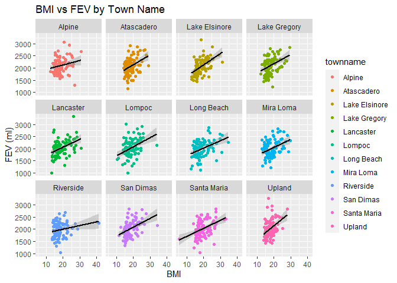
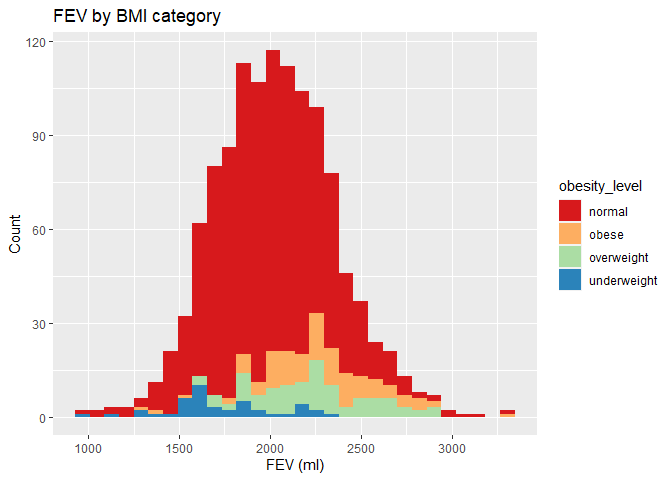
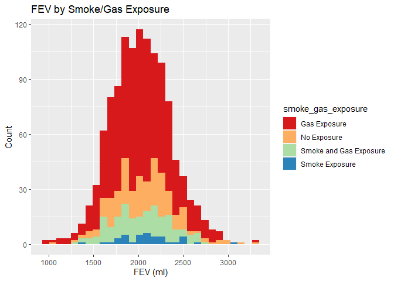
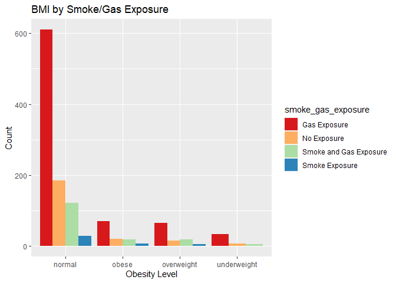
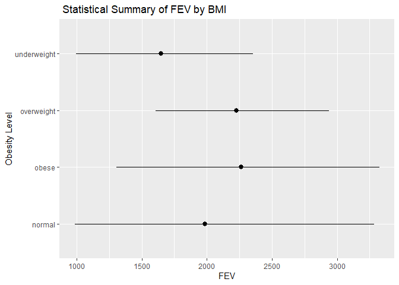
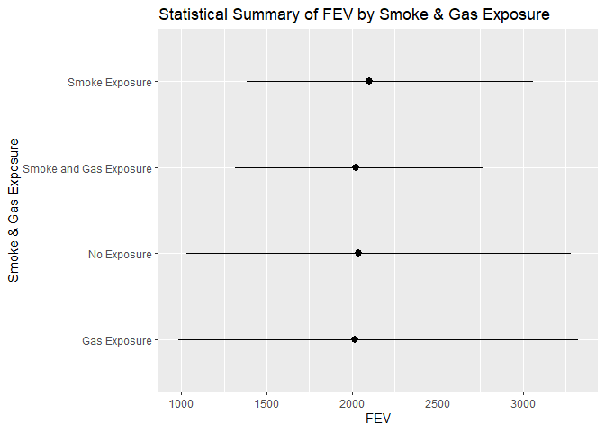
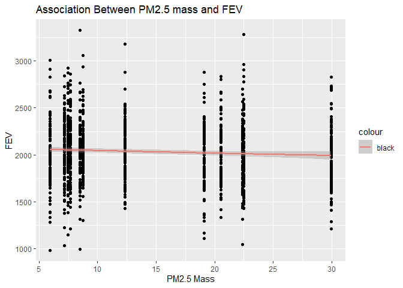
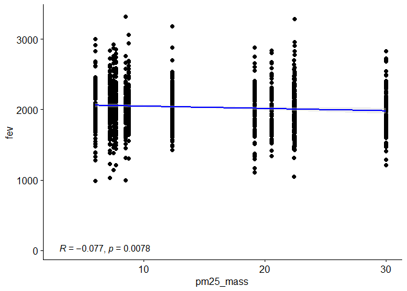

Assignment\_2
================
Ram Ayyala
10/4/2021

# Download Data

``` r
if (!require(tidyverse)) {
  install.packages("tidyverse")}
```

    ## Loading required package: tidyverse

    ## Warning: package 'tidyverse' was built under R version 4.1.1

    ## -- Attaching packages --------------------------------------- tidyverse 1.3.1 --

    ## v ggplot2 3.3.5     v purrr   0.3.4
    ## v tibble  3.1.3     v dplyr   1.0.7
    ## v tidyr   1.1.3     v stringr 1.4.0
    ## v readr   2.0.0     v forcats 0.5.1

    ## Warning: package 'ggplot2' was built under R version 4.1.1

    ## Warning: package 'forcats' was built under R version 4.1.1

    ## -- Conflicts ------------------------------------------ tidyverse_conflicts() --
    ## x dplyr::filter() masks stats::filter()
    ## x dplyr::lag()    masks stats::lag()

``` r
if (!require(data.table)) {
  install.packages("data.table")}
```

    ## Loading required package: data.table

    ## Warning: package 'data.table' was built under R version 4.1.1

    ## 
    ## Attaching package: 'data.table'

    ## The following objects are masked from 'package:dplyr':
    ## 
    ##     between, first, last

    ## The following object is masked from 'package:purrr':
    ## 
    ##     transpose

``` r
if (!require(Amelia)) {
  install.packages("Amelia")}
```

    ## Loading required package: Amelia

    ## Warning: package 'Amelia' was built under R version 4.1.1

    ## Loading required package: Rcpp

    ## ## 
    ## ## Amelia II: Multiple Imputation
    ## ## (Version 1.8.0, built: 2021-05-26)
    ## ## Copyright (C) 2005-2021 James Honaker, Gary King and Matthew Blackwell
    ## ## Refer to http://gking.harvard.edu/amelia/ for more information
    ## ##

``` r
if (!require(ggpubr)) {
  install.packages("ggpubr")}
```

    ## Loading required package: ggpubr

    ## Warning: package 'ggpubr' was built under R version 4.1.1

``` r
if (!require(leaflet)) {
  install.packages("leaflet")}
```

    ## Loading required package: leaflet

    ## Warning: package 'leaflet' was built under R version 4.1.1

``` r
fn1 <- "chs_individual.csv"
if (!file.exists(fn1))
  download.file("https://raw.githubusercontent.com/USCbiostats/data-science-data/master/01_chs/chs_individual.csv", destfile=fn1)

fn2 <- "chs_regional.csv"
if (!file.exists(fn2))
  download.file("https://raw.githubusercontent.com/USCbiostats/data-science-data/master/01_chs/chs_regional.csv", destfile=fn2)

individual <- read.csv(fn1)
individual <- as_tibble(individual)
regional <- read.csv(fn2)
regional <- as_tibble(regional)
```

# Merge Data

``` r
dat <- merge(
  # Data
  x     = individual,      
  y     = regional, 
  # List of variables to match
  by.x  = "townname",
  by.y  = "townname", 
  # Which obs to keep?
  all.x = TRUE,      
  all.y = FALSE
  )
```

# Check for duplicates

``` r
nrow(dat) == nrow(individual)
```

    ## [1] TRUE

# Impute Data with missing values

``` r
#find out which columns have missing values
idvars= c(names(which(!colSums(is.na(dat)) > 0)))
c(names(which(colSums(is.na(dat)) > 0)))
```

    ##  [1] "agepft"        "height"        "weight"        "bmi"          
    ##  [5] "asthma"        "father_asthma" "mother_asthma" "wheeze"       
    ##  [9] "hayfever"      "allergy"       "educ_parent"   "smoke"        
    ## [13] "gasstove"      "fev"           "fvc"           "mmef"         
    ## [17] "no_24hr"       "pm2_5_fr"

``` r
a.out <- amelia(dat, m = 5, idvars=idvars)
```

    ## -- Imputation 1 --
    ## 
    ##   1  2  3  4  5  6  7  8  9
    ## 
    ## -- Imputation 2 --
    ## 
    ##   1  2  3  4  5  6  7  8
    ## 
    ## -- Imputation 3 --
    ## 
    ##   1  2  3  4  5  6  7  8  9
    ## 
    ## -- Imputation 4 --
    ## 
    ##   1  2  3  4  5  6  7  8  9
    ## 
    ## -- Imputation 5 --
    ## 
    ##   1  2  3  4  5  6  7  8

``` r
dat <- a.out$imputations[[1]]
dat <- data.table(dat)

dat$smoke[dat$smoke < 0.5]  <- 0
dat$smoke[dat$smoke >=0.5]  <- 1
dat$gasstove[dat$gasstove < 0.5]  <- 0
dat$gasstove[dat$gasstove >= 0.5]  <- 1
```

# Create cat variable obesity level

``` r
dat[bmi < 14, obesity_level := "underweight"]
dat[bmi >= 14 & bmi <22, obesity_level := "normal"]
dat[bmi >= 22 & bmi <=24, obesity_level := "overweight"]
dat[bmi > 24, obesity_level := "obese"]
dat[, .(
  min_bmi = min(bmi),
  max_bmi = max(bmi),
  number_obv = .N
), by = obesity_level] %>%
  knitr::kable()
```

| obesity\_level | min\_bmi | max\_bmi | number\_obv |
|:---------------|---------:|---------:|------------:|
| normal         | 14.00380 | 21.97346 |         951 |
| obese          | 24.00647 | 41.26613 |         111 |
| overweight     | 22.02353 | 23.99650 |          95 |
| underweight    | 10.83633 | 13.98601 |          43 |

# Create cat variable smoke\_gas\_exposure

``` r
dat[smoke ==0 & gasstove ==0, smoke_gas_exposure := "No Exposure"]
dat[smoke == 1 & gasstove == 0, smoke_gas_exposure := "Smoke Exposure"]
dat[smoke == 0 & gasstove == 1, smoke_gas_exposure := "Gas Exposure"]
dat[smoke == 1 & gasstove ==1, smoke_gas_exposure := "Smoke and Gas Exposure"]
```

# Create 4 Summary Tables showing average/proportion and SD of “Forced expiratory volume in 1 second (ml)” and asthma indicator by town, sex, obesity level, and “smoke\_gas\_exposure.”

``` r
dat[, .(
  FEV_avg=mean(fev, na.rm=TRUE),
  FEV_sd=sd(fev, na.rm=TRUE),
  asmtha_avg=mean(asthma, na.rm=TRUE),
  asmtha_sd=sd(asthma,na.rm=TRUE)
), by = "townname"] %>%
  knitr::kable( caption ="AVG and SD of FEV and Asthma by Town")
```

| townname      | FEV\_avg |  FEV\_sd | asmtha\_avg | asmtha\_sd |
|:--------------|---------:|---------:|------------:|-----------:|
| Alpine        | 2088.686 | 295.8003 |   0.1251990 |  0.3222346 |
| Atascadero    | 2089.977 | 345.5405 |   0.2597975 |  0.4351145 |
| Lake Elsinore | 2041.648 | 317.3421 |   0.1410321 |  0.3457308 |
| Lake Gregory  | 2089.066 | 335.9009 |   0.1556944 |  0.3609777 |
| Lancaster     | 2012.497 | 326.1357 |   0.1635175 |  0.3678143 |
| Lompoc        | 2041.697 | 359.0063 |   0.1074164 |  0.3235258 |
| Long Beach    | 1992.933 | 326.1280 |   0.1295018 |  0.3457031 |
| Mira Loma     | 1981.437 | 337.1818 |   0.1600342 |  0.3710033 |
| Riverside     | 1977.123 | 309.2937 |   0.1100000 |  0.3144660 |
| San Dimas     | 2033.982 | 321.6548 |   0.1747816 |  0.3783774 |
| Santa Maria   | 2040.492 | 332.5957 |   0.1302296 |  0.3598020 |
| Upland        | 2029.632 | 357.9167 |   0.1214969 |  0.3263861 |

AVG and SD of FEV and Asthma by Town

``` r
dat[, .(
  FEV_avg=mean(fev, na.rm=TRUE),
  FEV_sd=sd(fev, na.rm=TRUE),
  asmtha_avg=mean(asthma, na.rm=TRUE),
  asmtha_sd=sd(asthma,na.rm=TRUE)
), by = "male"] %>%
  knitr::kable( caption ="AVG and SD of FEV and Asthma by Sex")
```

| male | FEV\_avg |  FEV\_sd | asmtha\_avg | asmtha\_sd |
|-----:|---------:|---------:|------------:|-----------:|
|    1 | 2104.200 | 317.2353 |   0.1753948 |  0.3823099 |
|    0 | 1967.933 | 331.5554 |   0.1219462 |  0.3272495 |

AVG and SD of FEV and Asthma by Sex

``` r
dat[, .(
  FEV_avg=mean(fev, na.rm=TRUE),
  FEV_sd=sd(fev, na.rm=TRUE),
  asmtha_avg=mean(asthma, na.rm=TRUE),
  asmtha_sd=sd(asthma,na.rm=TRUE)
), by = "obesity_level"] %>%
  knitr::kable( caption ="AVG and SD of FEV and Asthma by Obesity Level")
```

| obesity\_level | FEV\_avg |  FEV\_sd | asmtha\_avg | asmtha\_sd |
|:---------------|---------:|---------:|------------:|-----------:|
| normal         | 2004.027 | 313.3716 |   0.1415699 |  0.3511289 |
| obese          | 2271.287 | 321.7155 |   0.2135049 |  0.4056198 |
| overweight     | 2202.760 | 316.0762 |   0.1740849 |  0.3762306 |
| underweight    | 1737.494 | 313.7649 |   0.0697674 |  0.2577696 |

AVG and SD of FEV and Asthma by Obesity Level

``` r
dat[, .(
  FEV_avg=mean(fev, na.rm=TRUE),
  FEV_sd=sd(fev, na.rm=TRUE),
  asmtha_avg=mean(asthma, na.rm=TRUE),
  asmtha_sd=sd(asthma,na.rm=TRUE)
), by = "smoke_gas_exposure"] %>%
  knitr::kable( caption ="AVG and SD of FEV and Asthma by Smoke & Gas Exposure")
```

| smoke\_gas\_exposure   | FEV\_avg |  FEV\_sd | asmtha\_avg | asmtha\_sd |
|:-----------------------|---------:|---------:|------------:|-----------:|
| No Exposure            | 2046.168 | 336.9299 |   0.1471264 |  0.3577276 |
| Gas Exposure           | 2028.166 | 335.4109 |   0.1506004 |  0.3589837 |
| Smoke Exposure         | 2096.061 | 328.8206 |   0.1830629 |  0.3884087 |
| Smoke and Gas Exposure | 2036.874 | 306.2481 |   0.1301419 |  0.3349453 |

AVG and SD of FEV and Asthma by Smoke & Gas Exposure

# EDA Analysis

## EDA Checklist

### Checking Dimensions of data

``` r
dim(dat)
```

    ## [1] 1200   51

### Checking Headers and Footers

``` r
head(dat) %>% knitr::kable()
```

| townname | sid | male | race | hispanic |    agepft | height | weight |      bmi | asthma | active\_asthma | father\_asthma | mother\_asthma | wheeze | hayfever | allergy | educ\_parent | smoke | pets | gasstove |      fev |      fvc |     mmef | pm25\_mass | pm25\_so4 | pm25\_no3 | pm25\_nh4 | pm25\_oc | pm25\_ec | pm25\_om | pm10\_oc | pm10\_ec | pm10\_tc | formic | acetic |  hcl | hno3 | o3\_max | o3106 | o3\_24 |   no2 |  pm10 | no\_24hr | pm2\_5\_fr | iacid | oacid | total\_acids |       lon |      lat | obesity\_level | smoke\_gas\_exposure |
|:---------|----:|-----:|:-----|---------:|----------:|-------:|-------:|---------:|-------:|---------------:|---------------:|---------------:|-------:|---------:|--------:|-------------:|------:|-----:|---------:|---------:|---------:|---------:|-----------:|----------:|----------:|----------:|---------:|---------:|---------:|---------:|---------:|---------:|-------:|-------:|-----:|-----:|--------:|------:|-------:|------:|------:|---------:|-----------:|------:|------:|-------------:|----------:|---------:|:---------------|:---------------------|
| Alpine   | 841 |    1 | W    |        1 | 10.548939 |    150 |     78 | 15.75758 |      0 |              0 |      0.0000000 |              0 |      0 |        0 |       0 |     5.000000 |     0 |    1 |        0 | 2251.505 | 2594.649 | 2445.151 |       8.74 |      1.73 |      1.59 |      0.88 |     2.54 |     0.48 |     3.04 |     3.25 |     0.49 |     3.75 |   1.03 |   2.49 | 0.41 | 1.98 |   65.82 | 55.05 |  41.23 | 12.18 | 24.73 |     2.48 |      10.28 |  2.39 |  3.52 |          5.5 | -116.7664 | 32.83505 | normal         | No Exposure          |
| Alpine   | 835 |    0 | W    |        0 | 10.099932 |    143 |     69 | 15.33749 |      0 |              0 |      0.0000000 |              0 |      0 |        0 |       1 |     3.000000 |     0 |    1 |        0 | 2529.276 | 2826.316 | 3406.579 |       8.74 |      1.73 |      1.59 |      0.88 |     2.54 |     0.48 |     3.04 |     3.25 |     0.49 |     3.75 |   1.03 |   2.49 | 0.41 | 1.98 |   65.82 | 55.05 |  41.23 | 12.18 | 24.73 |     2.48 |      10.28 |  2.39 |  3.52 |          5.5 | -116.7664 | 32.83505 | normal         | No Exposure          |
| Alpine   | 838 |    0 | O    |        1 |  9.486653 |    133 |     62 | 15.93183 |      0 |              0 |      0.0000000 |              0 |      0 |        0 |       0 |     4.000000 |     0 |    1 |        0 | 1737.793 | 1963.545 | 2133.110 |       8.74 |      1.73 |      1.59 |      0.88 |     2.54 |     0.48 |     3.04 |     3.25 |     0.49 |     3.75 |   1.03 |   2.49 | 0.41 | 1.98 |   65.82 | 55.05 |  41.23 | 12.18 | 24.73 |     2.48 |      10.28 |  2.39 |  3.52 |          5.5 | -116.7664 | 32.83505 | normal         | No Exposure          |
| Alpine   | 840 |    0 | W    |        0 |  9.965777 |    146 |     78 | 16.63283 |      0 |              0 |      0.0000000 |              0 |      0 |        0 |       0 |     1.124305 |     0 |    0 |        1 | 2466.791 | 2638.221 | 3466.464 |       8.74 |      1.73 |      1.59 |      0.88 |     2.54 |     0.48 |     3.04 |     3.25 |     0.49 |     3.75 |   1.03 |   2.49 | 0.41 | 1.98 |   65.82 | 55.05 |  41.23 | 12.18 | 24.73 |     2.48 |      10.28 |  2.39 |  3.52 |          5.5 | -116.7664 | 32.83505 | normal         | Gas Exposure         |
| Alpine   | 865 |    0 | W    |        0 | 10.039699 |    162 |    140 | 24.24797 |      1 |              1 |      0.0000000 |              0 |      1 |        0 |       1 |     3.000000 |     0 |    1 |        1 | 2583.934 | 3567.541 | 2071.475 |       8.74 |      1.73 |      1.59 |      0.88 |     2.54 |     0.48 |     3.04 |     3.25 |     0.49 |     3.75 |   1.03 |   2.49 | 0.41 | 1.98 |   65.82 | 55.05 |  41.23 | 12.18 | 24.73 |     2.48 |      10.28 |  2.39 |  3.52 |          5.5 | -116.7664 | 32.83505 | obese          | Gas Exposure         |
| Alpine   | 867 |    0 | W    |        1 |  9.957563 |    141 |     94 | 21.49151 |      0 |              0 |      0.0174461 |              0 |      0 |        0 |       0 |     5.000000 |     0 |    1 |        1 | 1973.115 | 2154.098 | 2690.164 |       8.74 |      1.73 |      1.59 |      0.88 |     2.54 |     0.48 |     3.04 |     3.25 |     0.49 |     3.75 |   1.03 |   2.49 | 0.41 | 1.98 |   65.82 | 55.05 |  41.23 | 12.18 | 24.73 |     2.48 |      10.28 |  2.39 |  3.52 |          5.5 | -116.7664 | 32.83505 | normal         | Gas Exposure         |

``` r
tail(dat) %>% knitr::kable()
```

| townname |  sid | male | race | hispanic |    agepft |   height |   weight |      bmi | asthma | active\_asthma | father\_asthma | mother\_asthma | wheeze |  hayfever |    allergy | educ\_parent | smoke | pets | gasstove |      fev |      fvc |     mmef | pm25\_mass | pm25\_so4 | pm25\_no3 | pm25\_nh4 | pm25\_oc | pm25\_ec | pm25\_om | pm10\_oc | pm10\_ec | pm10\_tc | formic | acetic |  hcl | hno3 | o3\_max | o3106 | o3\_24 |   no2 | pm10 | no\_24hr | pm2\_5\_fr | iacid | oacid | total\_acids |       lon |      lat | obesity\_level | smoke\_gas\_exposure |
|:---------|-----:|-----:|:-----|---------:|----------:|---------:|---------:|---------:|-------:|---------------:|---------------:|---------------:|-------:|----------:|-----------:|-------------:|------:|-----:|---------:|---------:|---------:|---------:|-----------:|----------:|----------:|----------:|---------:|---------:|---------:|---------:|---------:|---------:|-------:|-------:|-----:|-----:|--------:|------:|-------:|------:|-----:|---------:|-----------:|------:|------:|-------------:|----------:|---------:|:---------------|:---------------------|
| Upland   | 1866 |    0 | O    |        1 |  9.806981 | 139.0000 | 60.00000 | 14.11559 |      0 |              0 |     -0.0164767 |              0 |      0 | 0.3824337 | -0.0213488 |            3 |     0 |    1 |        0 | 1691.275 | 1928.859 | 1890.604 |      22.46 |      2.65 |      7.75 |      2.96 |     6.49 |     1.19 |     7.79 |     8.32 |     1.22 |     9.54 |   2.67 |   4.73 | 0.46 | 4.03 |   63.83 |  46.5 |   22.2 | 37.97 | 40.8 |    18.48 |      27.73 |  4.49 |   7.4 |        11.43 | -117.6484 | 34.09751 | normal         | No Exposure          |
| Upland   | 1867 |    0 | M    |        1 |  9.618070 | 140.0000 | 71.00000 | 16.46568 |      0 |              0 |      1.0000000 |              0 |      0 | 0.0000000 |  0.0000000 |            3 |     0 |    1 |        0 | 1733.338 | 1993.040 | 2072.643 |      22.46 |      2.65 |      7.75 |      2.96 |     6.49 |     1.19 |     7.79 |     8.32 |     1.22 |     9.54 |   2.67 |   4.73 | 0.46 | 4.03 |   63.83 |  46.5 |   22.2 | 37.97 | 40.8 |    18.48 |      27.73 |  4.49 |   7.4 |        11.43 | -117.6484 | 34.09751 | normal         | No Exposure          |
| Upland   | 2033 |    0 | M    |        0 | 10.121834 | 130.0000 | 67.00000 | 18.02044 |      0 |              1 |      0.0000000 |              0 |      1 | 1.0000000 |  0.0000000 |            3 |     0 |    1 |        1 | 1929.866 | 2122.148 | 2558.054 |      22.46 |      2.65 |      7.75 |      2.96 |     6.49 |     1.19 |     7.79 |     8.32 |     1.22 |     9.54 |   2.67 |   4.73 | 0.46 | 4.03 |   63.83 |  46.5 |   22.2 | 37.97 | 40.8 |    18.48 |      27.73 |  4.49 |   7.4 |        11.43 | -117.6484 | 34.09751 | normal         | Gas Exposure         |
| Upland   | 2031 |    1 | W    |        0 |  9.798768 | 135.0000 | 83.00000 | 20.70084 |      0 |              0 |      0.0000000 |              0 |      1 | 0.0000000 |  1.0000000 |            3 |     0 |    1 |        1 | 2034.177 | 2505.535 | 1814.075 |      22.46 |      2.65 |      7.75 |      2.96 |     6.49 |     1.19 |     7.79 |     8.32 |     1.22 |     9.54 |   2.67 |   4.73 | 0.46 | 4.03 |   63.83 |  46.5 |   22.2 | 37.97 | 40.8 |    18.48 |      27.73 |  4.49 |   7.4 |        11.43 | -117.6484 | 34.09751 | normal         | Gas Exposure         |
| Upland   | 2032 |    1 | W    |        0 |  9.549623 | 137.0000 | 59.00000 | 14.28855 |      0 |              0 |      0.0000000 |              1 |      1 | 1.0000000 |  1.0000000 |            3 |     0 |    1 |        1 | 2077.703 | 2275.338 | 2706.081 |      22.46 |      2.65 |      7.75 |      2.96 |     6.49 |     1.19 |     7.79 |     8.32 |     1.22 |     9.54 |   2.67 |   4.73 | 0.46 | 4.03 |   63.83 |  46.5 |   22.2 | 37.97 | 40.8 |    18.48 |      27.73 |  4.49 |   7.4 |        11.43 | -117.6484 | 34.09751 | normal         | Gas Exposure         |
| Upland   | 2053 |    0 | W    |        0 |  9.603952 | 141.3908 | 53.15407 | 13.51134 |      0 |              0 |      0.0000000 |              0 |      0 | 0.0000000 |  0.0000000 |            3 |     0 |    1 |        0 | 1861.123 | 2108.354 | 1957.081 |      22.46 |      2.65 |      7.75 |      2.96 |     6.49 |     1.19 |     7.79 |     8.32 |     1.22 |     9.54 |   2.67 |   4.73 | 0.46 | 4.03 |   63.83 |  46.5 |   22.2 | 37.97 | 40.8 |    18.48 |      27.73 |  4.49 |   7.4 |        11.43 | -117.6484 | 34.09751 | underweight    | No Exposure          |

### Check Variable Names and Variable Types

``` r
str(dat)
```

    ## Classes 'data.table' and 'data.frame':   1200 obs. of  51 variables:
    ##  $ townname          : chr  "Alpine" "Alpine" "Alpine" "Alpine" ...
    ##  $ sid               : int  841 835 838 840 865 867 842 839 844 847 ...
    ##  $ male              : int  1 0 0 0 0 0 1 0 1 1 ...
    ##  $ race              : chr  "W" "W" "O" "W" ...
    ##  $ hispanic          : int  1 0 1 0 0 1 1 1 1 0 ...
    ##  $ agepft            : num  10.55 10.1 9.49 9.97 10.04 ...
    ##  $ height            : num  150 143 133 146 162 141 139 142 143 137 ...
    ##  $ weight            : num  78 69 62 78 140 94 65 86 65 69 ...
    ##  $ bmi               : num  15.8 15.3 15.9 16.6 24.2 ...
    ##  $ asthma            : num  0 0 0 0 1 ...
    ##  $ active_asthma     : int  0 0 0 0 1 0 0 0 0 0 ...
    ##  $ father_asthma     : num  0 0 0 0 0 ...
    ##  $ mother_asthma     : num  0 0 0 0 0 ...
    ##  $ wheeze            : num  0 0 0 0 1 ...
    ##  $ hayfever          : num  0 0 0 0 0 ...
    ##  $ allergy           : num  0 1 0 0 1 ...
    ##  $ educ_parent       : num  5 3 4 1.12 3 ...
    ##  $ smoke             : num  0 0 0 0 0 0 1 1 0 0 ...
    ##  $ pets              : int  1 1 1 0 1 1 1 1 0 1 ...
    ##  $ gasstove          : num  0 0 0 1 1 1 0 0 1 1 ...
    ##  $ fev               : num  2252 2529 1738 2467 2584 ...
    ##  $ fvc               : num  2595 2826 1964 2638 3568 ...
    ##  $ mmef              : num  2445 3407 2133 3466 2071 ...
    ##  $ pm25_mass         : num  8.74 8.74 8.74 8.74 8.74 8.74 8.74 8.74 8.74 8.74 ...
    ##  $ pm25_so4          : num  1.73 1.73 1.73 1.73 1.73 1.73 1.73 1.73 1.73 1.73 ...
    ##  $ pm25_no3          : num  1.59 1.59 1.59 1.59 1.59 1.59 1.59 1.59 1.59 1.59 ...
    ##  $ pm25_nh4          : num  0.88 0.88 0.88 0.88 0.88 0.88 0.88 0.88 0.88 0.88 ...
    ##  $ pm25_oc           : num  2.54 2.54 2.54 2.54 2.54 2.54 2.54 2.54 2.54 2.54 ...
    ##  $ pm25_ec           : num  0.48 0.48 0.48 0.48 0.48 0.48 0.48 0.48 0.48 0.48 ...
    ##  $ pm25_om           : num  3.04 3.04 3.04 3.04 3.04 3.04 3.04 3.04 3.04 3.04 ...
    ##  $ pm10_oc           : num  3.25 3.25 3.25 3.25 3.25 3.25 3.25 3.25 3.25 3.25 ...
    ##  $ pm10_ec           : num  0.49 0.49 0.49 0.49 0.49 0.49 0.49 0.49 0.49 0.49 ...
    ##  $ pm10_tc           : num  3.75 3.75 3.75 3.75 3.75 3.75 3.75 3.75 3.75 3.75 ...
    ##  $ formic            : num  1.03 1.03 1.03 1.03 1.03 1.03 1.03 1.03 1.03 1.03 ...
    ##  $ acetic            : num  2.49 2.49 2.49 2.49 2.49 2.49 2.49 2.49 2.49 2.49 ...
    ##  $ hcl               : num  0.41 0.41 0.41 0.41 0.41 0.41 0.41 0.41 0.41 0.41 ...
    ##  $ hno3              : num  1.98 1.98 1.98 1.98 1.98 1.98 1.98 1.98 1.98 1.98 ...
    ##  $ o3_max            : num  65.8 65.8 65.8 65.8 65.8 ...
    ##  $ o3106             : num  55 55 55 55 55 ...
    ##  $ o3_24             : num  41.2 41.2 41.2 41.2 41.2 ...
    ##  $ no2               : num  12.2 12.2 12.2 12.2 12.2 ...
    ##  $ pm10              : num  24.7 24.7 24.7 24.7 24.7 ...
    ##  $ no_24hr           : num  2.48 2.48 2.48 2.48 2.48 2.48 2.48 2.48 2.48 2.48 ...
    ##  $ pm2_5_fr          : num  10.3 10.3 10.3 10.3 10.3 ...
    ##  $ iacid             : num  2.39 2.39 2.39 2.39 2.39 2.39 2.39 2.39 2.39 2.39 ...
    ##  $ oacid             : num  3.52 3.52 3.52 3.52 3.52 3.52 3.52 3.52 3.52 3.52 ...
    ##  $ total_acids       : num  5.5 5.5 5.5 5.5 5.5 5.5 5.5 5.5 5.5 5.5 ...
    ##  $ lon               : num  -117 -117 -117 -117 -117 ...
    ##  $ lat               : num  32.8 32.8 32.8 32.8 32.8 ...
    ##  $ obesity_level     : chr  "normal" "normal" "normal" "normal" ...
    ##  $ smoke_gas_exposure: chr  "No Exposure" "No Exposure" "No Exposure" "Gas Exposure" ...
    ##  - attr(*, ".internal.selfref")=<externalptr> 
    ##  - attr(*, "index")= int(0) 
    ##   ..- attr(*, "__gasstove__smoke")= int [1:1200] 1 2 3 11 12 13 14 19 24 26 ...

### Key Variables

``` r
summary(dat$bmi) 
```

    ##    Min. 1st Qu.  Median    Mean 3rd Qu.    Max. 
    ##   10.84   15.81   17.56   18.53   20.41   41.27

``` r
summary(dat$fev)
```

    ##    Min. 1st Qu.  Median    Mean 3rd Qu.    Max. 
    ##   788.7  1814.0  2028.7  2034.9  2251.1  3323.7

``` r
summary(dat$smoke_gas_exposure)
```

    ##    Length     Class      Mode 
    ##      1200 character character

``` r
summary(dat$pm25_mass)
```

    ##    Min. 1st Qu.  Median    Mean 3rd Qu.    Max. 
    ##   5.960   7.615  10.545  14.362  20.988  29.970

# Part 1: Facet plot showing scatterplots with regression lines of BMI vs FEV by “townname”.

``` r
dat[!is.na(townname)] %>%
  ggplot(mapping=aes(x=bmi, y=fev, color=townname)) +
  geom_point() +
  geom_smooth(method="lm", color="black") +
  facet_wrap(~ townname) +
  labs(title = "BMI vs FEV by Town Name", x= "BMI", y="FEV")
```

    ## `geom_smooth()` using formula 'y ~ x'

<!-- --> The
figure above contains a scatter plot that details the relationship
between BMI and Forced expiratory volume in 1 second (ml) (FEV) for each
town in the data set, with the x-axis being the BMI values and the
y-axis being the FEV values. Within each scatter plot lies a regression
line. From the figure above, it is evident that across all of the towns,
BMI seems to have a positive association with. When comparing the graphs
to each other, we see that the $FEV is greatest in the Upland area and
the least in the Alpine area.

# Part 2: Stacked histograms of FEV by BMI category and FEV by smoke/gas exposure. Use different color schemes than the ggplot default.

``` r
dat[!is.na(fev) & !is.na(obesity_level) & !is.na(smoke_gas_exposure) ] %>%
  ggplot() +
  geom_histogram(mapping=aes(x=fev, fill = obesity_level))+
  labs(title = "FEV by BMI category", x= "FEV", y="Count") +
  scale_fill_brewer(palette = "Spectral")
```

    ## `stat_bin()` using `bins = 30`. Pick better value with `binwidth`.

<!-- -->

``` r
dat[!is.na(fev) & !is.na(obesity_level) & !is.na(smoke_gas_exposure) ] %>%
  ggplot() +
  geom_histogram(mapping=aes(x=fev, fill = smoke_gas_exposure))+
  labs(title = "FEV by Smoke/Gas Exposure", x= "FEV", y="Count") +
  scale_fill_brewer(palette = "Spectral")
```

    ## `stat_bin()` using `bins = 30`. Pick better value with `binwidth`.

<!-- --> Both
figures above are stacked histogras that display the distribution of FEV
by the BMI categories and the smoke/gas exposure categories. The first
figure displays the distribution of FEV by BMI categories, with the
x-axis being the FEV values and the y-axis being the count. From this
stacked histogram, we can see that the normal category is the only
obesity level that has a normal distribution. The obesity and overweight
categories appear to be left-skewed while the underweight category is
right skewed. Moreover, from this plot, we can see that the majority of
the data set is made up of individuals with normal BMI, while only a
small portion of the dataset are obese, overweight, or underweight.

The second figure displays the distribution of FEV by smoke/gas exposure
categories, with the x-axis being the FEV values and the y-axis being
the count. Interestingly enough, it seems that all of the categories for
smoke/gas exposure seem to have a normal distribution.Moreoever, the
majority of the population of these towns seem to be exposed to only
gas, while only a small portion were exposed to only smoke.

# Part 3: Barchart of BMI by smoke/gas exposure.

``` r
dat[!is.na(obesity_level) & !is.na(smoke_gas_exposure) ] %>%
  ggplot() +
  geom_bar(mapping=aes(x=obesity_level, fill = smoke_gas_exposure))+
  labs(title = "BMI by Smoke/Gas Exposure", x= "Obesity Level", y="Count") +
  scale_fill_brewer(palette = "Spectral")
```

<!-- --> The
graph above depicts a bar chart of BMI by smoke/gas exposure, with the
x-axis being the Obesity level categories and the y-axis being the
count. From the graph, we can see that the majority of each obesity
level is made up of individuals exposed to gas only, while a very small
portion were exposed to smoke only. Moreover, for each obesity level,
the order of the smoke/gas exposure category in terms of count
proportion seems to be maintained in this order from largest to
smallest: Gas Exposure, No Exposure, Smoke and Gas Exposure, and Smoke
Exposure.

# Part 4: Statistical summary graphs of FEV by BMI and FEV by smoke/gas exposure category.

``` r
dat[!is.na(fev) & !is.na(obesity_level)] %>%
  ggplot() + 
    stat_summary(mapping = aes(x = fev, y = obesity_level),
    fun.min = min,
    fun.max = max,
    fun = median)+ 
  labs(title = " Statistical Summary of FEV by BMI", x= "FEV", y="Obesity Level")
```

<!-- -->

``` r
dat[!is.na(fev) & !is.na(smoke_gas_exposure)] %>%
  ggplot() + 
    stat_summary(mapping = aes(x = fev, y = smoke_gas_exposure),
    fun.min = min,
    fun.max = max,
    fun = median)+ 
  labs(title = "Statistical Summary of FEV by Smoke & Gas Exposure", x= "FEV", y="Smoke & Gas Exposure")
```

<!-- --> The
graphs above depict statistical summary charts of FEV by Obesity Level
and FEV by smoke/gas exposure level respectively.

The first figure displays the statistical summary chart of FEV by
Obesity level, with the x-axis being the FEV values and the y-axis being
the Obesity level categories. From this graph, we observe that the
normal category has the greatest range, while the overweight category
has the smallest range. Furthermore, the obese category seems to have
the largest median while the underweight category has the smallest
median of the categories.

The second figure displays the statistical summary chart for FEV by
smoke/gas exposure level with the x-axis being the FEV values and the
y-axis being the smoke/gas exposure level categories. From this graph,
we observe that the Gas Exposure category has the largest range, with
the No Exposure category having nearly the same range. On the other
hand, the Smoke and Gas Exposure category has the smallest range.
Moreover, the No Exposure category seems to have the greatest median,
while the Gas Exposure and the Smoke and Gas Exposure categories have
nearly the same median, with that median being the smallest. Overall,it
seems that the medians are nearly the same for all of the categories,
with differences between each median for each category being very small.

# Part 5: A leaflet map showing the concentrations of PM2.5 mass in each of the CHS communities.

``` r
temp.pal <- colorNumeric(palette ='Accent', domain=dat$pm25_mass)
map <- dat [,.(townname,pm25_mass,lat,lon)]
leaflet(map) %>%
  addProviderTiles('CartoDB.Positron') %>%
  addCircles(
    lat = ~lat, lng=~lon,
    label = dat$townname, color = ~ temp.pal(pm25_mass),
    opacity = 1, fillOpacity = 1, radius = 500
    ) %>%
  # And a pretty legend
  addLegend('bottomleft', pal=temp.pal, values=dat$pm25_mass,
          title='Concentrations of PM2.5 mass in each of the CHS communities', opacity=1)
```

<div id="htmlwidget-eb7de2357423ce075600" style="width:672px;height:480px;" class="leaflet html-widget"></div>
<script type="application/json" data-for="htmlwidget-eb7de2357423ce075600">{"x":{"options":{"crs":{"crsClass":"L.CRS.EPSG3857","code":null,"proj4def":null,"projectedBounds":null,"options":{}}},"calls":[{"method":"addProviderTiles","args":["CartoDB.Positron",null,null,{"errorTileUrl":"","noWrap":false,"detectRetina":false}]},{"method":"addCircles","args":[[32.8350521,32.8350521,32.8350521,32.8350521,32.8350521,32.8350521,32.8350521,32.8350521,32.8350521,32.8350521,32.8350521,32.8350521,32.8350521,32.8350521,32.8350521,32.8350521,32.8350521,32.8350521,32.8350521,32.8350521,32.8350521,32.8350521,32.8350521,32.8350521,32.8350521,32.8350521,32.8350521,32.8350521,32.8350521,32.8350521,32.8350521,32.8350521,32.8350521,32.8350521,32.8350521,32.8350521,32.8350521,32.8350521,32.8350521,32.8350521,32.8350521,32.8350521,32.8350521,32.8350521,32.8350521,32.8350521,32.8350521,32.8350521,32.8350521,32.8350521,32.8350521,32.8350521,32.8350521,32.8350521,32.8350521,32.8350521,32.8350521,32.8350521,32.8350521,32.8350521,32.8350521,32.8350521,32.8350521,32.8350521,32.8350521,32.8350521,32.8350521,32.8350521,32.8350521,32.8350521,32.8350521,32.8350521,32.8350521,32.8350521,32.8350521,32.8350521,32.8350521,32.8350521,32.8350521,32.8350521,32.8350521,32.8350521,32.8350521,32.8350521,32.8350521,32.8350521,32.8350521,32.8350521,32.8350521,32.8350521,32.8350521,32.8350521,32.8350521,32.8350521,32.8350521,32.8350521,32.8350521,32.8350521,32.8350521,32.8350521,35.4894169,35.4894169,35.4894169,35.4894169,35.4894169,35.4894169,35.4894169,35.4894169,35.4894169,35.4894169,35.4894169,35.4894169,35.4894169,35.4894169,35.4894169,35.4894169,35.4894169,35.4894169,35.4894169,35.4894169,35.4894169,35.4894169,35.4894169,35.4894169,35.4894169,35.4894169,35.4894169,35.4894169,35.4894169,35.4894169,35.4894169,35.4894169,35.4894169,35.4894169,35.4894169,35.4894169,35.4894169,35.4894169,35.4894169,35.4894169,35.4894169,35.4894169,35.4894169,35.4894169,35.4894169,35.4894169,35.4894169,35.4894169,35.4894169,35.4894169,35.4894169,35.4894169,35.4894169,35.4894169,35.4894169,35.4894169,35.4894169,35.4894169,35.4894169,35.4894169,35.4894169,35.4894169,35.4894169,35.4894169,35.4894169,35.4894169,35.4894169,35.4894169,35.4894169,35.4894169,35.4894169,35.4894169,35.4894169,35.4894169,35.4894169,35.4894169,35.4894169,35.4894169,35.4894169,35.4894169,35.4894169,35.4894169,35.4894169,35.4894169,35.4894169,35.4894169,35.4894169,35.4894169,35.4894169,35.4894169,35.4894169,35.4894169,35.4894169,35.4894169,35.4894169,35.4894169,35.4894169,35.4894169,35.4894169,35.4894169,33.6680772,33.6680772,33.6680772,33.6680772,33.6680772,33.6680772,33.6680772,33.6680772,33.6680772,33.6680772,33.6680772,33.6680772,33.6680772,33.6680772,33.6680772,33.6680772,33.6680772,33.6680772,33.6680772,33.6680772,33.6680772,33.6680772,33.6680772,33.6680772,33.6680772,33.6680772,33.6680772,33.6680772,33.6680772,33.6680772,33.6680772,33.6680772,33.6680772,33.6680772,33.6680772,33.6680772,33.6680772,33.6680772,33.6680772,33.6680772,33.6680772,33.6680772,33.6680772,33.6680772,33.6680772,33.6680772,33.6680772,33.6680772,33.6680772,33.6680772,33.6680772,33.6680772,33.6680772,33.6680772,33.6680772,33.6680772,33.6680772,33.6680772,33.6680772,33.6680772,33.6680772,33.6680772,33.6680772,33.6680772,33.6680772,33.6680772,33.6680772,33.6680772,33.6680772,33.6680772,33.6680772,33.6680772,33.6680772,33.6680772,33.6680772,33.6680772,33.6680772,33.6680772,33.6680772,33.6680772,33.6680772,33.6680772,33.6680772,33.6680772,33.6680772,33.6680772,33.6680772,33.6680772,33.6680772,33.6680772,33.6680772,33.6680772,33.6680772,33.6680772,33.6680772,33.6680772,33.6680772,33.6680772,33.6680772,33.6680772,34.242901,34.242901,34.242901,34.242901,34.242901,34.242901,34.242901,34.242901,34.242901,34.242901,34.242901,34.242901,34.242901,34.242901,34.242901,34.242901,34.242901,34.242901,34.242901,34.242901,34.242901,34.242901,34.242901,34.242901,34.242901,34.242901,34.242901,34.242901,34.242901,34.242901,34.242901,34.242901,34.242901,34.242901,34.242901,34.242901,34.242901,34.242901,34.242901,34.242901,34.242901,34.242901,34.242901,34.242901,34.242901,34.242901,34.242901,34.242901,34.242901,34.242901,34.242901,34.242901,34.242901,34.242901,34.242901,34.242901,34.242901,34.242901,34.242901,34.242901,34.242901,34.242901,34.242901,34.242901,34.242901,34.242901,34.242901,34.242901,34.242901,34.242901,34.242901,34.242901,34.242901,34.242901,34.242901,34.242901,34.242901,34.242901,34.242901,34.242901,34.242901,34.242901,34.242901,34.242901,34.242901,34.242901,34.242901,34.242901,34.242901,34.242901,34.242901,34.242901,34.242901,34.242901,34.242901,34.242901,34.242901,34.242901,34.242901,34.242901,34.6867846,34.6867846,34.6867846,34.6867846,34.6867846,34.6867846,34.6867846,34.6867846,34.6867846,34.6867846,34.6867846,34.6867846,34.6867846,34.6867846,34.6867846,34.6867846,34.6867846,34.6867846,34.6867846,34.6867846,34.6867846,34.6867846,34.6867846,34.6867846,34.6867846,34.6867846,34.6867846,34.6867846,34.6867846,34.6867846,34.6867846,34.6867846,34.6867846,34.6867846,34.6867846,34.6867846,34.6867846,34.6867846,34.6867846,34.6867846,34.6867846,34.6867846,34.6867846,34.6867846,34.6867846,34.6867846,34.6867846,34.6867846,34.6867846,34.6867846,34.6867846,34.6867846,34.6867846,34.6867846,34.6867846,34.6867846,34.6867846,34.6867846,34.6867846,34.6867846,34.6867846,34.6867846,34.6867846,34.6867846,34.6867846,34.6867846,34.6867846,34.6867846,34.6867846,34.6867846,34.6867846,34.6867846,34.6867846,34.6867846,34.6867846,34.6867846,34.6867846,34.6867846,34.6867846,34.6867846,34.6867846,34.6867846,34.6867846,34.6867846,34.6867846,34.6867846,34.6867846,34.6867846,34.6867846,34.6867846,34.6867846,34.6867846,34.6867846,34.6867846,34.6867846,34.6867846,34.6867846,34.6867846,34.6867846,34.6867846,34.6391501,34.6391501,34.6391501,34.6391501,34.6391501,34.6391501,34.6391501,34.6391501,34.6391501,34.6391501,34.6391501,34.6391501,34.6391501,34.6391501,34.6391501,34.6391501,34.6391501,34.6391501,34.6391501,34.6391501,34.6391501,34.6391501,34.6391501,34.6391501,34.6391501,34.6391501,34.6391501,34.6391501,34.6391501,34.6391501,34.6391501,34.6391501,34.6391501,34.6391501,34.6391501,34.6391501,34.6391501,34.6391501,34.6391501,34.6391501,34.6391501,34.6391501,34.6391501,34.6391501,34.6391501,34.6391501,34.6391501,34.6391501,34.6391501,34.6391501,34.6391501,34.6391501,34.6391501,34.6391501,34.6391501,34.6391501,34.6391501,34.6391501,34.6391501,34.6391501,34.6391501,34.6391501,34.6391501,34.6391501,34.6391501,34.6391501,34.6391501,34.6391501,34.6391501,34.6391501,34.6391501,34.6391501,34.6391501,34.6391501,34.6391501,34.6391501,34.6391501,34.6391501,34.6391501,34.6391501,34.6391501,34.6391501,34.6391501,34.6391501,34.6391501,34.6391501,34.6391501,34.6391501,34.6391501,34.6391501,34.6391501,34.6391501,34.6391501,34.6391501,34.6391501,34.6391501,34.6391501,34.6391501,34.6391501,34.6391501,33.7700504,33.7700504,33.7700504,33.7700504,33.7700504,33.7700504,33.7700504,33.7700504,33.7700504,33.7700504,33.7700504,33.7700504,33.7700504,33.7700504,33.7700504,33.7700504,33.7700504,33.7700504,33.7700504,33.7700504,33.7700504,33.7700504,33.7700504,33.7700504,33.7700504,33.7700504,33.7700504,33.7700504,33.7700504,33.7700504,33.7700504,33.7700504,33.7700504,33.7700504,33.7700504,33.7700504,33.7700504,33.7700504,33.7700504,33.7700504,33.7700504,33.7700504,33.7700504,33.7700504,33.7700504,33.7700504,33.7700504,33.7700504,33.7700504,33.7700504,33.7700504,33.7700504,33.7700504,33.7700504,33.7700504,33.7700504,33.7700504,33.7700504,33.7700504,33.7700504,33.7700504,33.7700504,33.7700504,33.7700504,33.7700504,33.7700504,33.7700504,33.7700504,33.7700504,33.7700504,33.7700504,33.7700504,33.7700504,33.7700504,33.7700504,33.7700504,33.7700504,33.7700504,33.7700504,33.7700504,33.7700504,33.7700504,33.7700504,33.7700504,33.7700504,33.7700504,33.7700504,33.7700504,33.7700504,33.7700504,33.7700504,33.7700504,33.7700504,33.7700504,33.7700504,33.7700504,33.7700504,33.7700504,33.7700504,33.7700504,33.9845417,33.9845417,33.9845417,33.9845417,33.9845417,33.9845417,33.9845417,33.9845417,33.9845417,33.9845417,33.9845417,33.9845417,33.9845417,33.9845417,33.9845417,33.9845417,33.9845417,33.9845417,33.9845417,33.9845417,33.9845417,33.9845417,33.9845417,33.9845417,33.9845417,33.9845417,33.9845417,33.9845417,33.9845417,33.9845417,33.9845417,33.9845417,33.9845417,33.9845417,33.9845417,33.9845417,33.9845417,33.9845417,33.9845417,33.9845417,33.9845417,33.9845417,33.9845417,33.9845417,33.9845417,33.9845417,33.9845417,33.9845417,33.9845417,33.9845417,33.9845417,33.9845417,33.9845417,33.9845417,33.9845417,33.9845417,33.9845417,33.9845417,33.9845417,33.9845417,33.9845417,33.9845417,33.9845417,33.9845417,33.9845417,33.9845417,33.9845417,33.9845417,33.9845417,33.9845417,33.9845417,33.9845417,33.9845417,33.9845417,33.9845417,33.9845417,33.9845417,33.9845417,33.9845417,33.9845417,33.9845417,33.9845417,33.9845417,33.9845417,33.9845417,33.9845417,33.9845417,33.9845417,33.9845417,33.9845417,33.9845417,33.9845417,33.9845417,33.9845417,33.9845417,33.9845417,33.9845417,33.9845417,33.9845417,33.9845417,33.9806005,33.9806005,33.9806005,33.9806005,33.9806005,33.9806005,33.9806005,33.9806005,33.9806005,33.9806005,33.9806005,33.9806005,33.9806005,33.9806005,33.9806005,33.9806005,33.9806005,33.9806005,33.9806005,33.9806005,33.9806005,33.9806005,33.9806005,33.9806005,33.9806005,33.9806005,33.9806005,33.9806005,33.9806005,33.9806005,33.9806005,33.9806005,33.9806005,33.9806005,33.9806005,33.9806005,33.9806005,33.9806005,33.9806005,33.9806005,33.9806005,33.9806005,33.9806005,33.9806005,33.9806005,33.9806005,33.9806005,33.9806005,33.9806005,33.9806005,33.9806005,33.9806005,33.9806005,33.9806005,33.9806005,33.9806005,33.9806005,33.9806005,33.9806005,33.9806005,33.9806005,33.9806005,33.9806005,33.9806005,33.9806005,33.9806005,33.9806005,33.9806005,33.9806005,33.9806005,33.9806005,33.9806005,33.9806005,33.9806005,33.9806005,33.9806005,33.9806005,33.9806005,33.9806005,33.9806005,33.9806005,33.9806005,33.9806005,33.9806005,33.9806005,33.9806005,33.9806005,33.9806005,33.9806005,33.9806005,33.9806005,33.9806005,33.9806005,33.9806005,33.9806005,33.9806005,33.9806005,33.9806005,33.9806005,33.9806005,34.1066756,34.1066756,34.1066756,34.1066756,34.1066756,34.1066756,34.1066756,34.1066756,34.1066756,34.1066756,34.1066756,34.1066756,34.1066756,34.1066756,34.1066756,34.1066756,34.1066756,34.1066756,34.1066756,34.1066756,34.1066756,34.1066756,34.1066756,34.1066756,34.1066756,34.1066756,34.1066756,34.1066756,34.1066756,34.1066756,34.1066756,34.1066756,34.1066756,34.1066756,34.1066756,34.1066756,34.1066756,34.1066756,34.1066756,34.1066756,34.1066756,34.1066756,34.1066756,34.1066756,34.1066756,34.1066756,34.1066756,34.1066756,34.1066756,34.1066756,34.1066756,34.1066756,34.1066756,34.1066756,34.1066756,34.1066756,34.1066756,34.1066756,34.1066756,34.1066756,34.1066756,34.1066756,34.1066756,34.1066756,34.1066756,34.1066756,34.1066756,34.1066756,34.1066756,34.1066756,34.1066756,34.1066756,34.1066756,34.1066756,34.1066756,34.1066756,34.1066756,34.1066756,34.1066756,34.1066756,34.1066756,34.1066756,34.1066756,34.1066756,34.1066756,34.1066756,34.1066756,34.1066756,34.1066756,34.1066756,34.1066756,34.1066756,34.1066756,34.1066756,34.1066756,34.1066756,34.1066756,34.1066756,34.1066756,34.1066756,34.9530337,34.9530337,34.9530337,34.9530337,34.9530337,34.9530337,34.9530337,34.9530337,34.9530337,34.9530337,34.9530337,34.9530337,34.9530337,34.9530337,34.9530337,34.9530337,34.9530337,34.9530337,34.9530337,34.9530337,34.9530337,34.9530337,34.9530337,34.9530337,34.9530337,34.9530337,34.9530337,34.9530337,34.9530337,34.9530337,34.9530337,34.9530337,34.9530337,34.9530337,34.9530337,34.9530337,34.9530337,34.9530337,34.9530337,34.9530337,34.9530337,34.9530337,34.9530337,34.9530337,34.9530337,34.9530337,34.9530337,34.9530337,34.9530337,34.9530337,34.9530337,34.9530337,34.9530337,34.9530337,34.9530337,34.9530337,34.9530337,34.9530337,34.9530337,34.9530337,34.9530337,34.9530337,34.9530337,34.9530337,34.9530337,34.9530337,34.9530337,34.9530337,34.9530337,34.9530337,34.9530337,34.9530337,34.9530337,34.9530337,34.9530337,34.9530337,34.9530337,34.9530337,34.9530337,34.9530337,34.9530337,34.9530337,34.9530337,34.9530337,34.9530337,34.9530337,34.9530337,34.9530337,34.9530337,34.9530337,34.9530337,34.9530337,34.9530337,34.9530337,34.9530337,34.9530337,34.9530337,34.9530337,34.9530337,34.9530337,34.09751,34.09751,34.09751,34.09751,34.09751,34.09751,34.09751,34.09751,34.09751,34.09751,34.09751,34.09751,34.09751,34.09751,34.09751,34.09751,34.09751,34.09751,34.09751,34.09751,34.09751,34.09751,34.09751,34.09751,34.09751,34.09751,34.09751,34.09751,34.09751,34.09751,34.09751,34.09751,34.09751,34.09751,34.09751,34.09751,34.09751,34.09751,34.09751,34.09751,34.09751,34.09751,34.09751,34.09751,34.09751,34.09751,34.09751,34.09751,34.09751,34.09751,34.09751,34.09751,34.09751,34.09751,34.09751,34.09751,34.09751,34.09751,34.09751,34.09751,34.09751,34.09751,34.09751,34.09751,34.09751,34.09751,34.09751,34.09751,34.09751,34.09751,34.09751,34.09751,34.09751,34.09751,34.09751,34.09751,34.09751,34.09751,34.09751,34.09751,34.09751,34.09751,34.09751,34.09751,34.09751,34.09751,34.09751,34.09751,34.09751,34.09751,34.09751,34.09751,34.09751,34.09751,34.09751,34.09751,34.09751,34.09751,34.09751,34.09751],[-116.7664109,-116.7664109,-116.7664109,-116.7664109,-116.7664109,-116.7664109,-116.7664109,-116.7664109,-116.7664109,-116.7664109,-116.7664109,-116.7664109,-116.7664109,-116.7664109,-116.7664109,-116.7664109,-116.7664109,-116.7664109,-116.7664109,-116.7664109,-116.7664109,-116.7664109,-116.7664109,-116.7664109,-116.7664109,-116.7664109,-116.7664109,-116.7664109,-116.7664109,-116.7664109,-116.7664109,-116.7664109,-116.7664109,-116.7664109,-116.7664109,-116.7664109,-116.7664109,-116.7664109,-116.7664109,-116.7664109,-116.7664109,-116.7664109,-116.7664109,-116.7664109,-116.7664109,-116.7664109,-116.7664109,-116.7664109,-116.7664109,-116.7664109,-116.7664109,-116.7664109,-116.7664109,-116.7664109,-116.7664109,-116.7664109,-116.7664109,-116.7664109,-116.7664109,-116.7664109,-116.7664109,-116.7664109,-116.7664109,-116.7664109,-116.7664109,-116.7664109,-116.7664109,-116.7664109,-116.7664109,-116.7664109,-116.7664109,-116.7664109,-116.7664109,-116.7664109,-116.7664109,-116.7664109,-116.7664109,-116.7664109,-116.7664109,-116.7664109,-116.7664109,-116.7664109,-116.7664109,-116.7664109,-116.7664109,-116.7664109,-116.7664109,-116.7664109,-116.7664109,-116.7664109,-116.7664109,-116.7664109,-116.7664109,-116.7664109,-116.7664109,-116.7664109,-116.7664109,-116.7664109,-116.7664109,-116.7664109,-120.6707255,-120.6707255,-120.6707255,-120.6707255,-120.6707255,-120.6707255,-120.6707255,-120.6707255,-120.6707255,-120.6707255,-120.6707255,-120.6707255,-120.6707255,-120.6707255,-120.6707255,-120.6707255,-120.6707255,-120.6707255,-120.6707255,-120.6707255,-120.6707255,-120.6707255,-120.6707255,-120.6707255,-120.6707255,-120.6707255,-120.6707255,-120.6707255,-120.6707255,-120.6707255,-120.6707255,-120.6707255,-120.6707255,-120.6707255,-120.6707255,-120.6707255,-120.6707255,-120.6707255,-120.6707255,-120.6707255,-120.6707255,-120.6707255,-120.6707255,-120.6707255,-120.6707255,-120.6707255,-120.6707255,-120.6707255,-120.6707255,-120.6707255,-120.6707255,-120.6707255,-120.6707255,-120.6707255,-120.6707255,-120.6707255,-120.6707255,-120.6707255,-120.6707255,-120.6707255,-120.6707255,-120.6707255,-120.6707255,-120.6707255,-120.6707255,-120.6707255,-120.6707255,-120.6707255,-120.6707255,-120.6707255,-120.6707255,-120.6707255,-120.6707255,-120.6707255,-120.6707255,-120.6707255,-120.6707255,-120.6707255,-120.6707255,-120.6707255,-120.6707255,-120.6707255,-120.6707255,-120.6707255,-120.6707255,-120.6707255,-120.6707255,-120.6707255,-120.6707255,-120.6707255,-120.6707255,-120.6707255,-120.6707255,-120.6707255,-120.6707255,-120.6707255,-120.6707255,-120.6707255,-120.6707255,-120.6707255,-117.3272615,-117.3272615,-117.3272615,-117.3272615,-117.3272615,-117.3272615,-117.3272615,-117.3272615,-117.3272615,-117.3272615,-117.3272615,-117.3272615,-117.3272615,-117.3272615,-117.3272615,-117.3272615,-117.3272615,-117.3272615,-117.3272615,-117.3272615,-117.3272615,-117.3272615,-117.3272615,-117.3272615,-117.3272615,-117.3272615,-117.3272615,-117.3272615,-117.3272615,-117.3272615,-117.3272615,-117.3272615,-117.3272615,-117.3272615,-117.3272615,-117.3272615,-117.3272615,-117.3272615,-117.3272615,-117.3272615,-117.3272615,-117.3272615,-117.3272615,-117.3272615,-117.3272615,-117.3272615,-117.3272615,-117.3272615,-117.3272615,-117.3272615,-117.3272615,-117.3272615,-117.3272615,-117.3272615,-117.3272615,-117.3272615,-117.3272615,-117.3272615,-117.3272615,-117.3272615,-117.3272615,-117.3272615,-117.3272615,-117.3272615,-117.3272615,-117.3272615,-117.3272615,-117.3272615,-117.3272615,-117.3272615,-117.3272615,-117.3272615,-117.3272615,-117.3272615,-117.3272615,-117.3272615,-117.3272615,-117.3272615,-117.3272615,-117.3272615,-117.3272615,-117.3272615,-117.3272615,-117.3272615,-117.3272615,-117.3272615,-117.3272615,-117.3272615,-117.3272615,-117.3272615,-117.3272615,-117.3272615,-117.3272615,-117.3272615,-117.3272615,-117.3272615,-117.3272615,-117.3272615,-117.3272615,-117.3272615,-117.275233,-117.275233,-117.275233,-117.275233,-117.275233,-117.275233,-117.275233,-117.275233,-117.275233,-117.275233,-117.275233,-117.275233,-117.275233,-117.275233,-117.275233,-117.275233,-117.275233,-117.275233,-117.275233,-117.275233,-117.275233,-117.275233,-117.275233,-117.275233,-117.275233,-117.275233,-117.275233,-117.275233,-117.275233,-117.275233,-117.275233,-117.275233,-117.275233,-117.275233,-117.275233,-117.275233,-117.275233,-117.275233,-117.275233,-117.275233,-117.275233,-117.275233,-117.275233,-117.275233,-117.275233,-117.275233,-117.275233,-117.275233,-117.275233,-117.275233,-117.275233,-117.275233,-117.275233,-117.275233,-117.275233,-117.275233,-117.275233,-117.275233,-117.275233,-117.275233,-117.275233,-117.275233,-117.275233,-117.275233,-117.275233,-117.275233,-117.275233,-117.275233,-117.275233,-117.275233,-117.275233,-117.275233,-117.275233,-117.275233,-117.275233,-117.275233,-117.275233,-117.275233,-117.275233,-117.275233,-117.275233,-117.275233,-117.275233,-117.275233,-117.275233,-117.275233,-117.275233,-117.275233,-117.275233,-117.275233,-117.275233,-117.275233,-117.275233,-117.275233,-117.275233,-117.275233,-117.275233,-117.275233,-117.275233,-117.275233,-118.1541632,-118.1541632,-118.1541632,-118.1541632,-118.1541632,-118.1541632,-118.1541632,-118.1541632,-118.1541632,-118.1541632,-118.1541632,-118.1541632,-118.1541632,-118.1541632,-118.1541632,-118.1541632,-118.1541632,-118.1541632,-118.1541632,-118.1541632,-118.1541632,-118.1541632,-118.1541632,-118.1541632,-118.1541632,-118.1541632,-118.1541632,-118.1541632,-118.1541632,-118.1541632,-118.1541632,-118.1541632,-118.1541632,-118.1541632,-118.1541632,-118.1541632,-118.1541632,-118.1541632,-118.1541632,-118.1541632,-118.1541632,-118.1541632,-118.1541632,-118.1541632,-118.1541632,-118.1541632,-118.1541632,-118.1541632,-118.1541632,-118.1541632,-118.1541632,-118.1541632,-118.1541632,-118.1541632,-118.1541632,-118.1541632,-118.1541632,-118.1541632,-118.1541632,-118.1541632,-118.1541632,-118.1541632,-118.1541632,-118.1541632,-118.1541632,-118.1541632,-118.1541632,-118.1541632,-118.1541632,-118.1541632,-118.1541632,-118.1541632,-118.1541632,-118.1541632,-118.1541632,-118.1541632,-118.1541632,-118.1541632,-118.1541632,-118.1541632,-118.1541632,-118.1541632,-118.1541632,-118.1541632,-118.1541632,-118.1541632,-118.1541632,-118.1541632,-118.1541632,-118.1541632,-118.1541632,-118.1541632,-118.1541632,-118.1541632,-118.1541632,-118.1541632,-118.1541632,-118.1541632,-118.1541632,-118.1541632,-120.4579409,-120.4579409,-120.4579409,-120.4579409,-120.4579409,-120.4579409,-120.4579409,-120.4579409,-120.4579409,-120.4579409,-120.4579409,-120.4579409,-120.4579409,-120.4579409,-120.4579409,-120.4579409,-120.4579409,-120.4579409,-120.4579409,-120.4579409,-120.4579409,-120.4579409,-120.4579409,-120.4579409,-120.4579409,-120.4579409,-120.4579409,-120.4579409,-120.4579409,-120.4579409,-120.4579409,-120.4579409,-120.4579409,-120.4579409,-120.4579409,-120.4579409,-120.4579409,-120.4579409,-120.4579409,-120.4579409,-120.4579409,-120.4579409,-120.4579409,-120.4579409,-120.4579409,-120.4579409,-120.4579409,-120.4579409,-120.4579409,-120.4579409,-120.4579409,-120.4579409,-120.4579409,-120.4579409,-120.4579409,-120.4579409,-120.4579409,-120.4579409,-120.4579409,-120.4579409,-120.4579409,-120.4579409,-120.4579409,-120.4579409,-120.4579409,-120.4579409,-120.4579409,-120.4579409,-120.4579409,-120.4579409,-120.4579409,-120.4579409,-120.4579409,-120.4579409,-120.4579409,-120.4579409,-120.4579409,-120.4579409,-120.4579409,-120.4579409,-120.4579409,-120.4579409,-120.4579409,-120.4579409,-120.4579409,-120.4579409,-120.4579409,-120.4579409,-120.4579409,-120.4579409,-120.4579409,-120.4579409,-120.4579409,-120.4579409,-120.4579409,-120.4579409,-120.4579409,-120.4579409,-120.4579409,-120.4579409,-118.1937395,-118.1937395,-118.1937395,-118.1937395,-118.1937395,-118.1937395,-118.1937395,-118.1937395,-118.1937395,-118.1937395,-118.1937395,-118.1937395,-118.1937395,-118.1937395,-118.1937395,-118.1937395,-118.1937395,-118.1937395,-118.1937395,-118.1937395,-118.1937395,-118.1937395,-118.1937395,-118.1937395,-118.1937395,-118.1937395,-118.1937395,-118.1937395,-118.1937395,-118.1937395,-118.1937395,-118.1937395,-118.1937395,-118.1937395,-118.1937395,-118.1937395,-118.1937395,-118.1937395,-118.1937395,-118.1937395,-118.1937395,-118.1937395,-118.1937395,-118.1937395,-118.1937395,-118.1937395,-118.1937395,-118.1937395,-118.1937395,-118.1937395,-118.1937395,-118.1937395,-118.1937395,-118.1937395,-118.1937395,-118.1937395,-118.1937395,-118.1937395,-118.1937395,-118.1937395,-118.1937395,-118.1937395,-118.1937395,-118.1937395,-118.1937395,-118.1937395,-118.1937395,-118.1937395,-118.1937395,-118.1937395,-118.1937395,-118.1937395,-118.1937395,-118.1937395,-118.1937395,-118.1937395,-118.1937395,-118.1937395,-118.1937395,-118.1937395,-118.1937395,-118.1937395,-118.1937395,-118.1937395,-118.1937395,-118.1937395,-118.1937395,-118.1937395,-118.1937395,-118.1937395,-118.1937395,-118.1937395,-118.1937395,-118.1937395,-118.1937395,-118.1937395,-118.1937395,-118.1937395,-118.1937395,-118.1937395,-117.5159449,-117.5159449,-117.5159449,-117.5159449,-117.5159449,-117.5159449,-117.5159449,-117.5159449,-117.5159449,-117.5159449,-117.5159449,-117.5159449,-117.5159449,-117.5159449,-117.5159449,-117.5159449,-117.5159449,-117.5159449,-117.5159449,-117.5159449,-117.5159449,-117.5159449,-117.5159449,-117.5159449,-117.5159449,-117.5159449,-117.5159449,-117.5159449,-117.5159449,-117.5159449,-117.5159449,-117.5159449,-117.5159449,-117.5159449,-117.5159449,-117.5159449,-117.5159449,-117.5159449,-117.5159449,-117.5159449,-117.5159449,-117.5159449,-117.5159449,-117.5159449,-117.5159449,-117.5159449,-117.5159449,-117.5159449,-117.5159449,-117.5159449,-117.5159449,-117.5159449,-117.5159449,-117.5159449,-117.5159449,-117.5159449,-117.5159449,-117.5159449,-117.5159449,-117.5159449,-117.5159449,-117.5159449,-117.5159449,-117.5159449,-117.5159449,-117.5159449,-117.5159449,-117.5159449,-117.5159449,-117.5159449,-117.5159449,-117.5159449,-117.5159449,-117.5159449,-117.5159449,-117.5159449,-117.5159449,-117.5159449,-117.5159449,-117.5159449,-117.5159449,-117.5159449,-117.5159449,-117.5159449,-117.5159449,-117.5159449,-117.5159449,-117.5159449,-117.5159449,-117.5159449,-117.5159449,-117.5159449,-117.5159449,-117.5159449,-117.5159449,-117.5159449,-117.5159449,-117.5159449,-117.5159449,-117.5159449,-117.3754942,-117.3754942,-117.3754942,-117.3754942,-117.3754942,-117.3754942,-117.3754942,-117.3754942,-117.3754942,-117.3754942,-117.3754942,-117.3754942,-117.3754942,-117.3754942,-117.3754942,-117.3754942,-117.3754942,-117.3754942,-117.3754942,-117.3754942,-117.3754942,-117.3754942,-117.3754942,-117.3754942,-117.3754942,-117.3754942,-117.3754942,-117.3754942,-117.3754942,-117.3754942,-117.3754942,-117.3754942,-117.3754942,-117.3754942,-117.3754942,-117.3754942,-117.3754942,-117.3754942,-117.3754942,-117.3754942,-117.3754942,-117.3754942,-117.3754942,-117.3754942,-117.3754942,-117.3754942,-117.3754942,-117.3754942,-117.3754942,-117.3754942,-117.3754942,-117.3754942,-117.3754942,-117.3754942,-117.3754942,-117.3754942,-117.3754942,-117.3754942,-117.3754942,-117.3754942,-117.3754942,-117.3754942,-117.3754942,-117.3754942,-117.3754942,-117.3754942,-117.3754942,-117.3754942,-117.3754942,-117.3754942,-117.3754942,-117.3754942,-117.3754942,-117.3754942,-117.3754942,-117.3754942,-117.3754942,-117.3754942,-117.3754942,-117.3754942,-117.3754942,-117.3754942,-117.3754942,-117.3754942,-117.3754942,-117.3754942,-117.3754942,-117.3754942,-117.3754942,-117.3754942,-117.3754942,-117.3754942,-117.3754942,-117.3754942,-117.3754942,-117.3754942,-117.3754942,-117.3754942,-117.3754942,-117.3754942,-117.8067257,-117.8067257,-117.8067257,-117.8067257,-117.8067257,-117.8067257,-117.8067257,-117.8067257,-117.8067257,-117.8067257,-117.8067257,-117.8067257,-117.8067257,-117.8067257,-117.8067257,-117.8067257,-117.8067257,-117.8067257,-117.8067257,-117.8067257,-117.8067257,-117.8067257,-117.8067257,-117.8067257,-117.8067257,-117.8067257,-117.8067257,-117.8067257,-117.8067257,-117.8067257,-117.8067257,-117.8067257,-117.8067257,-117.8067257,-117.8067257,-117.8067257,-117.8067257,-117.8067257,-117.8067257,-117.8067257,-117.8067257,-117.8067257,-117.8067257,-117.8067257,-117.8067257,-117.8067257,-117.8067257,-117.8067257,-117.8067257,-117.8067257,-117.8067257,-117.8067257,-117.8067257,-117.8067257,-117.8067257,-117.8067257,-117.8067257,-117.8067257,-117.8067257,-117.8067257,-117.8067257,-117.8067257,-117.8067257,-117.8067257,-117.8067257,-117.8067257,-117.8067257,-117.8067257,-117.8067257,-117.8067257,-117.8067257,-117.8067257,-117.8067257,-117.8067257,-117.8067257,-117.8067257,-117.8067257,-117.8067257,-117.8067257,-117.8067257,-117.8067257,-117.8067257,-117.8067257,-117.8067257,-117.8067257,-117.8067257,-117.8067257,-117.8067257,-117.8067257,-117.8067257,-117.8067257,-117.8067257,-117.8067257,-117.8067257,-117.8067257,-117.8067257,-117.8067257,-117.8067257,-117.8067257,-117.8067257,-120.4357191,-120.4357191,-120.4357191,-120.4357191,-120.4357191,-120.4357191,-120.4357191,-120.4357191,-120.4357191,-120.4357191,-120.4357191,-120.4357191,-120.4357191,-120.4357191,-120.4357191,-120.4357191,-120.4357191,-120.4357191,-120.4357191,-120.4357191,-120.4357191,-120.4357191,-120.4357191,-120.4357191,-120.4357191,-120.4357191,-120.4357191,-120.4357191,-120.4357191,-120.4357191,-120.4357191,-120.4357191,-120.4357191,-120.4357191,-120.4357191,-120.4357191,-120.4357191,-120.4357191,-120.4357191,-120.4357191,-120.4357191,-120.4357191,-120.4357191,-120.4357191,-120.4357191,-120.4357191,-120.4357191,-120.4357191,-120.4357191,-120.4357191,-120.4357191,-120.4357191,-120.4357191,-120.4357191,-120.4357191,-120.4357191,-120.4357191,-120.4357191,-120.4357191,-120.4357191,-120.4357191,-120.4357191,-120.4357191,-120.4357191,-120.4357191,-120.4357191,-120.4357191,-120.4357191,-120.4357191,-120.4357191,-120.4357191,-120.4357191,-120.4357191,-120.4357191,-120.4357191,-120.4357191,-120.4357191,-120.4357191,-120.4357191,-120.4357191,-120.4357191,-120.4357191,-120.4357191,-120.4357191,-120.4357191,-120.4357191,-120.4357191,-120.4357191,-120.4357191,-120.4357191,-120.4357191,-120.4357191,-120.4357191,-120.4357191,-120.4357191,-120.4357191,-120.4357191,-120.4357191,-120.4357191,-120.4357191,-117.6483876,-117.6483876,-117.6483876,-117.6483876,-117.6483876,-117.6483876,-117.6483876,-117.6483876,-117.6483876,-117.6483876,-117.6483876,-117.6483876,-117.6483876,-117.6483876,-117.6483876,-117.6483876,-117.6483876,-117.6483876,-117.6483876,-117.6483876,-117.6483876,-117.6483876,-117.6483876,-117.6483876,-117.6483876,-117.6483876,-117.6483876,-117.6483876,-117.6483876,-117.6483876,-117.6483876,-117.6483876,-117.6483876,-117.6483876,-117.6483876,-117.6483876,-117.6483876,-117.6483876,-117.6483876,-117.6483876,-117.6483876,-117.6483876,-117.6483876,-117.6483876,-117.6483876,-117.6483876,-117.6483876,-117.6483876,-117.6483876,-117.6483876,-117.6483876,-117.6483876,-117.6483876,-117.6483876,-117.6483876,-117.6483876,-117.6483876,-117.6483876,-117.6483876,-117.6483876,-117.6483876,-117.6483876,-117.6483876,-117.6483876,-117.6483876,-117.6483876,-117.6483876,-117.6483876,-117.6483876,-117.6483876,-117.6483876,-117.6483876,-117.6483876,-117.6483876,-117.6483876,-117.6483876,-117.6483876,-117.6483876,-117.6483876,-117.6483876,-117.6483876,-117.6483876,-117.6483876,-117.6483876,-117.6483876,-117.6483876,-117.6483876,-117.6483876,-117.6483876,-117.6483876,-117.6483876,-117.6483876,-117.6483876,-117.6483876,-117.6483876,-117.6483876,-117.6483876,-117.6483876,-117.6483876,-117.6483876],500,null,null,{"interactive":true,"className":"","stroke":true,"color":["#B4B4C4","#B4B4C4","#B4B4C4","#B4B4C4","#B4B4C4","#B4B4C4","#B4B4C4","#B4B4C4","#B4B4C4","#B4B4C4","#B4B4C4","#B4B4C4","#B4B4C4","#B4B4C4","#B4B4C4","#B4B4C4","#B4B4C4","#B4B4C4","#B4B4C4","#B4B4C4","#B4B4C4","#B4B4C4","#B4B4C4","#B4B4C4","#B4B4C4","#B4B4C4","#B4B4C4","#B4B4C4","#B4B4C4","#B4B4C4","#B4B4C4","#B4B4C4","#B4B4C4","#B4B4C4","#B4B4C4","#B4B4C4","#B4B4C4","#B4B4C4","#B4B4C4","#B4B4C4","#B4B4C4","#B4B4C4","#B4B4C4","#B4B4C4","#B4B4C4","#B4B4C4","#B4B4C4","#B4B4C4","#B4B4C4","#B4B4C4","#B4B4C4","#B4B4C4","#B4B4C4","#B4B4C4","#B4B4C4","#B4B4C4","#B4B4C4","#B4B4C4","#B4B4C4","#B4B4C4","#B4B4C4","#B4B4C4","#B4B4C4","#B4B4C4","#B4B4C4","#B4B4C4","#B4B4C4","#B4B4C4","#B4B4C4","#B4B4C4","#B4B4C4","#B4B4C4","#B4B4C4","#B4B4C4","#B4B4C4","#B4B4C4","#B4B4C4","#B4B4C4","#B4B4C4","#B4B4C4","#B4B4C4","#B4B4C4","#B4B4C4","#B4B4C4","#B4B4C4","#B4B4C4","#B4B4C4","#B4B4C4","#B4B4C4","#B4B4C4","#B4B4C4","#B4B4C4","#B4B4C4","#B4B4C4","#B4B4C4","#B4B4C4","#B4B4C4","#B4B4C4","#B4B4C4","#B4B4C4","#9FBEA5","#9FBEA5","#9FBEA5","#9FBEA5","#9FBEA5","#9FBEA5","#9FBEA5","#9FBEA5","#9FBEA5","#9FBEA5","#9FBEA5","#9FBEA5","#9FBEA5","#9FBEA5","#9FBEA5","#9FBEA5","#9FBEA5","#9FBEA5","#9FBEA5","#9FBEA5","#9FBEA5","#9FBEA5","#9FBEA5","#9FBEA5","#9FBEA5","#9FBEA5","#9FBEA5","#9FBEA5","#9FBEA5","#9FBEA5","#9FBEA5","#9FBEA5","#9FBEA5","#9FBEA5","#9FBEA5","#9FBEA5","#9FBEA5","#9FBEA5","#9FBEA5","#9FBEA5","#9FBEA5","#9FBEA5","#9FBEA5","#9FBEA5","#9FBEA5","#9FBEA5","#9FBEA5","#9FBEA5","#9FBEA5","#9FBEA5","#9FBEA5","#9FBEA5","#9FBEA5","#9FBEA5","#9FBEA5","#9FBEA5","#9FBEA5","#9FBEA5","#9FBEA5","#9FBEA5","#9FBEA5","#9FBEA5","#9FBEA5","#9FBEA5","#9FBEA5","#9FBEA5","#9FBEA5","#9FBEA5","#9FBEA5","#9FBEA5","#9FBEA5","#9FBEA5","#9FBEA5","#9FBEA5","#9FBEA5","#9FBEA5","#9FBEA5","#9FBEA5","#9FBEA5","#9FBEA5","#9FBEA5","#9FBEA5","#9FBEA5","#9FBEA5","#9FBEA5","#9FBEA5","#9FBEA5","#9FBEA5","#9FBEA5","#9FBEA5","#9FBEA5","#9FBEA5","#9FBEA5","#9FBEA5","#9FBEA5","#9FBEA5","#9FBEA5","#9FBEA5","#9FBEA5","#9FBEA5","#F6BD91","#F6BD91","#F6BD91","#F6BD91","#F6BD91","#F6BD91","#F6BD91","#F6BD91","#F6BD91","#F6BD91","#F6BD91","#F6BD91","#F6BD91","#F6BD91","#F6BD91","#F6BD91","#F6BD91","#F6BD91","#F6BD91","#F6BD91","#F6BD91","#F6BD91","#F6BD91","#F6BD91","#F6BD91","#F6BD91","#F6BD91","#F6BD91","#F6BD91","#F6BD91","#F6BD91","#F6BD91","#F6BD91","#F6BD91","#F6BD91","#F6BD91","#F6BD91","#F6BD91","#F6BD91","#F6BD91","#F6BD91","#F6BD91","#F6BD91","#F6BD91","#F6BD91","#F6BD91","#F6BD91","#F6BD91","#F6BD91","#F6BD91","#F6BD91","#F6BD91","#F6BD91","#F6BD91","#F6BD91","#F6BD91","#F6BD91","#F6BD91","#F6BD91","#F6BD91","#F6BD91","#F6BD91","#F6BD91","#F6BD91","#F6BD91","#F6BD91","#F6BD91","#F6BD91","#F6BD91","#F6BD91","#F6BD91","#F6BD91","#F6BD91","#F6BD91","#F6BD91","#F6BD91","#F6BD91","#F6BD91","#F6BD91","#F6BD91","#F6BD91","#F6BD91","#F6BD91","#F6BD91","#F6BD91","#F6BD91","#F6BD91","#F6BD91","#F6BD91","#F6BD91","#F6BD91","#F6BD91","#F6BD91","#F6BD91","#F6BD91","#F6BD91","#F6BD91","#F6BD91","#F6BD91","#F6BD91","#A2BDAA","#A2BDAA","#A2BDAA","#A2BDAA","#A2BDAA","#A2BDAA","#A2BDAA","#A2BDAA","#A2BDAA","#A2BDAA","#A2BDAA","#A2BDAA","#A2BDAA","#A2BDAA","#A2BDAA","#A2BDAA","#A2BDAA","#A2BDAA","#A2BDAA","#A2BDAA","#A2BDAA","#A2BDAA","#A2BDAA","#A2BDAA","#A2BDAA","#A2BDAA","#A2BDAA","#A2BDAA","#A2BDAA","#A2BDAA","#A2BDAA","#A2BDAA","#A2BDAA","#A2BDAA","#A2BDAA","#A2BDAA","#A2BDAA","#A2BDAA","#A2BDAA","#A2BDAA","#A2BDAA","#A2BDAA","#A2BDAA","#A2BDAA","#A2BDAA","#A2BDAA","#A2BDAA","#A2BDAA","#A2BDAA","#A2BDAA","#A2BDAA","#A2BDAA","#A2BDAA","#A2BDAA","#A2BDAA","#A2BDAA","#A2BDAA","#A2BDAA","#A2BDAA","#A2BDAA","#A2BDAA","#A2BDAA","#A2BDAA","#A2BDAA","#A2BDAA","#A2BDAA","#A2BDAA","#A2BDAA","#A2BDAA","#A2BDAA","#A2BDAA","#A2BDAA","#A2BDAA","#A2BDAA","#A2BDAA","#A2BDAA","#A2BDAA","#A2BDAA","#A2BDAA","#A2BDAA","#A2BDAA","#A2BDAA","#A2BDAA","#A2BDAA","#A2BDAA","#A2BDAA","#A2BDAA","#A2BDAA","#A2BDAA","#A2BDAA","#A2BDAA","#A2BDAA","#A2BDAA","#A2BDAA","#A2BDAA","#A2BDAA","#A2BDAA","#A2BDAA","#A2BDAA","#A2BDAA","#B1B6BE","#B1B6BE","#B1B6BE","#B1B6BE","#B1B6BE","#B1B6BE","#B1B6BE","#B1B6BE","#B1B6BE","#B1B6BE","#B1B6BE","#B1B6BE","#B1B6BE","#B1B6BE","#B1B6BE","#B1B6BE","#B1B6BE","#B1B6BE","#B1B6BE","#B1B6BE","#B1B6BE","#B1B6BE","#B1B6BE","#B1B6BE","#B1B6BE","#B1B6BE","#B1B6BE","#B1B6BE","#B1B6BE","#B1B6BE","#B1B6BE","#B1B6BE","#B1B6BE","#B1B6BE","#B1B6BE","#B1B6BE","#B1B6BE","#B1B6BE","#B1B6BE","#B1B6BE","#B1B6BE","#B1B6BE","#B1B6BE","#B1B6BE","#B1B6BE","#B1B6BE","#B1B6BE","#B1B6BE","#B1B6BE","#B1B6BE","#B1B6BE","#B1B6BE","#B1B6BE","#B1B6BE","#B1B6BE","#B1B6BE","#B1B6BE","#B1B6BE","#B1B6BE","#B1B6BE","#B1B6BE","#B1B6BE","#B1B6BE","#B1B6BE","#B1B6BE","#B1B6BE","#B1B6BE","#B1B6BE","#B1B6BE","#B1B6BE","#B1B6BE","#B1B6BE","#B1B6BE","#B1B6BE","#B1B6BE","#B1B6BE","#B1B6BE","#B1B6BE","#B1B6BE","#B1B6BE","#B1B6BE","#B1B6BE","#B1B6BE","#B1B6BE","#B1B6BE","#B1B6BE","#B1B6BE","#B1B6BE","#B1B6BE","#B1B6BE","#B1B6BE","#B1B6BE","#B1B6BE","#B1B6BE","#B1B6BE","#B1B6BE","#B1B6BE","#B1B6BE","#B1B6BE","#B1B6BE","#7FC97F","#7FC97F","#7FC97F","#7FC97F","#7FC97F","#7FC97F","#7FC97F","#7FC97F","#7FC97F","#7FC97F","#7FC97F","#7FC97F","#7FC97F","#7FC97F","#7FC97F","#7FC97F","#7FC97F","#7FC97F","#7FC97F","#7FC97F","#7FC97F","#7FC97F","#7FC97F","#7FC97F","#7FC97F","#7FC97F","#7FC97F","#7FC97F","#7FC97F","#7FC97F","#7FC97F","#7FC97F","#7FC97F","#7FC97F","#7FC97F","#7FC97F","#7FC97F","#7FC97F","#7FC97F","#7FC97F","#7FC97F","#7FC97F","#7FC97F","#7FC97F","#7FC97F","#7FC97F","#7FC97F","#7FC97F","#7FC97F","#7FC97F","#7FC97F","#7FC97F","#7FC97F","#7FC97F","#7FC97F","#7FC97F","#7FC97F","#7FC97F","#7FC97F","#7FC97F","#7FC97F","#7FC97F","#7FC97F","#7FC97F","#7FC97F","#7FC97F","#7FC97F","#7FC97F","#7FC97F","#7FC97F","#7FC97F","#7FC97F","#7FC97F","#7FC97F","#7FC97F","#7FC97F","#7FC97F","#7FC97F","#7FC97F","#7FC97F","#7FC97F","#7FC97F","#7FC97F","#7FC97F","#7FC97F","#7FC97F","#7FC97F","#7FC97F","#7FC97F","#7FC97F","#7FC97F","#7FC97F","#7FC97F","#7FC97F","#7FC97F","#7FC97F","#7FC97F","#7FC97F","#7FC97F","#7FC97F","#6782AE","#6782AE","#6782AE","#6782AE","#6782AE","#6782AE","#6782AE","#6782AE","#6782AE","#6782AE","#6782AE","#6782AE","#6782AE","#6782AE","#6782AE","#6782AE","#6782AE","#6782AE","#6782AE","#6782AE","#6782AE","#6782AE","#6782AE","#6782AE","#6782AE","#6782AE","#6782AE","#6782AE","#6782AE","#6782AE","#6782AE","#6782AE","#6782AE","#6782AE","#6782AE","#6782AE","#6782AE","#6782AE","#6782AE","#6782AE","#6782AE","#6782AE","#6782AE","#6782AE","#6782AE","#6782AE","#6782AE","#6782AE","#6782AE","#6782AE","#6782AE","#6782AE","#6782AE","#6782AE","#6782AE","#6782AE","#6782AE","#6782AE","#6782AE","#6782AE","#6782AE","#6782AE","#6782AE","#6782AE","#6782AE","#6782AE","#6782AE","#6782AE","#6782AE","#6782AE","#6782AE","#6782AE","#6782AE","#6782AE","#6782AE","#6782AE","#6782AE","#6782AE","#6782AE","#6782AE","#6782AE","#6782AE","#6782AE","#6782AE","#6782AE","#6782AE","#6782AE","#6782AE","#6782AE","#6782AE","#6782AE","#6782AE","#6782AE","#6782AE","#6782AE","#6782AE","#6782AE","#6782AE","#6782AE","#6782AE","#666666","#666666","#666666","#666666","#666666","#666666","#666666","#666666","#666666","#666666","#666666","#666666","#666666","#666666","#666666","#666666","#666666","#666666","#666666","#666666","#666666","#666666","#666666","#666666","#666666","#666666","#666666","#666666","#666666","#666666","#666666","#666666","#666666","#666666","#666666","#666666","#666666","#666666","#666666","#666666","#666666","#666666","#666666","#666666","#666666","#666666","#666666","#666666","#666666","#666666","#666666","#666666","#666666","#666666","#666666","#666666","#666666","#666666","#666666","#666666","#666666","#666666","#666666","#666666","#666666","#666666","#666666","#666666","#666666","#666666","#666666","#666666","#666666","#666666","#666666","#666666","#666666","#666666","#666666","#666666","#666666","#666666","#666666","#666666","#666666","#666666","#666666","#666666","#666666","#666666","#666666","#666666","#666666","#666666","#666666","#666666","#666666","#666666","#666666","#666666","#D43B89","#D43B89","#D43B89","#D43B89","#D43B89","#D43B89","#D43B89","#D43B89","#D43B89","#D43B89","#D43B89","#D43B89","#D43B89","#D43B89","#D43B89","#D43B89","#D43B89","#D43B89","#D43B89","#D43B89","#D43B89","#D43B89","#D43B89","#D43B89","#D43B89","#D43B89","#D43B89","#D43B89","#D43B89","#D43B89","#D43B89","#D43B89","#D43B89","#D43B89","#D43B89","#D43B89","#D43B89","#D43B89","#D43B89","#D43B89","#D43B89","#D43B89","#D43B89","#D43B89","#D43B89","#D43B89","#D43B89","#D43B89","#D43B89","#D43B89","#D43B89","#D43B89","#D43B89","#D43B89","#D43B89","#D43B89","#D43B89","#D43B89","#D43B89","#D43B89","#D43B89","#D43B89","#D43B89","#D43B89","#D43B89","#D43B89","#D43B89","#D43B89","#D43B89","#D43B89","#D43B89","#D43B89","#D43B89","#D43B89","#D43B89","#D43B89","#D43B89","#D43B89","#D43B89","#D43B89","#D43B89","#D43B89","#D43B89","#D43B89","#D43B89","#D43B89","#D43B89","#D43B89","#D43B89","#D43B89","#D43B89","#D43B89","#D43B89","#D43B89","#D43B89","#D43B89","#D43B89","#D43B89","#D43B89","#D43B89","#7C63A4","#7C63A4","#7C63A4","#7C63A4","#7C63A4","#7C63A4","#7C63A4","#7C63A4","#7C63A4","#7C63A4","#7C63A4","#7C63A4","#7C63A4","#7C63A4","#7C63A4","#7C63A4","#7C63A4","#7C63A4","#7C63A4","#7C63A4","#7C63A4","#7C63A4","#7C63A4","#7C63A4","#7C63A4","#7C63A4","#7C63A4","#7C63A4","#7C63A4","#7C63A4","#7C63A4","#7C63A4","#7C63A4","#7C63A4","#7C63A4","#7C63A4","#7C63A4","#7C63A4","#7C63A4","#7C63A4","#7C63A4","#7C63A4","#7C63A4","#7C63A4","#7C63A4","#7C63A4","#7C63A4","#7C63A4","#7C63A4","#7C63A4","#7C63A4","#7C63A4","#7C63A4","#7C63A4","#7C63A4","#7C63A4","#7C63A4","#7C63A4","#7C63A4","#7C63A4","#7C63A4","#7C63A4","#7C63A4","#7C63A4","#7C63A4","#7C63A4","#7C63A4","#7C63A4","#7C63A4","#7C63A4","#7C63A4","#7C63A4","#7C63A4","#7C63A4","#7C63A4","#7C63A4","#7C63A4","#7C63A4","#7C63A4","#7C63A4","#7C63A4","#7C63A4","#7C63A4","#7C63A4","#7C63A4","#7C63A4","#7C63A4","#7C63A4","#7C63A4","#7C63A4","#7C63A4","#7C63A4","#7C63A4","#7C63A4","#7C63A4","#7C63A4","#7C63A4","#7C63A4","#7C63A4","#7C63A4","#9AC09E","#9AC09E","#9AC09E","#9AC09E","#9AC09E","#9AC09E","#9AC09E","#9AC09E","#9AC09E","#9AC09E","#9AC09E","#9AC09E","#9AC09E","#9AC09E","#9AC09E","#9AC09E","#9AC09E","#9AC09E","#9AC09E","#9AC09E","#9AC09E","#9AC09E","#9AC09E","#9AC09E","#9AC09E","#9AC09E","#9AC09E","#9AC09E","#9AC09E","#9AC09E","#9AC09E","#9AC09E","#9AC09E","#9AC09E","#9AC09E","#9AC09E","#9AC09E","#9AC09E","#9AC09E","#9AC09E","#9AC09E","#9AC09E","#9AC09E","#9AC09E","#9AC09E","#9AC09E","#9AC09E","#9AC09E","#9AC09E","#9AC09E","#9AC09E","#9AC09E","#9AC09E","#9AC09E","#9AC09E","#9AC09E","#9AC09E","#9AC09E","#9AC09E","#9AC09E","#9AC09E","#9AC09E","#9AC09E","#9AC09E","#9AC09E","#9AC09E","#9AC09E","#9AC09E","#9AC09E","#9AC09E","#9AC09E","#9AC09E","#9AC09E","#9AC09E","#9AC09E","#9AC09E","#9AC09E","#9AC09E","#9AC09E","#9AC09E","#9AC09E","#9AC09E","#9AC09E","#9AC09E","#9AC09E","#9AC09E","#9AC09E","#9AC09E","#9AC09E","#9AC09E","#9AC09E","#9AC09E","#9AC09E","#9AC09E","#9AC09E","#9AC09E","#9AC09E","#9AC09E","#9AC09E","#9AC09E","#D73888","#D73888","#D73888","#D73888","#D73888","#D73888","#D73888","#D73888","#D73888","#D73888","#D73888","#D73888","#D73888","#D73888","#D73888","#D73888","#D73888","#D73888","#D73888","#D73888","#D73888","#D73888","#D73888","#D73888","#D73888","#D73888","#D73888","#D73888","#D73888","#D73888","#D73888","#D73888","#D73888","#D73888","#D73888","#D73888","#D73888","#D73888","#D73888","#D73888","#D73888","#D73888","#D73888","#D73888","#D73888","#D73888","#D73888","#D73888","#D73888","#D73888","#D73888","#D73888","#D73888","#D73888","#D73888","#D73888","#D73888","#D73888","#D73888","#D73888","#D73888","#D73888","#D73888","#D73888","#D73888","#D73888","#D73888","#D73888","#D73888","#D73888","#D73888","#D73888","#D73888","#D73888","#D73888","#D73888","#D73888","#D73888","#D73888","#D73888","#D73888","#D73888","#D73888","#D73888","#D73888","#D73888","#D73888","#D73888","#D73888","#D73888","#D73888","#D73888","#D73888","#D73888","#D73888","#D73888","#D73888","#D73888","#D73888","#D73888"],"weight":5,"opacity":1,"fill":true,"fillColor":["#B4B4C4","#B4B4C4","#B4B4C4","#B4B4C4","#B4B4C4","#B4B4C4","#B4B4C4","#B4B4C4","#B4B4C4","#B4B4C4","#B4B4C4","#B4B4C4","#B4B4C4","#B4B4C4","#B4B4C4","#B4B4C4","#B4B4C4","#B4B4C4","#B4B4C4","#B4B4C4","#B4B4C4","#B4B4C4","#B4B4C4","#B4B4C4","#B4B4C4","#B4B4C4","#B4B4C4","#B4B4C4","#B4B4C4","#B4B4C4","#B4B4C4","#B4B4C4","#B4B4C4","#B4B4C4","#B4B4C4","#B4B4C4","#B4B4C4","#B4B4C4","#B4B4C4","#B4B4C4","#B4B4C4","#B4B4C4","#B4B4C4","#B4B4C4","#B4B4C4","#B4B4C4","#B4B4C4","#B4B4C4","#B4B4C4","#B4B4C4","#B4B4C4","#B4B4C4","#B4B4C4","#B4B4C4","#B4B4C4","#B4B4C4","#B4B4C4","#B4B4C4","#B4B4C4","#B4B4C4","#B4B4C4","#B4B4C4","#B4B4C4","#B4B4C4","#B4B4C4","#B4B4C4","#B4B4C4","#B4B4C4","#B4B4C4","#B4B4C4","#B4B4C4","#B4B4C4","#B4B4C4","#B4B4C4","#B4B4C4","#B4B4C4","#B4B4C4","#B4B4C4","#B4B4C4","#B4B4C4","#B4B4C4","#B4B4C4","#B4B4C4","#B4B4C4","#B4B4C4","#B4B4C4","#B4B4C4","#B4B4C4","#B4B4C4","#B4B4C4","#B4B4C4","#B4B4C4","#B4B4C4","#B4B4C4","#B4B4C4","#B4B4C4","#B4B4C4","#B4B4C4","#B4B4C4","#B4B4C4","#9FBEA5","#9FBEA5","#9FBEA5","#9FBEA5","#9FBEA5","#9FBEA5","#9FBEA5","#9FBEA5","#9FBEA5","#9FBEA5","#9FBEA5","#9FBEA5","#9FBEA5","#9FBEA5","#9FBEA5","#9FBEA5","#9FBEA5","#9FBEA5","#9FBEA5","#9FBEA5","#9FBEA5","#9FBEA5","#9FBEA5","#9FBEA5","#9FBEA5","#9FBEA5","#9FBEA5","#9FBEA5","#9FBEA5","#9FBEA5","#9FBEA5","#9FBEA5","#9FBEA5","#9FBEA5","#9FBEA5","#9FBEA5","#9FBEA5","#9FBEA5","#9FBEA5","#9FBEA5","#9FBEA5","#9FBEA5","#9FBEA5","#9FBEA5","#9FBEA5","#9FBEA5","#9FBEA5","#9FBEA5","#9FBEA5","#9FBEA5","#9FBEA5","#9FBEA5","#9FBEA5","#9FBEA5","#9FBEA5","#9FBEA5","#9FBEA5","#9FBEA5","#9FBEA5","#9FBEA5","#9FBEA5","#9FBEA5","#9FBEA5","#9FBEA5","#9FBEA5","#9FBEA5","#9FBEA5","#9FBEA5","#9FBEA5","#9FBEA5","#9FBEA5","#9FBEA5","#9FBEA5","#9FBEA5","#9FBEA5","#9FBEA5","#9FBEA5","#9FBEA5","#9FBEA5","#9FBEA5","#9FBEA5","#9FBEA5","#9FBEA5","#9FBEA5","#9FBEA5","#9FBEA5","#9FBEA5","#9FBEA5","#9FBEA5","#9FBEA5","#9FBEA5","#9FBEA5","#9FBEA5","#9FBEA5","#9FBEA5","#9FBEA5","#9FBEA5","#9FBEA5","#9FBEA5","#9FBEA5","#F6BD91","#F6BD91","#F6BD91","#F6BD91","#F6BD91","#F6BD91","#F6BD91","#F6BD91","#F6BD91","#F6BD91","#F6BD91","#F6BD91","#F6BD91","#F6BD91","#F6BD91","#F6BD91","#F6BD91","#F6BD91","#F6BD91","#F6BD91","#F6BD91","#F6BD91","#F6BD91","#F6BD91","#F6BD91","#F6BD91","#F6BD91","#F6BD91","#F6BD91","#F6BD91","#F6BD91","#F6BD91","#F6BD91","#F6BD91","#F6BD91","#F6BD91","#F6BD91","#F6BD91","#F6BD91","#F6BD91","#F6BD91","#F6BD91","#F6BD91","#F6BD91","#F6BD91","#F6BD91","#F6BD91","#F6BD91","#F6BD91","#F6BD91","#F6BD91","#F6BD91","#F6BD91","#F6BD91","#F6BD91","#F6BD91","#F6BD91","#F6BD91","#F6BD91","#F6BD91","#F6BD91","#F6BD91","#F6BD91","#F6BD91","#F6BD91","#F6BD91","#F6BD91","#F6BD91","#F6BD91","#F6BD91","#F6BD91","#F6BD91","#F6BD91","#F6BD91","#F6BD91","#F6BD91","#F6BD91","#F6BD91","#F6BD91","#F6BD91","#F6BD91","#F6BD91","#F6BD91","#F6BD91","#F6BD91","#F6BD91","#F6BD91","#F6BD91","#F6BD91","#F6BD91","#F6BD91","#F6BD91","#F6BD91","#F6BD91","#F6BD91","#F6BD91","#F6BD91","#F6BD91","#F6BD91","#F6BD91","#A2BDAA","#A2BDAA","#A2BDAA","#A2BDAA","#A2BDAA","#A2BDAA","#A2BDAA","#A2BDAA","#A2BDAA","#A2BDAA","#A2BDAA","#A2BDAA","#A2BDAA","#A2BDAA","#A2BDAA","#A2BDAA","#A2BDAA","#A2BDAA","#A2BDAA","#A2BDAA","#A2BDAA","#A2BDAA","#A2BDAA","#A2BDAA","#A2BDAA","#A2BDAA","#A2BDAA","#A2BDAA","#A2BDAA","#A2BDAA","#A2BDAA","#A2BDAA","#A2BDAA","#A2BDAA","#A2BDAA","#A2BDAA","#A2BDAA","#A2BDAA","#A2BDAA","#A2BDAA","#A2BDAA","#A2BDAA","#A2BDAA","#A2BDAA","#A2BDAA","#A2BDAA","#A2BDAA","#A2BDAA","#A2BDAA","#A2BDAA","#A2BDAA","#A2BDAA","#A2BDAA","#A2BDAA","#A2BDAA","#A2BDAA","#A2BDAA","#A2BDAA","#A2BDAA","#A2BDAA","#A2BDAA","#A2BDAA","#A2BDAA","#A2BDAA","#A2BDAA","#A2BDAA","#A2BDAA","#A2BDAA","#A2BDAA","#A2BDAA","#A2BDAA","#A2BDAA","#A2BDAA","#A2BDAA","#A2BDAA","#A2BDAA","#A2BDAA","#A2BDAA","#A2BDAA","#A2BDAA","#A2BDAA","#A2BDAA","#A2BDAA","#A2BDAA","#A2BDAA","#A2BDAA","#A2BDAA","#A2BDAA","#A2BDAA","#A2BDAA","#A2BDAA","#A2BDAA","#A2BDAA","#A2BDAA","#A2BDAA","#A2BDAA","#A2BDAA","#A2BDAA","#A2BDAA","#A2BDAA","#B1B6BE","#B1B6BE","#B1B6BE","#B1B6BE","#B1B6BE","#B1B6BE","#B1B6BE","#B1B6BE","#B1B6BE","#B1B6BE","#B1B6BE","#B1B6BE","#B1B6BE","#B1B6BE","#B1B6BE","#B1B6BE","#B1B6BE","#B1B6BE","#B1B6BE","#B1B6BE","#B1B6BE","#B1B6BE","#B1B6BE","#B1B6BE","#B1B6BE","#B1B6BE","#B1B6BE","#B1B6BE","#B1B6BE","#B1B6BE","#B1B6BE","#B1B6BE","#B1B6BE","#B1B6BE","#B1B6BE","#B1B6BE","#B1B6BE","#B1B6BE","#B1B6BE","#B1B6BE","#B1B6BE","#B1B6BE","#B1B6BE","#B1B6BE","#B1B6BE","#B1B6BE","#B1B6BE","#B1B6BE","#B1B6BE","#B1B6BE","#B1B6BE","#B1B6BE","#B1B6BE","#B1B6BE","#B1B6BE","#B1B6BE","#B1B6BE","#B1B6BE","#B1B6BE","#B1B6BE","#B1B6BE","#B1B6BE","#B1B6BE","#B1B6BE","#B1B6BE","#B1B6BE","#B1B6BE","#B1B6BE","#B1B6BE","#B1B6BE","#B1B6BE","#B1B6BE","#B1B6BE","#B1B6BE","#B1B6BE","#B1B6BE","#B1B6BE","#B1B6BE","#B1B6BE","#B1B6BE","#B1B6BE","#B1B6BE","#B1B6BE","#B1B6BE","#B1B6BE","#B1B6BE","#B1B6BE","#B1B6BE","#B1B6BE","#B1B6BE","#B1B6BE","#B1B6BE","#B1B6BE","#B1B6BE","#B1B6BE","#B1B6BE","#B1B6BE","#B1B6BE","#B1B6BE","#B1B6BE","#7FC97F","#7FC97F","#7FC97F","#7FC97F","#7FC97F","#7FC97F","#7FC97F","#7FC97F","#7FC97F","#7FC97F","#7FC97F","#7FC97F","#7FC97F","#7FC97F","#7FC97F","#7FC97F","#7FC97F","#7FC97F","#7FC97F","#7FC97F","#7FC97F","#7FC97F","#7FC97F","#7FC97F","#7FC97F","#7FC97F","#7FC97F","#7FC97F","#7FC97F","#7FC97F","#7FC97F","#7FC97F","#7FC97F","#7FC97F","#7FC97F","#7FC97F","#7FC97F","#7FC97F","#7FC97F","#7FC97F","#7FC97F","#7FC97F","#7FC97F","#7FC97F","#7FC97F","#7FC97F","#7FC97F","#7FC97F","#7FC97F","#7FC97F","#7FC97F","#7FC97F","#7FC97F","#7FC97F","#7FC97F","#7FC97F","#7FC97F","#7FC97F","#7FC97F","#7FC97F","#7FC97F","#7FC97F","#7FC97F","#7FC97F","#7FC97F","#7FC97F","#7FC97F","#7FC97F","#7FC97F","#7FC97F","#7FC97F","#7FC97F","#7FC97F","#7FC97F","#7FC97F","#7FC97F","#7FC97F","#7FC97F","#7FC97F","#7FC97F","#7FC97F","#7FC97F","#7FC97F","#7FC97F","#7FC97F","#7FC97F","#7FC97F","#7FC97F","#7FC97F","#7FC97F","#7FC97F","#7FC97F","#7FC97F","#7FC97F","#7FC97F","#7FC97F","#7FC97F","#7FC97F","#7FC97F","#7FC97F","#6782AE","#6782AE","#6782AE","#6782AE","#6782AE","#6782AE","#6782AE","#6782AE","#6782AE","#6782AE","#6782AE","#6782AE","#6782AE","#6782AE","#6782AE","#6782AE","#6782AE","#6782AE","#6782AE","#6782AE","#6782AE","#6782AE","#6782AE","#6782AE","#6782AE","#6782AE","#6782AE","#6782AE","#6782AE","#6782AE","#6782AE","#6782AE","#6782AE","#6782AE","#6782AE","#6782AE","#6782AE","#6782AE","#6782AE","#6782AE","#6782AE","#6782AE","#6782AE","#6782AE","#6782AE","#6782AE","#6782AE","#6782AE","#6782AE","#6782AE","#6782AE","#6782AE","#6782AE","#6782AE","#6782AE","#6782AE","#6782AE","#6782AE","#6782AE","#6782AE","#6782AE","#6782AE","#6782AE","#6782AE","#6782AE","#6782AE","#6782AE","#6782AE","#6782AE","#6782AE","#6782AE","#6782AE","#6782AE","#6782AE","#6782AE","#6782AE","#6782AE","#6782AE","#6782AE","#6782AE","#6782AE","#6782AE","#6782AE","#6782AE","#6782AE","#6782AE","#6782AE","#6782AE","#6782AE","#6782AE","#6782AE","#6782AE","#6782AE","#6782AE","#6782AE","#6782AE","#6782AE","#6782AE","#6782AE","#6782AE","#666666","#666666","#666666","#666666","#666666","#666666","#666666","#666666","#666666","#666666","#666666","#666666","#666666","#666666","#666666","#666666","#666666","#666666","#666666","#666666","#666666","#666666","#666666","#666666","#666666","#666666","#666666","#666666","#666666","#666666","#666666","#666666","#666666","#666666","#666666","#666666","#666666","#666666","#666666","#666666","#666666","#666666","#666666","#666666","#666666","#666666","#666666","#666666","#666666","#666666","#666666","#666666","#666666","#666666","#666666","#666666","#666666","#666666","#666666","#666666","#666666","#666666","#666666","#666666","#666666","#666666","#666666","#666666","#666666","#666666","#666666","#666666","#666666","#666666","#666666","#666666","#666666","#666666","#666666","#666666","#666666","#666666","#666666","#666666","#666666","#666666","#666666","#666666","#666666","#666666","#666666","#666666","#666666","#666666","#666666","#666666","#666666","#666666","#666666","#666666","#D43B89","#D43B89","#D43B89","#D43B89","#D43B89","#D43B89","#D43B89","#D43B89","#D43B89","#D43B89","#D43B89","#D43B89","#D43B89","#D43B89","#D43B89","#D43B89","#D43B89","#D43B89","#D43B89","#D43B89","#D43B89","#D43B89","#D43B89","#D43B89","#D43B89","#D43B89","#D43B89","#D43B89","#D43B89","#D43B89","#D43B89","#D43B89","#D43B89","#D43B89","#D43B89","#D43B89","#D43B89","#D43B89","#D43B89","#D43B89","#D43B89","#D43B89","#D43B89","#D43B89","#D43B89","#D43B89","#D43B89","#D43B89","#D43B89","#D43B89","#D43B89","#D43B89","#D43B89","#D43B89","#D43B89","#D43B89","#D43B89","#D43B89","#D43B89","#D43B89","#D43B89","#D43B89","#D43B89","#D43B89","#D43B89","#D43B89","#D43B89","#D43B89","#D43B89","#D43B89","#D43B89","#D43B89","#D43B89","#D43B89","#D43B89","#D43B89","#D43B89","#D43B89","#D43B89","#D43B89","#D43B89","#D43B89","#D43B89","#D43B89","#D43B89","#D43B89","#D43B89","#D43B89","#D43B89","#D43B89","#D43B89","#D43B89","#D43B89","#D43B89","#D43B89","#D43B89","#D43B89","#D43B89","#D43B89","#D43B89","#7C63A4","#7C63A4","#7C63A4","#7C63A4","#7C63A4","#7C63A4","#7C63A4","#7C63A4","#7C63A4","#7C63A4","#7C63A4","#7C63A4","#7C63A4","#7C63A4","#7C63A4","#7C63A4","#7C63A4","#7C63A4","#7C63A4","#7C63A4","#7C63A4","#7C63A4","#7C63A4","#7C63A4","#7C63A4","#7C63A4","#7C63A4","#7C63A4","#7C63A4","#7C63A4","#7C63A4","#7C63A4","#7C63A4","#7C63A4","#7C63A4","#7C63A4","#7C63A4","#7C63A4","#7C63A4","#7C63A4","#7C63A4","#7C63A4","#7C63A4","#7C63A4","#7C63A4","#7C63A4","#7C63A4","#7C63A4","#7C63A4","#7C63A4","#7C63A4","#7C63A4","#7C63A4","#7C63A4","#7C63A4","#7C63A4","#7C63A4","#7C63A4","#7C63A4","#7C63A4","#7C63A4","#7C63A4","#7C63A4","#7C63A4","#7C63A4","#7C63A4","#7C63A4","#7C63A4","#7C63A4","#7C63A4","#7C63A4","#7C63A4","#7C63A4","#7C63A4","#7C63A4","#7C63A4","#7C63A4","#7C63A4","#7C63A4","#7C63A4","#7C63A4","#7C63A4","#7C63A4","#7C63A4","#7C63A4","#7C63A4","#7C63A4","#7C63A4","#7C63A4","#7C63A4","#7C63A4","#7C63A4","#7C63A4","#7C63A4","#7C63A4","#7C63A4","#7C63A4","#7C63A4","#7C63A4","#7C63A4","#9AC09E","#9AC09E","#9AC09E","#9AC09E","#9AC09E","#9AC09E","#9AC09E","#9AC09E","#9AC09E","#9AC09E","#9AC09E","#9AC09E","#9AC09E","#9AC09E","#9AC09E","#9AC09E","#9AC09E","#9AC09E","#9AC09E","#9AC09E","#9AC09E","#9AC09E","#9AC09E","#9AC09E","#9AC09E","#9AC09E","#9AC09E","#9AC09E","#9AC09E","#9AC09E","#9AC09E","#9AC09E","#9AC09E","#9AC09E","#9AC09E","#9AC09E","#9AC09E","#9AC09E","#9AC09E","#9AC09E","#9AC09E","#9AC09E","#9AC09E","#9AC09E","#9AC09E","#9AC09E","#9AC09E","#9AC09E","#9AC09E","#9AC09E","#9AC09E","#9AC09E","#9AC09E","#9AC09E","#9AC09E","#9AC09E","#9AC09E","#9AC09E","#9AC09E","#9AC09E","#9AC09E","#9AC09E","#9AC09E","#9AC09E","#9AC09E","#9AC09E","#9AC09E","#9AC09E","#9AC09E","#9AC09E","#9AC09E","#9AC09E","#9AC09E","#9AC09E","#9AC09E","#9AC09E","#9AC09E","#9AC09E","#9AC09E","#9AC09E","#9AC09E","#9AC09E","#9AC09E","#9AC09E","#9AC09E","#9AC09E","#9AC09E","#9AC09E","#9AC09E","#9AC09E","#9AC09E","#9AC09E","#9AC09E","#9AC09E","#9AC09E","#9AC09E","#9AC09E","#9AC09E","#9AC09E","#9AC09E","#D73888","#D73888","#D73888","#D73888","#D73888","#D73888","#D73888","#D73888","#D73888","#D73888","#D73888","#D73888","#D73888","#D73888","#D73888","#D73888","#D73888","#D73888","#D73888","#D73888","#D73888","#D73888","#D73888","#D73888","#D73888","#D73888","#D73888","#D73888","#D73888","#D73888","#D73888","#D73888","#D73888","#D73888","#D73888","#D73888","#D73888","#D73888","#D73888","#D73888","#D73888","#D73888","#D73888","#D73888","#D73888","#D73888","#D73888","#D73888","#D73888","#D73888","#D73888","#D73888","#D73888","#D73888","#D73888","#D73888","#D73888","#D73888","#D73888","#D73888","#D73888","#D73888","#D73888","#D73888","#D73888","#D73888","#D73888","#D73888","#D73888","#D73888","#D73888","#D73888","#D73888","#D73888","#D73888","#D73888","#D73888","#D73888","#D73888","#D73888","#D73888","#D73888","#D73888","#D73888","#D73888","#D73888","#D73888","#D73888","#D73888","#D73888","#D73888","#D73888","#D73888","#D73888","#D73888","#D73888","#D73888","#D73888","#D73888","#D73888"],"fillOpacity":1},null,null,["Alpine","Alpine","Alpine","Alpine","Alpine","Alpine","Alpine","Alpine","Alpine","Alpine","Alpine","Alpine","Alpine","Alpine","Alpine","Alpine","Alpine","Alpine","Alpine","Alpine","Alpine","Alpine","Alpine","Alpine","Alpine","Alpine","Alpine","Alpine","Alpine","Alpine","Alpine","Alpine","Alpine","Alpine","Alpine","Alpine","Alpine","Alpine","Alpine","Alpine","Alpine","Alpine","Alpine","Alpine","Alpine","Alpine","Alpine","Alpine","Alpine","Alpine","Alpine","Alpine","Alpine","Alpine","Alpine","Alpine","Alpine","Alpine","Alpine","Alpine","Alpine","Alpine","Alpine","Alpine","Alpine","Alpine","Alpine","Alpine","Alpine","Alpine","Alpine","Alpine","Alpine","Alpine","Alpine","Alpine","Alpine","Alpine","Alpine","Alpine","Alpine","Alpine","Alpine","Alpine","Alpine","Alpine","Alpine","Alpine","Alpine","Alpine","Alpine","Alpine","Alpine","Alpine","Alpine","Alpine","Alpine","Alpine","Alpine","Alpine","Atascadero","Atascadero","Atascadero","Atascadero","Atascadero","Atascadero","Atascadero","Atascadero","Atascadero","Atascadero","Atascadero","Atascadero","Atascadero","Atascadero","Atascadero","Atascadero","Atascadero","Atascadero","Atascadero","Atascadero","Atascadero","Atascadero","Atascadero","Atascadero","Atascadero","Atascadero","Atascadero","Atascadero","Atascadero","Atascadero","Atascadero","Atascadero","Atascadero","Atascadero","Atascadero","Atascadero","Atascadero","Atascadero","Atascadero","Atascadero","Atascadero","Atascadero","Atascadero","Atascadero","Atascadero","Atascadero","Atascadero","Atascadero","Atascadero","Atascadero","Atascadero","Atascadero","Atascadero","Atascadero","Atascadero","Atascadero","Atascadero","Atascadero","Atascadero","Atascadero","Atascadero","Atascadero","Atascadero","Atascadero","Atascadero","Atascadero","Atascadero","Atascadero","Atascadero","Atascadero","Atascadero","Atascadero","Atascadero","Atascadero","Atascadero","Atascadero","Atascadero","Atascadero","Atascadero","Atascadero","Atascadero","Atascadero","Atascadero","Atascadero","Atascadero","Atascadero","Atascadero","Atascadero","Atascadero","Atascadero","Atascadero","Atascadero","Atascadero","Atascadero","Atascadero","Atascadero","Atascadero","Atascadero","Atascadero","Atascadero","Lake Elsinore","Lake Elsinore","Lake Elsinore","Lake Elsinore","Lake Elsinore","Lake Elsinore","Lake Elsinore","Lake Elsinore","Lake Elsinore","Lake Elsinore","Lake Elsinore","Lake Elsinore","Lake Elsinore","Lake Elsinore","Lake Elsinore","Lake Elsinore","Lake Elsinore","Lake Elsinore","Lake Elsinore","Lake Elsinore","Lake Elsinore","Lake Elsinore","Lake Elsinore","Lake Elsinore","Lake Elsinore","Lake Elsinore","Lake Elsinore","Lake Elsinore","Lake Elsinore","Lake Elsinore","Lake Elsinore","Lake Elsinore","Lake Elsinore","Lake Elsinore","Lake Elsinore","Lake Elsinore","Lake Elsinore","Lake Elsinore","Lake Elsinore","Lake Elsinore","Lake Elsinore","Lake Elsinore","Lake Elsinore","Lake Elsinore","Lake Elsinore","Lake Elsinore","Lake Elsinore","Lake Elsinore","Lake Elsinore","Lake Elsinore","Lake Elsinore","Lake Elsinore","Lake Elsinore","Lake Elsinore","Lake Elsinore","Lake Elsinore","Lake Elsinore","Lake Elsinore","Lake Elsinore","Lake Elsinore","Lake Elsinore","Lake Elsinore","Lake Elsinore","Lake Elsinore","Lake Elsinore","Lake Elsinore","Lake Elsinore","Lake Elsinore","Lake Elsinore","Lake Elsinore","Lake Elsinore","Lake Elsinore","Lake Elsinore","Lake Elsinore","Lake Elsinore","Lake Elsinore","Lake Elsinore","Lake Elsinore","Lake Elsinore","Lake Elsinore","Lake Elsinore","Lake Elsinore","Lake Elsinore","Lake Elsinore","Lake Elsinore","Lake Elsinore","Lake Elsinore","Lake Elsinore","Lake Elsinore","Lake Elsinore","Lake Elsinore","Lake Elsinore","Lake Elsinore","Lake Elsinore","Lake Elsinore","Lake Elsinore","Lake Elsinore","Lake Elsinore","Lake Elsinore","Lake Elsinore","Lake Gregory","Lake Gregory","Lake Gregory","Lake Gregory","Lake Gregory","Lake Gregory","Lake Gregory","Lake Gregory","Lake Gregory","Lake Gregory","Lake Gregory","Lake Gregory","Lake Gregory","Lake Gregory","Lake Gregory","Lake Gregory","Lake Gregory","Lake Gregory","Lake Gregory","Lake Gregory","Lake Gregory","Lake Gregory","Lake Gregory","Lake Gregory","Lake Gregory","Lake Gregory","Lake Gregory","Lake Gregory","Lake Gregory","Lake Gregory","Lake Gregory","Lake Gregory","Lake Gregory","Lake Gregory","Lake Gregory","Lake Gregory","Lake Gregory","Lake Gregory","Lake Gregory","Lake Gregory","Lake Gregory","Lake Gregory","Lake Gregory","Lake Gregory","Lake Gregory","Lake Gregory","Lake Gregory","Lake Gregory","Lake Gregory","Lake Gregory","Lake Gregory","Lake Gregory","Lake Gregory","Lake Gregory","Lake Gregory","Lake Gregory","Lake Gregory","Lake Gregory","Lake Gregory","Lake Gregory","Lake Gregory","Lake Gregory","Lake Gregory","Lake Gregory","Lake Gregory","Lake Gregory","Lake Gregory","Lake Gregory","Lake Gregory","Lake Gregory","Lake Gregory","Lake Gregory","Lake Gregory","Lake Gregory","Lake Gregory","Lake Gregory","Lake Gregory","Lake Gregory","Lake Gregory","Lake Gregory","Lake Gregory","Lake Gregory","Lake Gregory","Lake Gregory","Lake Gregory","Lake Gregory","Lake Gregory","Lake Gregory","Lake Gregory","Lake Gregory","Lake Gregory","Lake Gregory","Lake Gregory","Lake Gregory","Lake Gregory","Lake Gregory","Lake Gregory","Lake Gregory","Lake Gregory","Lake Gregory","Lancaster","Lancaster","Lancaster","Lancaster","Lancaster","Lancaster","Lancaster","Lancaster","Lancaster","Lancaster","Lancaster","Lancaster","Lancaster","Lancaster","Lancaster","Lancaster","Lancaster","Lancaster","Lancaster","Lancaster","Lancaster","Lancaster","Lancaster","Lancaster","Lancaster","Lancaster","Lancaster","Lancaster","Lancaster","Lancaster","Lancaster","Lancaster","Lancaster","Lancaster","Lancaster","Lancaster","Lancaster","Lancaster","Lancaster","Lancaster","Lancaster","Lancaster","Lancaster","Lancaster","Lancaster","Lancaster","Lancaster","Lancaster","Lancaster","Lancaster","Lancaster","Lancaster","Lancaster","Lancaster","Lancaster","Lancaster","Lancaster","Lancaster","Lancaster","Lancaster","Lancaster","Lancaster","Lancaster","Lancaster","Lancaster","Lancaster","Lancaster","Lancaster","Lancaster","Lancaster","Lancaster","Lancaster","Lancaster","Lancaster","Lancaster","Lancaster","Lancaster","Lancaster","Lancaster","Lancaster","Lancaster","Lancaster","Lancaster","Lancaster","Lancaster","Lancaster","Lancaster","Lancaster","Lancaster","Lancaster","Lancaster","Lancaster","Lancaster","Lancaster","Lancaster","Lancaster","Lancaster","Lancaster","Lancaster","Lancaster","Lompoc","Lompoc","Lompoc","Lompoc","Lompoc","Lompoc","Lompoc","Lompoc","Lompoc","Lompoc","Lompoc","Lompoc","Lompoc","Lompoc","Lompoc","Lompoc","Lompoc","Lompoc","Lompoc","Lompoc","Lompoc","Lompoc","Lompoc","Lompoc","Lompoc","Lompoc","Lompoc","Lompoc","Lompoc","Lompoc","Lompoc","Lompoc","Lompoc","Lompoc","Lompoc","Lompoc","Lompoc","Lompoc","Lompoc","Lompoc","Lompoc","Lompoc","Lompoc","Lompoc","Lompoc","Lompoc","Lompoc","Lompoc","Lompoc","Lompoc","Lompoc","Lompoc","Lompoc","Lompoc","Lompoc","Lompoc","Lompoc","Lompoc","Lompoc","Lompoc","Lompoc","Lompoc","Lompoc","Lompoc","Lompoc","Lompoc","Lompoc","Lompoc","Lompoc","Lompoc","Lompoc","Lompoc","Lompoc","Lompoc","Lompoc","Lompoc","Lompoc","Lompoc","Lompoc","Lompoc","Lompoc","Lompoc","Lompoc","Lompoc","Lompoc","Lompoc","Lompoc","Lompoc","Lompoc","Lompoc","Lompoc","Lompoc","Lompoc","Lompoc","Lompoc","Lompoc","Lompoc","Lompoc","Lompoc","Lompoc","Long Beach","Long Beach","Long Beach","Long Beach","Long Beach","Long Beach","Long Beach","Long Beach","Long Beach","Long Beach","Long Beach","Long Beach","Long Beach","Long Beach","Long Beach","Long Beach","Long Beach","Long Beach","Long Beach","Long Beach","Long Beach","Long Beach","Long Beach","Long Beach","Long Beach","Long Beach","Long Beach","Long Beach","Long Beach","Long Beach","Long Beach","Long Beach","Long Beach","Long Beach","Long Beach","Long Beach","Long Beach","Long Beach","Long Beach","Long Beach","Long Beach","Long Beach","Long Beach","Long Beach","Long Beach","Long Beach","Long Beach","Long Beach","Long Beach","Long Beach","Long Beach","Long Beach","Long Beach","Long Beach","Long Beach","Long Beach","Long Beach","Long Beach","Long Beach","Long Beach","Long Beach","Long Beach","Long Beach","Long Beach","Long Beach","Long Beach","Long Beach","Long Beach","Long Beach","Long Beach","Long Beach","Long Beach","Long Beach","Long Beach","Long Beach","Long Beach","Long Beach","Long Beach","Long Beach","Long Beach","Long Beach","Long Beach","Long Beach","Long Beach","Long Beach","Long Beach","Long Beach","Long Beach","Long Beach","Long Beach","Long Beach","Long Beach","Long Beach","Long Beach","Long Beach","Long Beach","Long Beach","Long Beach","Long Beach","Long Beach","Mira Loma","Mira Loma","Mira Loma","Mira Loma","Mira Loma","Mira Loma","Mira Loma","Mira Loma","Mira Loma","Mira Loma","Mira Loma","Mira Loma","Mira Loma","Mira Loma","Mira Loma","Mira Loma","Mira Loma","Mira Loma","Mira Loma","Mira Loma","Mira Loma","Mira Loma","Mira Loma","Mira Loma","Mira Loma","Mira Loma","Mira Loma","Mira Loma","Mira Loma","Mira Loma","Mira Loma","Mira Loma","Mira Loma","Mira Loma","Mira Loma","Mira Loma","Mira Loma","Mira Loma","Mira Loma","Mira Loma","Mira Loma","Mira Loma","Mira Loma","Mira Loma","Mira Loma","Mira Loma","Mira Loma","Mira Loma","Mira Loma","Mira Loma","Mira Loma","Mira Loma","Mira Loma","Mira Loma","Mira Loma","Mira Loma","Mira Loma","Mira Loma","Mira Loma","Mira Loma","Mira Loma","Mira Loma","Mira Loma","Mira Loma","Mira Loma","Mira Loma","Mira Loma","Mira Loma","Mira Loma","Mira Loma","Mira Loma","Mira Loma","Mira Loma","Mira Loma","Mira Loma","Mira Loma","Mira Loma","Mira Loma","Mira Loma","Mira Loma","Mira Loma","Mira Loma","Mira Loma","Mira Loma","Mira Loma","Mira Loma","Mira Loma","Mira Loma","Mira Loma","Mira Loma","Mira Loma","Mira Loma","Mira Loma","Mira Loma","Mira Loma","Mira Loma","Mira Loma","Mira Loma","Mira Loma","Mira Loma","Riverside","Riverside","Riverside","Riverside","Riverside","Riverside","Riverside","Riverside","Riverside","Riverside","Riverside","Riverside","Riverside","Riverside","Riverside","Riverside","Riverside","Riverside","Riverside","Riverside","Riverside","Riverside","Riverside","Riverside","Riverside","Riverside","Riverside","Riverside","Riverside","Riverside","Riverside","Riverside","Riverside","Riverside","Riverside","Riverside","Riverside","Riverside","Riverside","Riverside","Riverside","Riverside","Riverside","Riverside","Riverside","Riverside","Riverside","Riverside","Riverside","Riverside","Riverside","Riverside","Riverside","Riverside","Riverside","Riverside","Riverside","Riverside","Riverside","Riverside","Riverside","Riverside","Riverside","Riverside","Riverside","Riverside","Riverside","Riverside","Riverside","Riverside","Riverside","Riverside","Riverside","Riverside","Riverside","Riverside","Riverside","Riverside","Riverside","Riverside","Riverside","Riverside","Riverside","Riverside","Riverside","Riverside","Riverside","Riverside","Riverside","Riverside","Riverside","Riverside","Riverside","Riverside","Riverside","Riverside","Riverside","Riverside","Riverside","Riverside","San Dimas","San Dimas","San Dimas","San Dimas","San Dimas","San Dimas","San Dimas","San Dimas","San Dimas","San Dimas","San Dimas","San Dimas","San Dimas","San Dimas","San Dimas","San Dimas","San Dimas","San Dimas","San Dimas","San Dimas","San Dimas","San Dimas","San Dimas","San Dimas","San Dimas","San Dimas","San Dimas","San Dimas","San Dimas","San Dimas","San Dimas","San Dimas","San Dimas","San Dimas","San Dimas","San Dimas","San Dimas","San Dimas","San Dimas","San Dimas","San Dimas","San Dimas","San Dimas","San Dimas","San Dimas","San Dimas","San Dimas","San Dimas","San Dimas","San Dimas","San Dimas","San Dimas","San Dimas","San Dimas","San Dimas","San Dimas","San Dimas","San Dimas","San Dimas","San Dimas","San Dimas","San Dimas","San Dimas","San Dimas","San Dimas","San Dimas","San Dimas","San Dimas","San Dimas","San Dimas","San Dimas","San Dimas","San Dimas","San Dimas","San Dimas","San Dimas","San Dimas","San Dimas","San Dimas","San Dimas","San Dimas","San Dimas","San Dimas","San Dimas","San Dimas","San Dimas","San Dimas","San Dimas","San Dimas","San Dimas","San Dimas","San Dimas","San Dimas","San Dimas","San Dimas","San Dimas","San Dimas","San Dimas","San Dimas","San Dimas","Santa Maria","Santa Maria","Santa Maria","Santa Maria","Santa Maria","Santa Maria","Santa Maria","Santa Maria","Santa Maria","Santa Maria","Santa Maria","Santa Maria","Santa Maria","Santa Maria","Santa Maria","Santa Maria","Santa Maria","Santa Maria","Santa Maria","Santa Maria","Santa Maria","Santa Maria","Santa Maria","Santa Maria","Santa Maria","Santa Maria","Santa Maria","Santa Maria","Santa Maria","Santa Maria","Santa Maria","Santa Maria","Santa Maria","Santa Maria","Santa Maria","Santa Maria","Santa Maria","Santa Maria","Santa Maria","Santa Maria","Santa Maria","Santa Maria","Santa Maria","Santa Maria","Santa Maria","Santa Maria","Santa Maria","Santa Maria","Santa Maria","Santa Maria","Santa Maria","Santa Maria","Santa Maria","Santa Maria","Santa Maria","Santa Maria","Santa Maria","Santa Maria","Santa Maria","Santa Maria","Santa Maria","Santa Maria","Santa Maria","Santa Maria","Santa Maria","Santa Maria","Santa Maria","Santa Maria","Santa Maria","Santa Maria","Santa Maria","Santa Maria","Santa Maria","Santa Maria","Santa Maria","Santa Maria","Santa Maria","Santa Maria","Santa Maria","Santa Maria","Santa Maria","Santa Maria","Santa Maria","Santa Maria","Santa Maria","Santa Maria","Santa Maria","Santa Maria","Santa Maria","Santa Maria","Santa Maria","Santa Maria","Santa Maria","Santa Maria","Santa Maria","Santa Maria","Santa Maria","Santa Maria","Santa Maria","Santa Maria","Upland","Upland","Upland","Upland","Upland","Upland","Upland","Upland","Upland","Upland","Upland","Upland","Upland","Upland","Upland","Upland","Upland","Upland","Upland","Upland","Upland","Upland","Upland","Upland","Upland","Upland","Upland","Upland","Upland","Upland","Upland","Upland","Upland","Upland","Upland","Upland","Upland","Upland","Upland","Upland","Upland","Upland","Upland","Upland","Upland","Upland","Upland","Upland","Upland","Upland","Upland","Upland","Upland","Upland","Upland","Upland","Upland","Upland","Upland","Upland","Upland","Upland","Upland","Upland","Upland","Upland","Upland","Upland","Upland","Upland","Upland","Upland","Upland","Upland","Upland","Upland","Upland","Upland","Upland","Upland","Upland","Upland","Upland","Upland","Upland","Upland","Upland","Upland","Upland","Upland","Upland","Upland","Upland","Upland","Upland","Upland","Upland","Upland","Upland","Upland"],{"interactive":false,"permanent":false,"direction":"auto","opacity":1,"offset":[0,0],"textsize":"10px","textOnly":false,"className":"","sticky":true},null,null]},{"method":"addLegend","args":[{"colors":["#7FC97F , #CCB1C7 16.826322365681%, #FFE892 37.6509787588505%, #5969AB 58.47563515202%, #D6464B 79.3002915451895%, #666666 "],"labels":["10","15","20","25"],"na_color":null,"na_label":"NA","opacity":1,"position":"bottomleft","type":"numeric","title":"Concentrations of PM2.5 mass in each of the CHS communities","extra":{"p_1":0.16826322365681,"p_n":0.793002915451895},"layerId":null,"className":"info legend","group":null}]}],"limits":{"lat":[32.8350521,35.4894169],"lng":[-120.6707255,-116.7664109]}},"evals":[],"jsHooks":[]}</script>

The graph above is a leaflet graph that maps the concentrations of PM2.5
mass in each of the CHS communities, with the ranking legend displaying
the different PM2.5 mass values for each community marked on the map.
Each dot on the map corresponds to a CHS town name that is displayed
when hoevered over. From the map we can see the that the greatest PM2.5
masses are centered around the Mira Loma, Riverside and Upland
communities, with Mira Loma containing the highest PM2.5 mass. This
seems accurate as this area was riddled with fires in 2018, explaining
the high PM2.5 masses. The lowest PM2.5 masses seem to lie in Lompoc
community in the Santa Barbara Area.

# Part 6: Choose a visualization to examine whether PM2.5 mass is associated with FEV.

``` r
dat[!is.na(pm25_mass) & !is.na(fev)] %>%
  ggplot() +
  geom_point(mapping=aes(x=pm25_mass, y=fev)) +
  geom_smooth(mapping=aes(x=pm25_mass, y=fev, color="black", method="lm")) +
  labs(title = "Association Between PM2.5 mass and FEV", x= "PM2.5 Mass", y="FEV")
```

    ## Warning: Ignoring unknown aesthetics: method

    ## `geom_smooth()` using method = 'gam' and formula 'y ~ s(x, bs = "cs")'

<!-- -->

``` r
p <- ggscatter(dat, x="pm25_mass", y="fev", add = "reg.line", add.params = list(color="blue", fill="lightgray"), conf.int = TRUE) 
p + stat_cor(method = "pearson", label.x = 3, label.y = 30)
```

    ## `geom_smooth()` using formula 'y ~ x'

<!-- --> From
the 1st graph above, it is evident that there is no association bewteem
PM2.5 mass and FEV. However, just to confirm that lack of association, I
plotted the PM2.5 mass and FEV with a scatterplot that includes the
Pearson Correlation Value and the p-value. This 2nd graph further
confirms that there is no association bewteen PM2.5 mass and FEV as the
Pearson Correlation was -0.0835221, meaning there is very little
correlation or association between the two variables, which is confirmed
by the p-value of 0.007 &lt; 0.05, the standard significance level.
