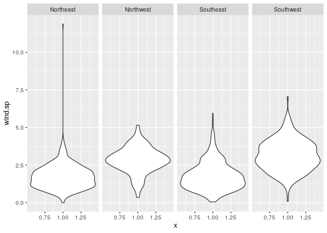
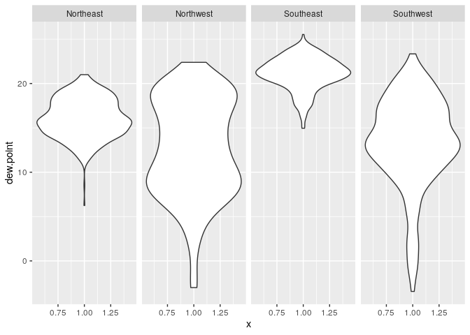
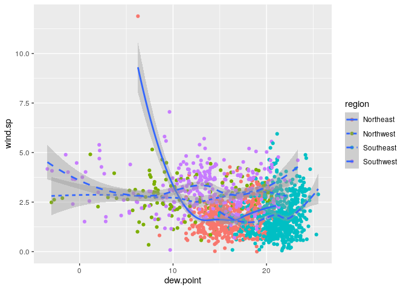
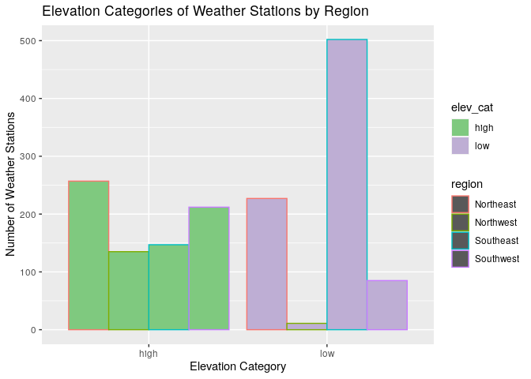
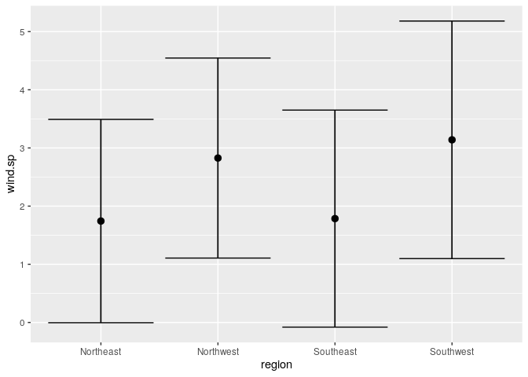
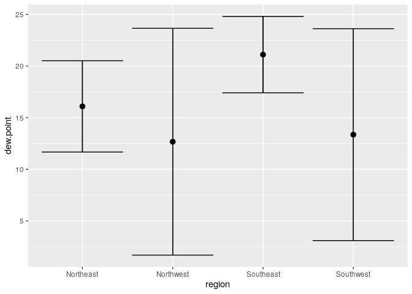

PM566\_LAB4
================
Ram Ayyala
9/17/2021

# Read in the Data

``` r
library(data.table)
if (!file.exists("met_all.gz"))
  download.file(
    url = "https://raw.githubusercontent.com/USCbiostats/data-science-data/master/02_met/met_all.gz",
    destfile = "met_all.gz",
    method   = "libcurl",
    timeout  = 60
    )
met <- data.table::fread("met_all.gz")
```

# Prepare the Data

\#\#Remove Temperatures less than -17C

``` r
met <- met[temp>=-17][order(temp)]
summary(met)
```

    ##      USAFID            WBAN            year          month        day    
    ##  Min.   :690150   Min.   :  116   Min.   :2019   Min.   :8   Min.   : 1  
    ##  1st Qu.:720927   1st Qu.: 3705   1st Qu.:2019   1st Qu.:8   1st Qu.: 8  
    ##  Median :722720   Median :13841   Median :2019   Median :8   Median :16  
    ##  Mean   :723095   Mean   :29496   Mean   :2019   Mean   :8   Mean   :16  
    ##  3rd Qu.:725090   3rd Qu.:54768   3rd Qu.:2019   3rd Qu.:8   3rd Qu.:24  
    ##  Max.   :726813   Max.   :94998   Max.   :2019   Max.   :8   Max.   :31  
    ##                                                                          
    ##       hour            min             lat             lon         
    ##  Min.   : 0.00   Min.   : 0.00   Min.   :24.55   Min.   :-124.29  
    ##  1st Qu.: 6.00   1st Qu.:20.00   1st Qu.:33.98   1st Qu.: -98.02  
    ##  Median :11.00   Median :48.00   Median :38.37   Median : -91.74  
    ##  Mean   :11.46   Mean   :39.23   Mean   :37.97   Mean   : -92.14  
    ##  3rd Qu.:17.00   3rd Qu.:55.00   3rd Qu.:41.96   3rd Qu.: -82.99  
    ##  Max.   :23.00   Max.   :59.00   Max.   :48.94   Max.   : -68.31  
    ##                                                                   
    ##       elev           wind.dir      wind.dir.qc        wind.type.code    
    ##  Min.   : -13.0   Min.   :  3      Length:2317212     Length:2317212    
    ##  1st Qu.: 101.0   1st Qu.:120      Class :character   Class :character  
    ##  Median : 252.0   Median :180      Mode  :character   Mode  :character  
    ##  Mean   : 415.1   Mean   :185                                           
    ##  3rd Qu.: 400.0   3rd Qu.:260                                           
    ##  Max.   :9999.0   Max.   :360                                           
    ##                   NA's   :732171                                        
    ##     wind.sp       wind.sp.qc          ceiling.ht    ceiling.ht.qc  
    ##  Min.   : 0.00   Length:2317212     Min.   :    0   Min.   :1.000  
    ##  1st Qu.: 0.00   Class :character   1st Qu.: 3048   1st Qu.:5.000  
    ##  Median : 2.10   Mode  :character   Median :22000   Median :5.000  
    ##  Mean   : 2.46                      Mean   :16171   Mean   :4.945  
    ##  3rd Qu.: 3.60                      3rd Qu.:22000   3rd Qu.:5.000  
    ##  Max.   :36.00                      Max.   :22000   Max.   :9.000  
    ##  NA's   :31743                      NA's   :73442                  
    ##  ceiling.ht.method    sky.cond            vis.dist      vis.dist.qc       
    ##  Length:2317212     Length:2317212     Min.   :     0   Length:2317212    
    ##  Class :character   Class :character   1st Qu.: 16093   Class :character  
    ##  Mode  :character   Mode  :character   Median : 16093   Mode  :character  
    ##                                        Mean   : 14924                     
    ##                                        3rd Qu.: 16093                     
    ##                                        Max.   :160000                     
    ##                                        NA's   :33674                      
    ##    vis.var           vis.var.qc             temp          temp.qc         
    ##  Length:2317212     Length:2317212     Min.   :-17.00   Length:2317212    
    ##  Class :character   Class :character   1st Qu.: 19.60   Class :character  
    ##  Mode  :character   Mode  :character   Median : 23.50   Mode  :character  
    ##                                        Mean   : 23.59                     
    ##                                        3rd Qu.: 27.80                     
    ##                                        Max.   : 56.00                     
    ##                                                                           
    ##    dew.point      dew.point.qc         atm.press        atm.press.qc  
    ##  Min.   :-37.20   Length:2317212     Min.   : 960.5    Min.   :1.000  
    ##  1st Qu.: 13.80   Class :character   1st Qu.:1011.8    1st Qu.:5.000  
    ##  Median : 18.10   Mode  :character   Median :1014.1    Median :9.000  
    ##  Mean   : 17.02                      Mean   :1014.2    Mean   :7.696  
    ##  3rd Qu.: 21.70                      3rd Qu.:1016.4    3rd Qu.:9.000  
    ##  Max.   : 36.00                      Max.   :1059.9    Max.   :9.000  
    ##  NA's   :6295                        NA's   :1606788                  
    ##        rh         
    ##  Min.   :  0.833  
    ##  1st Qu.: 55.790  
    ##  Median : 76.554  
    ##  Mean   : 71.641  
    ##  3rd Qu.: 90.629  
    ##  Max.   :100.000  
    ##  NA's   :6295

\#\#Make sure there are no missing data in the key variables coded as
9999, 999, etc

``` r
met[, range(temp)]
```

    ## [1] -17  56

``` r
met[, range(rh, na.rm=TRUE)]
```

    ## [1]   0.8334298 100.0000000

``` r
met[, range(wind.sp, na.rm=TRUE)]
```

    ## [1]  0 36

``` r
met[, range(vis.dist, na.rm=TRUE)]
```

    ## [1]      0 160000

``` r
met[, range(dew.point, na.rm=TRUE)]
```

    ## [1] -37.2  36.0

``` r
met[, range(lat, na.rm=TRUE)]
```

    ## [1] 24.550 48.941

``` r
met[, range(lon, na.rm=TRUE)]
```

    ## [1] -124.290  -68.313

``` r
met[, range(elev, na.rm=TRUE)]
```

    ## [1]  -13 9999

``` r
met[met$elev==9999.0] <- NA
summary(met$elev)
```

    ##    Min. 1st Qu.  Median    Mean 3rd Qu.    Max.    NA's 
    ##   -13.0   101.0   252.0   414.3   400.0  4113.0     182

\#\#Generate a date variable

``` r
met$date<-as.Date(paste(met$year,met$month,met$day, sep="-"))
summary(met)
```

    ##      USAFID            WBAN            year          month          day     
    ##  Min.   :690150   Min.   :  116   Min.   :2019   Min.   :8     Min.   : 1   
    ##  1st Qu.:720927   1st Qu.: 3705   1st Qu.:2019   1st Qu.:8     1st Qu.: 8   
    ##  Median :722710   Median :13841   Median :2019   Median :8     Median :16   
    ##  Mean   :723095   Mean   :29494   Mean   :2019   Mean   :8     Mean   :16   
    ##  3rd Qu.:725090   3rd Qu.:54767   3rd Qu.:2019   3rd Qu.:8     3rd Qu.:24   
    ##  Max.   :726813   Max.   :94998   Max.   :2019   Max.   :8     Max.   :31   
    ##  NA's   :182      NA's   :182     NA's   :182    NA's   :182   NA's   :182  
    ##       hour            min             lat             lon         
    ##  Min.   : 0.00   Min.   : 0.00   Min.   :24.55   Min.   :-124.29  
    ##  1st Qu.: 6.00   1st Qu.:21.00   1st Qu.:33.98   1st Qu.: -98.02  
    ##  Median :11.00   Median :48.00   Median :38.37   Median : -91.74  
    ##  Mean   :11.46   Mean   :39.24   Mean   :37.97   Mean   : -92.14  
    ##  3rd Qu.:17.00   3rd Qu.:55.00   3rd Qu.:41.96   3rd Qu.: -82.99  
    ##  Max.   :23.00   Max.   :59.00   Max.   :48.94   Max.   : -68.31  
    ##  NA's   :182     NA's   :182     NA's   :182     NA's   :182      
    ##       elev           wind.dir      wind.dir.qc        wind.type.code    
    ##  Min.   : -13.0   Min.   :  3      Length:2317212     Length:2317212    
    ##  1st Qu.: 101.0   1st Qu.:120      Class :character   Class :character  
    ##  Median : 252.0   Median :180      Mode  :character   Mode  :character  
    ##  Mean   : 414.3   Mean   :185                                           
    ##  3rd Qu.: 400.0   3rd Qu.:260                                           
    ##  Max.   :4113.0   Max.   :360                                           
    ##  NA's   :182      NA's   :732176                                        
    ##     wind.sp       wind.sp.qc          ceiling.ht    ceiling.ht.qc  
    ##  Min.   : 0.00   Length:2317212     Min.   :    0   Min.   :1.000  
    ##  1st Qu.: 0.00   Class :character   1st Qu.: 3048   1st Qu.:5.000  
    ##  Median : 2.10   Mode  :character   Median :22000   Median :5.000  
    ##  Mean   : 2.46                      Mean   :16171   Mean   :4.945  
    ##  3rd Qu.: 3.60                      3rd Qu.:22000   3rd Qu.:5.000  
    ##  Max.   :36.00                      Max.   :22000   Max.   :9.000  
    ##  NA's   :31764                      NA's   :73442   NA's   :182    
    ##  ceiling.ht.method    sky.cond            vis.dist      vis.dist.qc       
    ##  Length:2317212     Length:2317212     Min.   :     0   Length:2317212    
    ##  Class :character   Class :character   1st Qu.: 16093   Class :character  
    ##  Mode  :character   Mode  :character   Median : 16093   Mode  :character  
    ##                                        Mean   : 14924                     
    ##                                        3rd Qu.: 16093                     
    ##                                        Max.   :160000                     
    ##                                        NA's   :33674                      
    ##    vis.var           vis.var.qc             temp          temp.qc         
    ##  Length:2317212     Length:2317212     Min.   :-17.00   Length:2317212    
    ##  Class :character   Class :character   1st Qu.: 19.60   Class :character  
    ##  Mode  :character   Mode  :character   Median : 23.50   Mode  :character  
    ##                                        Mean   : 23.59                     
    ##                                        3rd Qu.: 27.80                     
    ##                                        Max.   : 56.00                     
    ##                                        NA's   :182                        
    ##    dew.point      dew.point.qc         atm.press        atm.press.qc  
    ##  Min.   :-37.20   Length:2317212     Min.   : 960.5    Min.   :1.000  
    ##  1st Qu.: 13.80   Class :character   1st Qu.:1011.8    1st Qu.:5.000  
    ##  Median : 18.10   Mode  :character   Median :1014.1    Median :9.000  
    ##  Mean   : 17.02                      Mean   :1014.2    Mean   :7.696  
    ##  3rd Qu.: 21.70                      3rd Qu.:1016.4    3rd Qu.:9.000  
    ##  Max.   : 36.00                      Max.   :1059.9    Max.   :9.000  
    ##  NA's   :6295                        NA's   :1606788   NA's   :182    
    ##        rh               date           
    ##  Min.   :  0.833   Min.   :2019-08-01  
    ##  1st Qu.: 55.790   1st Qu.:2019-08-08  
    ##  Median : 76.554   Median :2019-08-16  
    ##  Mean   : 71.641   Mean   :2019-08-16  
    ##  3rd Qu.: 90.629   3rd Qu.:2019-08-24  
    ##  Max.   :100.000   Max.   :2019-08-31  
    ##  NA's   :6295      NA's   :182

## Keep the observations of the first week of the month, which is week 31

``` r
met[, table(data.table::week(date))]
```

    ## 
    ##     31     32     33     34     35 
    ## 297235 521565 527882 523806 446542

``` r
met <-met[data.table::week(met$date)==31]
```

## Compute means

``` r
met_avg <- met[, .(
  temp=mean(temp, na.rm=TRUE),
  rh=mean(rh, na.rm=TRUE),
  wind.sp=mean(wind.sp, na.rm=TRUE),
  vis.dist=mean(vis.dist, na.rm=TRUE),
  dew.point=mean(dew.point, na.rm=TRUE),
  lat=mean(lat, na.rm=TRUE),
  lon=mean(lon, na.rm=TRUE),
  elev=mean(elev, n.rm=TRUE)
), by = "USAFID"]
met_avg
```

    ##       USAFID      temp       rh   wind.sp vis.dist  dew.point      lat
    ##    1: 722817 -17.00000      NaN 5.1000000      NaN        NaN 38.76700
    ##    2: 725846  13.26316 57.04408 1.5231579 16093.00  2.7947368 39.32000
    ##    3: 726228  13.87603 76.49562 0.8180556 11593.03  8.5472603 44.38500
    ##    4: 723894  17.97326 34.72814 2.4013889 16093.00 -0.7194444 37.63294
    ##    5: 726664  14.31979 63.53435 1.0053191      NaN  6.1958333 44.54392
    ##   ---                                                                 
    ## 1572: 722788  37.58730 32.34272 2.6587302 16093.00 17.2698413 33.41719
    ## 1573: 722780  36.13750 35.26803 2.8313559 16000.13 16.9625000 33.42877
    ## 1574: 723788  37.53953 19.90287 1.8395349 17814.68  9.5860465 35.15700
    ## 1575: 722073  32.22857 54.36891 0.2142857 16093.00 21.8285714 34.97600
    ## 1576: 723805  39.65417 17.11396 2.8627660 16093.00  9.2604167 34.76800
    ##             lon    elev
    ##    1: -104.3000 1838.00
    ##    2: -120.1390 1798.00
    ##    3:  -74.2070  507.00
    ##    4: -118.8499 2173.00
    ##    5: -110.4210 2388.00
    ##   ---                  
    ## 1572: -112.3828  295.00
    ## 1573: -112.0050  337.15
    ## 1574: -114.5591  212.00
    ## 1575:  -78.3640   45.00
    ## 1576: -114.6180  279.00

## Create region variable

``` r
met_avg[lat >= 39.71 & lon <= -98.00, region := "Northwest"]
met_avg[lat < 39.71 & lon <= -98.00, region := "Southwest"]
met_avg[lat >= 39.71 & lon > -98.00, region := "Northeast"]
met_avg[lat < 39.71 & lon > -98.00, region := "Southeast"]
met_avg[, table(region, useNA ="always")]
```

    ## region
    ## Northeast Northwest Southeast Southwest      <NA> 
    ##       484       146       649       297         0

## Create categorical Elevation variable

``` r
met_avg[, elev_cat := data.table::fifelse(elev > 252, "high", "low")]
```

# 3\. Examine the wind speed and dew point temperature by region using geom\_violin

``` r
library(tidyverse)
met_avg[!is.na(region)] %>% ggplot(met_avg, mapping =aes(y= wind.sp, x=1)) + geom_violin() + facet_grid(~ region)
```

    ## Warning: Removed 15 rows containing non-finite values (stat_ydensity).

<!-- -->

``` r
met_avg[!is.na(region)] %>% ggplot(met_avg, mapping =aes(y= dew.point, x=1)) + geom_violin() + facet_grid(~ region)
```

    ## Warning: Removed 1 rows containing non-finite values (stat_ydensity).

<!-- --> \#\#\#
The windspeed in the Northeast and Southeast is relatively the same,
except that the Northeast seems to have some form of an outlier. The
Nortwest and Southwest regions have similarish wind speeds, but the
Southwest seems to have a bigger range. In terms of dew point
temperature, the Northwest and Southwest seem to have relatively similar
dew point distributions. On the other hand, the Southeast and Northeast
dew point distributions are relatively different. The Northeast
distribution seems to have a higher dew point temperature than the
Southeast region.

## 4\. Use geom\_jitter with stat\_smooth to examine the association between dew point temperature and wind speed by region

``` r
met_avg[!is.na(dew.point) & !is.na(wind.sp)] %>%
  ggplot() + 
  geom_jitter(mapping=aes(x=dew.point, y=wind.sp, color=region)) + geom_smooth(mapping = aes(x = dew.point, y = wind.sp, linetype = region))
```

    ## `geom_smooth()` using method = 'loess' and formula 'y ~ x'

<!-- --> \#\#\#
It seems that there is a negative association bewteen wind speed and dew
point temperature.

## 5\. Use geom\_bar to create barplots of the weather stations by elevation category coloured by region

``` r
met_avg[!is.na(elev_cat)] %>%
  ggplot() + 
  geom_bar(mapping = aes(x = elev_cat, colour= region, fill = elev_cat), position = "dodge") + scale_fill_brewer(palette = "Accent") + labs(title = "Elevation Categories of Weather Stations by Region") + 
  labs(x = "Elevation Category", y = "Number of Weather Stations")
```

<!-- --> \#\#\#
It seems there is a similar number of weather stations in the Northeast
region in both high and low elevations. However, in the Northwest, there
are very little weather stations at low elevations, while there are some
weather stations at the high elevations. For the southeast region, there
is a high number of weather stations in the low elevation category, but
only some weather stations at the high elevation category. For the
southwest region, there are more weather stations at high elevations
than at low elevations.

## 6\. Use stat\_summary to examine mean dew point and wind speed by region with standard deviation error bars

``` r
ggplot(
    met_avg[!is.na(wind.sp) & !is.na(dew.point)],
    mapping = aes(x = region, y = wind.sp)) +
    stat_summary(fun.data = "mean_sdl") + 
    stat_summary(fun.data = "mean_sdl", geom="errorbar")
```

<!-- -->

``` r
ggplot(
    met_avg[!is.na(wind.sp) & !is.na(dew.point)],
    mapping = aes(x = region, y = dew.point)) +
    stat_summary(fun.data = "mean_sdl") + 
    stat_summary(fun.data = "mean_sdl", geom="errorbar")
```

<!-- --> \#\#\# I
observe that the northwest and southwest regions have similar windspeed
and dew point temperatures, while the northeast and southeast regions
have similar windspeed and dew point temperatures. The dew point
temperature from around 17 - 21 mph for the Northeast and southeast
regions. For the Northwest and Southwest regions, the dew point
temperature is around 12C. In terms of windspeed, the Northeast and
Southeast regions had a windspeed of about 1.75 mph, while the Northwest
and Southwest regions had a windspeed of about 3mph.

## 7\. Make a map showing the spatial trend in relative h in the US

``` r
library(leaflet)

temp.pal <- colorNumeric(c('darkgreen','goldenrod','brown'), domain=met_avg$rh)

leaflet(met_avg) %>%
  addProviderTiles('CartoDB.Positron') %>%
  addCircles(
    lat = ~lat, lng=~lon,
                                                  # HERE IS OUR PAL!
    label = ~paste0(round(rh,2), ' rh'), color = ~ temp.pal(rh),
    opacity = 1, fillOpacity = 1, radius = 500
    ) %>%
  # And a pretty legend
  addLegend('bottomleft', pal=temp.pal, values=met_avg$rh,
          title='Temperature, C', opacity=1) %>%
  addMarkers(met_avg$lon,met_avg$lat, rank(-met_avg$rh) <= 10)
```

<div id="htmlwidget-e5a77041adf970dd6ed3" style="width:672px;height:480px;" class="leaflet html-widget"></div>
<script type="application/json" data-for="htmlwidget-e5a77041adf970dd6ed3">{"x":{"options":{"crs":{"crsClass":"L.CRS.EPSG3857","code":null,"proj4def":null,"projectedBounds":null,"options":{}}},"calls":[{"method":"addProviderTiles","args":["CartoDB.Positron",null,null,{"errorTileUrl":"","noWrap":false,"detectRetina":false}]},{"method":"addCircles","args":[[38.767,39.32,44.385,37.6329375,44.5439166666667,38.898,39.7999649122807,37.45,39.229,44.6830173611111,45.469,36.4219789915966,42.7959722222222,38.483,44.576,44.368,43.4170526315789,44.68,42.584,46.15,43.78,45.199,46.311,45.932,43.6000538461538,42.1665,43.7690173913043,45.654,48.2990069444444,43.548,44.27,44.267034965035,45.9823725490196,42.6900105263158,46.3502985074627,38.3558888888889,46.117,45.013,40.9016782608696,41.491,44.3595777777778,45.7324166666667,41.824,44.2822452830189,39.4302195121951,39.05,43.041,43.967,45.154,44.251,43.963,43.743,37.706,39.2957391304348,40.4947538461538,44.534015503876,45.0708732394366,44.55,44.133,45.709,44.4500989010989,35.67,38.533,43.2041351351351,43.344,41.333,43.067,48.726,34.717,42.9,43.1090546448087,43.933,44.567,43.459,45.101,46.417,42.223,42.9196190476191,40.829,44.889,42.147,44.204,43.991,43.9888899082569,46.549,41.8,45.787720338983,44.6259243697479,44.883578313253,38.698,40.517,41.0370069444444,43.167,48.4670555555556,38.15,39.6670277777778,44.523,34.89908,37.438232,37.9500555555556,39.23,39.6009896907216,42.911,43.322,43.51896,41.333,43.394,44.42,44.741,42.5950338983051,43.769,41.893,42.5740489130435,43.663,42.246,46.6890105263158,44.614,43.7174578947368,35.237,40.0441,43.35,43.533,43.338,41.8,41.316953271028,47.286,43.626,42.805,44.05,44.936,44.929,45.1174464285714,41.921,43.622,43.426,45.417,46.682914893617,37.283,42.517,39.4670729166667,43.433,42.046,38.0970520833333,34.6669939759036,34.607,40.6117743055556,41.703,38.7801795774648,45.928,42.6171111111111,44.7825987654321,42.9920760869565,35.1422518518519,35.946,37.3704285714286,38.5040806451613,42.6969863013699,42.417,44.0219583333333,42.2668653846154,42.251,42.9009821428571,40.978,44.533,42.8939591836735,44.6500208333333,44.4838,43.984,46.026,47.049,42.566,41.425,44.892,38.533,44.783,45.426,40.924,43.433,36.4503669724771,41.5329339622642,39.6494455445545,37.7087913043478,41.7870833333333,43.234,41.743,43.1540338983051,42.0569496855346,40.068,41.78,42.9669915966387,43.1399841269841,42.761,44.85,43.522,45.698,41.932,41.5,42.6290729166667,40.747,41.275,44.333,47.1039166666667,41.4440347222222,39.18334375,44.095,40.204,48.929,45.506,40.3677418111753,43.467,41.5399826388889,39.2170416666667,42.351,42.4836095238095,42.746,41.94,41.276,42.223972027972,43.500125,44.067,44.2655649350649,45.497,41.933,45.419,34.1170196078431,38.21,41.876,42.57,42.109,41.9139375,41.7084285714286,47.46703125,42.7747142857143,41.868,42.1940178571429,41.9910671641791,41.595,41.2730377358491,36.664,44.45,43.567,42.1260540540541,44.6379916666667,40.031,41.352,40.52,45.698,42.608,42.07,40.9331041666667,34.98806,40.708,40.412,39.845,37.1429756097561,41.179,43.117,39.83403125,42.2331,42.308,42.796,40.4796875,42.815,41.781,42.6,42.074,43.278,44.79845,44.4678253968254,42.6650303030303,43.533,44.867,44.3590175438597,43.733,43.021,44.7687419354839,40.11696,46.619,41.736,40.947,41.3000729166667,38.533,38.909,35.3,37.513,41.066,46.925,48.381,40.711,44.0739663299663,40.2,37.333,42.191,40.777,41.3829673202614,42.241,41.8166344086021,41.691,43.2750174216028,42.4360070175439,41.3670104166667,41.053,47.822,46.7028088235294,46.4472977667494,44.018,44.482979020979,45.56,44.933,44.4764497607655,45.308013986014,39.9000103626943,39.016,41.121,36.7410157480315,35.654,39.756,40.528,39.2749834710744,37.307,39.417,36.5879946236559,37.359,41.393,42.552,41.047012195122,42.159,43.1123913043478,41.778,40.04,39.478,40.9739291338583,41.4628571428571,41.8328541666667,46.1439583333333,42.482,42.5420202020202,45.462,42.8829538461538,42.235,43.1704285714286,42.9541578947368,43.212,43.156,43.9059642857143,42.4709405204461,43.677,36.2,36.432,45.823,35.165,41.604,41.96,45.149972027972,39.531,41.0326610169492,35.658,39.163,34.426,39.4309724770642,39.452,38.8833333333333,40.483,40.097,38.506,38.051,37.693,42.571,41.742,40.616,40.873,39.364,40.472,40.0230701754386,43.10799,41.9656696428571,40.6676899224806,41.453,41.883,42.111,42.5534285714286,41.1569923664122,45.648,42.4530034843206,40.333,43.235,47.29,47.796,39.7,40.684,34.2640069686411,40.1759863945578,39.84,38.323,38.5662207792208,37.4667272727273,41.7010438596491,40.6329860627178,40.234,40.46,42.742,43.073,41.674,42.046,40.659,41.099,41.1889965156794,42.887,48.016,44.628,44.589,43.6828710601719,41.217,40.6499099099099,40.225,40.293,43.019,33.898,33.023,37.298,37.867,39.1331354166667,40.436,39.4862857142857,37.6196335877863,42.47,41.9099716981132,42.584,40.1330175438597,42.2062222222222,42.643,41.3459591836735,41.2566859504132,41.338,41.108,42.3983571428571,42.8370085470086,41.8706081081081,39.5279583333333,42.061,43.4011875,44.339,43.6498333333333,39.217,41.828,42.683,38.946,33.8998020833333,43.0829065420561,42.219,35.8829270833333,37.7500260416667,41.716972027972,42.615,41.226,40.96,41.5669220779221,38.607,39.817,38.583,41.4,45.372,39.428,38.2388765432099,40.0330208333333,40.167,38.0329893992933,43.581,48.784,48.48,48.405,48.301,40.28,38.089,41.584,42.0980416666667,35.003,33.4500909090909,33.3000701754386,35.5139743589744,35.617,34.2169696969697,34.201,38.8848644067797,37.8001649484536,39.944,39.103,39.578,39.2669253731343,37.761,37.2829693877551,38.4261184573003,38.417,37.3827125748503,38.3779791666667,38.69596875,37.721,37.5168275862069,41.676,41.626,40.296,40.2827784810127,41.6169797297297,41.717,42.2275912408759,42.099,42.409,41.139,41.5338584070796,42.049006993007,42.681,42.5500198019802,41.7000105263158,40.443,37.654,39.126,43.6439692307692,44.316,45.644,45.543,44.8590987654321,45.9491012345679,43.6495625,44.077,44.0434046242775,43.0644137931034,46.357603960396,42.543,35.821,45.159065625,36.766,38.01,41.052,38.678,40.333,35.195,40.7680340136054,30.371,33.975,32.572,36.895,41.5630625,40.0780204081633,39.89621875,37.78,38.1319479166667,37.2619736842105,38.81,40.4500606060606,38.5070659340659,41.921,41.9373103448276,41.3710247933884,40.316,42.7348620689655,42.9391037037037,41.5864482758621,41.014,40.219,42.3772265625,43.879,46.4049457364341,44.3810243902439,44.2171132075472,43.966,44.51709,38.65,39.717,41.11765625,43.987,32.633,42.732,39.1330566037736,39,37.578,40.5670138888889,40.6168541666667,41.552,36.33,48.884,48.39,46.9419722222222,46.218,46.244,43.6209936507937,45.2363672456576,38.247,44.779,36.285,48.941,34.9013333333333,39.143,37.9500037593985,36.988,37.7839315068493,40.167,39.9007005988024,41.650275862069,40.8499723756906,41.407,43.078,41.0190104529617,41.0073902439024,41.986,41.299,41.0100034843206,43.208,42.597,48.941,45.566,44.3191214285714,44.123,45.1498888888889,44.15,42.242,33.219,37.225,34.518,38.264,37.1330555555556,40.8200306122449,39.5939489795918,39.9923982300885,41.038,39.72675,39.825,39.937125,38.8170234375,38.704,39.57,39.609,39.1019583333333,37.8905714285714,37.9919791666667,41.509,41.51,41.4828655462185,41.2527125748503,40.4928167938931,41.40884375,41.7855714285714,40.783,41.633,40.6309905660377,41.119,41.196,43.164,44.051,43.774,45.062,43.645,44.381,38.783,42.5770208333333,36.3610138888889,37.208,44.857,41.964,35.8999826388889,36.6830555555556,37.064,40.893,36.855,39.9280555555556,32.816,33.286,36.4799596774194,36.449081300813,34.741,34.629,36.3170416666667,38.376387755102,39.4039365079365,39.34,37.057408,39.823,38.07,37.285,41.626,40.3549850746269,40.9178571428571,42.0804210526316,38.571,38.764,41.623,41.764,41.9857,42.3931428571429,40.206,40.5099854014599,39.8404466666667,42.8784624277457,45.032,44.548,44.932,44.517,45.8054044117647,33.79,35.145,38.955,45.117,37.633,38.0669684210526,46.217027972028,36.783,41.384,44.016,35.883,47.451,30.902,36.654,46.768,37.974,36.023,36.4371666666667,34.0992727272727,32.826,33.803,35.428,35.4321100917431,36.223,36.056,34.257,39.078,40.7999636363636,39.643,37.0539965277778,38.8495912408759,38.6670421052632,41.5,40.821,41.2437417218543,40.7510034965035,40.722,41.4331013513514,45.2280579710145,44.969,43.983,46.2830860759494,45.1421948051948,43.65,39.6000627615063,37.751,37.186,38.398,34.43244,31.458,34.016,33.9373798449612,35.951,36.773,35.94,36.744,34.6520163934426,36.319,37.358,37.3222972972973,39.2960060606061,38.3654024390244,38.657,38.249,38.591,38.096,38.2890655737705,39.3760243902439,42.072,42.271,39.918,41.433,41.1202426035503,39.2769583333333,44.300101010101,45.6689793814433,44.3954864864865,44.831898989899,45.6039591836735,43.567,36.4139895833333,39.7669583333333,35.858,37.183,37.9000578512397,37.7499285714286,39.7840706521739,40.789,30.886,36.687,36.611,44.7293663366337,36.688,39.1670344827586,34.85,41.35,40.624,34.3837142857143,38.5859479166667,31.607,33.952,34.201,32.8670223880597,35.5930603448276,36.2669626865672,35.1820101010101,38.9412047244095,36.573,37.5909927007299,39.0448938053097,38.0447946428571,37.927,37.05,38.0490103092784,39.367025,37.6240416666667,41.669,41.7244159292035,41.7360280373832,40.433,40.08,40.7208217821782,40.1516964285714,40.5154285714286,42.8803669064748,44.905,44.4500729166667,45.4437814569536,47.133,45.5460072463768,31.397,40.435,35.538,41.4120868055556,36.665,36.9,34.383,36.533,34.315,38.3500252707581,33.912,34.8167985611511,33.433,35.7,35.38,39.332,34.269,46.839,34.979,34.167,35.2119369369369,38.783,33.872,38.527,35.726,36.666,38.1370680272109,39.7060327868852,38.5499479166667,37.7650256410256,42.778,41.259,40.8940208333333,40.7323142857143,44.753,40.1,35.6334545454545,37.4,36.682,35.582,40.948,37.033,34.21,32.7338823529412,37.7080084745763,41.7299826388889,36.878,35.0264590163934,34.7448571428571,38.267,41.009,38.0398571428571,38.1849375,37.75,37.086962962963,38.7525178571429,39.7739423076923,39.0080361445783,38.3499558823529,37.2839583333333,38.95,39.245,39.1311379310345,40.822,41.067,41.533,40.2380535714286,41.3338120805369,40.961530927835,40.606,40.7792121212121,43.5786896551724,45.8679215686275,44.883,42.47,35.6130833333333,41.2330277777778,32.756,40.4500625,33.6329861111111,34.067,38.7171274509804,35.0170277777778,37.85,36.298,40.1490104166667,31.5879685534591,35.646,34.267,33.9670454545455,34.0237473684211,33.128,33.923,33.8126666666667,34.672,36.0940331125828,35.8177837837838,36.6239473684211,36,36.125,36.291,36.372,35.2269185185185,35.040243902439,36.7780714285714,38.721,40.0169906542056,37.7460258064516,38.065,38.0675683453237,38.3290193548387,39.0724845360825,38.876,41.073,41.264,41.3280163934426,40.6500149253731,41.3085714285714,40.8508947368421,40.6010245398773,43.3909012345679,35.256,34.229,35.6,39.983,33.902,34.5,34.7170629370629,34.4,38.717074204947,34.915,35.178,39.4170282485876,36.6050489510489,33.8750135135135,31.467,35.55,32.84,35.0668586572438,35.742,36.698,34.758,35.2226,35.3504228187919,36.2829820359281,36.191,34.8499588014981,36.983,39.3660142857143,36.0229508196721,39.7997674418605,40.3731417322835,41.117,41.449,30.383,32.214,35.781,35.483,35.417,34.9170208333333,37.521,33.96628125,36.46,38.96,34.123,32.5158230088496,31.395,31.4209752066116,32.567,33.6799674796748,35.889037037037,34.249,35.237,36.134,35.0170136054422,34.1799285714286,39.941,40.183,40.277,37.317132231405,38.228,37.2392328767123,38.8499672131148,38.832,37.0910559006211,41.688,40.3300280373832,40.1200135135135,41.518,41.196,35.864,35.4329930555556,32.675,34.891,32.514,37,43.7669965277778,34.861,35.4729375,34.594,32.915,31.35,32.2830416666667,36.333,31.356,30.65,35.0331105990783,34.545,33.636,33.7799859649123,30.243,30.750012345679,30.7036423357664,30.4600208333333,34.3,34.783,33.6499823943662,33.717,34.717,34.181,32.9170139372822,34,33.8280106007067,35.483,34.6170174825175,30.735,39.608,32.304,34.689,33.227,36.773,35.135,36.2939756944444,34.3168229166667,35.541,35.389923566879,31.083,34.722,34.2720268456376,35.929,30.78,32.564,38.5330415224914,33.9169124087591,34.653,33.587,33.178,32.55,34.681,33.6637543859649,32.6927905759162,35.173985645933,35.765,35.3175798816568,35.855,34.833,34.187961038961,33.587,33.9482191780822,34.4652608695652,34.9870136054422,34.8871801242236,36.047,34.3482875816993,34.679,35.554,33.45,35.8310097087379,34.6,36.369,36.3498195488722,36.01,37.152,35.357,36.3829772727273,35.8519459459459,37.510325203252,38.2998823529412,39.4716,39.4517664233577,39.133,39.2938671328671,37.6170177304964,39.5509120879121,38.8,38.75,33.861,41.1592631578947,40.7790188679245,42.362546875,35.2499542857143,36.399,38.7169814814815,35.0960034722222,31.2670535714286,40.301,37.45,31.684,35.4169813084112,36.018,35.95,32.2,36.682,31.0429927536232,31.846,37.158,30.3490782608696,35.724,30.783,33.3643461538461,35.3570034722222,33.779,30.717106870229,32.35,31.860985915493,31.416,33.5659732142857,29.81732,32.3201048951049,31.1829032258065,30.205,33.2365151515151,32.262,34.991,36.261,36.817,36.9023766233766,37.132,33.462,34.498,34.6445774647887,36.009,33.65,34.7270208333333,35.3876086956522,38.341,40.195975,37.647,38.5039826086957,39.1743125,40.876,37.1680060240964,37.6699878787879,37.1,40.85,40.217,33.53,40.617,31.4770209059233,38.981,31.736,33.598,33.154,31.056,33.183,33.2500286738351,34.283,33.063,35.937,31.606,32.609,34.804,27.9999329268293,35.438,30.368,35.0210104166667,33.6322666666667,31.317,32.6159923076923,33.212,30.5210173611111,32.233020979021,31.616856,29.947,31.7999581881533,32.853,34.2678106508876,35.6330138888889,36.937,34.8460434782609,36.1674029850746,34.3000114285714,38.804,39.3326956521739,28.817,40.7799618320611,41.597,32.521,30.3997086614173,32.6877403314917,33.3550437956204,30.6874405594406,32.3348085106383,32.35,31.8309896907216,31.3997321428571,31.0226554621849,36.0280173010381,34.9000066666667,33.9430158730159,33.9709661016949,34.792,35.197,34.744032,36.1432251655629,35.0546849315068,35.534,35.657,36.768,35.2592564102564,37.9365294117647,38.69,38.1815,36.695,32.213,31.106,39.05,34.273,34.602,32.6459965277778,30.291,30.558,31.3829861111111,35.3438203592814,33.175,34.1,32.473,30.8169479166667,28.228,30.173,33.929,29.211,35.9170072727273,32.633,32.5,34.1,29.445,29.167,30.4927005988024,29.6340526315789,31.259,31.536,33.467,32.3,27.349,32.337,29.36,33.3067719298246,32.3340297029703,32.855,35.068,34.708,31.536,35.0338897058824,34.262688,33.221,35.258,34.5470285714286,35.6951212121212,36.9269911504425,35.4338571428571,36.6204159292035,38.8477260273973,40.079,39.674,39.121,37.6482176870748,36.7369056603774,39.1350379746835,40.685203125,29.976,31.841,31.885,31.8831948051948,37.133,34.65,34.65,32.693,37.239,38.967,32.4118745644599,29.8,36.75,35.283,28.867,31.554,29.467,32.646,29.067,32.1100138888889,30.033,30.718,28.014,32.742,34.398,30.219,27.072,27.9499345794393,31.25,32.193,31.666,27.2669861111111,32.383,31.309,31.417,30.833,29.2961754385965,29.2657083333333,29.5660526315789,29.983,33.651,35.9668421052632,33.6170208333333,36.1991059602649,34.882,31.1780104166667,34.427,33.909,38.142,29.5000208333333,31.0496846846847,32.215,28.95,28.474,32.8992206896552,27.911,35.668,29.7329333333333,30.478,30.350125,30.6260175438596,32.516,30.3430175438596,31.236,31.578,27.741,29.8910576923077,30.1992782608696,32.782,30.0479375,31.3540338983051,34.7330076923077,34.6831567164179,33.454,35.333,34.989,36.162,34.854,39.8743223140496,33.312,30.483,33.096,34.699,32.15,32.579,36.1748333333333,32.7170277777778,32.931,32.699,32.747,30.617,26.917,28.4338219178082,28.545,32.1312285714286,34.471,32.482954887218,26.5850117647059,27.9629554140127,27.4007446808511,31.152,28.8210242424242,30.038,30.5369322033898,29.7168396946565,29.7089607843137,30.3569489795918,32.44775,28.8597246376812,31.0830576923077,33.6330350877193,33.2059572649573,30.9121237113402,32.4118421052632,31.8084571428571,35.233,33.9774833333333,34.344,36.039,30.5159756944444,40.033,30.784,32.2174556213018,32.456,33.1100486111111,32.354,32.1491272727273,27.916,32.701,30.533,30.395,35.947,32.4328762886598,26.6847902097902,26.197,27.765,27.182,29.0540882352941,30.210025477707,27.5000714285714,31.1338793103448,31.067,30.069,31.641,29.5329433962264,27.779,30.071,33.85,30.5,28.29,28.78,30.3999189189189,35.9765833333333,27.498,26.536,29.959,29.9508814814815,26.228,27.775252173913,29.11,33.19,30.74094,29.622,31.485,31.9482831858407,31.78,34.29,34.558,29.3830660377358,33.254,26.179,32.036,33.167,27.207,26.442,31.869,30.872,30.131,28.973,31.78,25.483145631068,32.565,29.36675,32.1669903846154,25.907,25.648,26.1549586206897,28.1010243902439,26.2499805194805,30.2330545454545,30.4,29.9954113475177,30.1267534246575,29.562,30.0679393939394,30.744,32.354,32.0309411764706,32.7099814814815,27.9001129032258,29.339,30.3209900990099,30.679,31.1500594059406,31.921,32.1443793103448,33.714,29.296,30.879,26.378,25.9990268456376,28.5169661016949,32.699,33.068,32.8984637681159,32.969,28.654,25.7813551912568,30.049,29.518963963964,29.9783247863248,32.3849895833333,32.664,32.543,26.166,28.0840526315789,28.457,29.5411384615385,32.8519038461538,32.681,32.9503608247423,32.084,30.169,26.967,29.117,29.616156626506,26.184,28.725,31.6186551724138,32.973,29.3763571428571,27.917,34.2999166666667,32.444,24.726,29.638067961165,27.6830970873786,27.5331145833333,32.7670208333333,29.717,33.417020979021,28.6430243902439,28.0556443661972,26.9331041666667,29.1170416666667,29.634,33.269,33.3005294117647,24.5556802325581,36.212,24.5828939393939,33.4668823529412,32.817,36.0735462184874,28.5,27.833,27.6300520833333,29.273,33.5489285714286,27.812,33.623,33.8222474226804,33.688,33.5273272727273,33.4171904761905,33.4287666666667,35.157,34.976,34.768],[-104.3,-120.139015789474,-74.207,-118.849916666667,-110.420979166667,-119.994,-105.765985964912,-106.8,-106.316,-111.116006944444,-89.806,-105.29,-109.806027777778,-106.316,-71.179,-71.5449794520548,-88.132947368421,-84.729,-110.107,-89.217,-82.9859876923077,-89.7110070175439,-85.457,-89.269,-110.733038461538,-120.399916666667,-87.851,-84.519,-116.56,-109.69,-71.3,-86.249979020979,-86.182137254902,-88.3040105263158,-87.3996268656716,-119.518962962963,-89.883,-84.701,-117.806869565217,-120.564,-84.6746133333333,-87.0836416666667,-110.556024305556,-85.4171886792453,-107.380219512195,-105.510314685315,-88.237,-90.733,-89.111,-90.855,-86.408,-111.097,-112.145,-114.845408695652,-107.522246153846,-72.614,-83.564676056338,-89.533,-87.667,-90.402,-83.3997032967033,-120.628,-106.933,-71.5024810810811,-72.5179925373134,-86.667,-83.2674293628809,-116.295,-120.566,-72.267,-88.0311639344262,-90.267,-72.017,-83.4459408450704,-90.303,-86.65,-83.7440353982301,-112.574682539683,-115.788,-116.101,-121.724,-72.562,-70.948,-76.0258348623853,-90.919,-107.2,-111.159822033898,-86.201,-72.2326144578313,-106.07,-106.866,-107.492034722222,-88.717,-122.416069444444,-122.55,-119.876,-114.215,-120.44816,-105.861768,-107.900111111111,-106.87,-116.005051546392,-82.529,-84.688,-112.06308,-122.332,-70.708,-72.019,-85.5829895833333,-87.9376610169491,-88.491,-89.078,-84.811,-84.261,-89.582,-92.0940105263158,-88.731,-85.5003052631579,-120.641,-107.88796,-76.385,-72.95,-73.61,-78.633,-105.682925233645,-68.313,-72.3049913043478,-72.0039914529915,-70.283,-74.846,-89.628,-87.6332232142857,-84.586,-84.737,-88.703,-123.817,-122.983,-107.05,-108.783,-106.15,-83.8665108695652,-90.108,-106.168034722222,-120.466012048193,-120.075027777778,-116.890704861111,-86.821,-106.219820422535,-89.731,-89.0333333333333,-89.667,-84.1384456521739,-111.666548148148,-112.154,-118.359285714286,-122.810048387097,-73.17,-87.867,-82.7929375,-84.4668461538461,-84.9559184782609,-106.471901785714,-124.108005376344,-69.667,-73.2489591836735,-73.4670208333333,-88.1324285714286,-88.557,-91.444,-109.457,-84.4322582417582,-88.419,-91.868,-106.05,-88.55,-84.913,-88.625,-86,-105.666275229358,-85.7830943396226,-106.916158415842,-113.094130434783,-111.852979166667,-75.4119494949495,-89.676,-93.3270338983051,-102.801037735849,-118.569,-124.236009708738,-83.7490840336134,-89.3434761904762,-87.8140306122449,-87.417,-89.774,-110.44,-88.708,-88.167,-83.984,-122.922,-85.84,-89.02,-122.286916666667,-106.826895833333,-119.733038194444,-121.2,-84.532,-103.297,-91.981,-83.8172967244701,-108.386880701754,-87.5319930555555,-104.632958333333,-86.256,-76.4663142857143,-86.097,-83.435,-91.673,-91.165979020979,-114.299875,-69.1,-88.517,-91.0009824561403,-85.053,-91.773,-119.116032679739,-122.284,-71.021,-72.2909880239521,-77.992,-88.24603125,-86.3161428571429,-87.88296875,-84.6,-84.0789405940594,-89.0940357142857,-93.6189850746269,-109.052,-111.030037735849,-121.608,-68.3668834951456,-71.433,-86.428,-90.1880083333333,-86.251,-89.153,-90.652,-92.953,-82.818,-124.29,-90.4329583333333,-117.86398,-84.027,-86.937,-89.684,-107.76,-78.893,-77.6755964912281,-88.866,-83.53294,-85.251,-105.38,-107.217,-108.726,-122.468,-123.364,-124.29,-70.922,-68.81945,-73.1500476190476,-83.4180606060606,-84.08,-91.488,-89.8370350877193,-103.611,-102.518,-106.967967741935,-85.61698,-93.31,-83.655,-91.511,-85.06696875,-121.783,-121.351,-112.2,-122.501,-86.182,-103.982,-102.898,-86.375,-93.553,-87.6,-121.816056603774,-71.174,-79.95,-79.866954248366,-78.371,-85.4335483870968,-93.566,-91.739,-93.869,-91.1499791666667,-91.979,-92.689,-92.504,-95.2119007444169,-92.831,-103.783,-93.608,-73.1,-93.0164497607656,-92.690013986014,-83.1330414507772,-87.65,-87.846,-104.502,-105.141016666667,-82.657,-86.059,-103.666,-108.626,-118.715234693878,-121.844989247312,-121.924,-70.615,-71.756,-78.412006097561,-76.892,-76.1030724637681,-80.696,-88.278,-88.28,-85.2045354330709,-90.5197142857143,-90.3327083333333,-115.596041666667,-114.486,-113.766121212121,-69.595,-85.5222538461538,-85.552,-86.2388571428571,-87.9033157894737,-90.181,-90.678,-92.4933928571429,-93.2078921933085,-92.18,-81.65,-81.4190034722222,-92.373,-107.902,-88.085,-85.593,-92.5330699300699,-84.395,-80.4168305084746,-109.061,-89.675,-119.841983333333,-83.7771376146789,-87.309,-90.0498095238095,-88.95,-92.543,-107.898,-117.09,-121.814054054054,-77.713,-72.184,-83.06398,-81.887,-84.5249381443299,-81.424,-82.4629649122807,-78.93808,-87.9268125,-89.6838914728682,-87.006,-91.717,-92.916,-92.4008571428571,-104.805358778626,-68.6929285714286,-91.948,-82.517,-93.624,-101.581,-103.254,-87.6690034722222,-92.901,-110.006993031359,-80.6469863945578,-83.84,-88.858,-121.299805194805,-122.115954545455,-74.795,-79.1000836236934,-85.394,-91.428,-93.759,-92.611,-93.022,-94.789,-91.327,-102.986,-103.670024390244,-90.236,-92.856,-93.228,-92.485,-93.367,-81.25,-86.1500900900901,-83.352,-88.142,-91.124,-117.602,-118.588,-81.204,-80.4,-86.617,-104.631,-119.772714285714,-122.366320610687,-71.289,-70.729,-70.918,-80.2830409356725,-75.9803333333333,-77.056,-82.1789795918367,-80.6752727272727,-84.429,-92.447,-90.7059464285714,-103.097974358974,-103.593797297297,-107.719166666667,-104.158,-94.74696875,-105.541,-116.6330625,-82.233,-94.16,-90.45,-104.57,-117.25009375,-70.8171121495327,-92.026,-106.282659722222,-89.0000572916667,-92.7001223776224,-89.591,-92.491,-72.252,-81.4831168831169,-87.727,-82.933,-91,-92.946,-94.7461031941032,-101.046,-108.563082304527,-105.21703125,-105.167,-120.416992932862,-116.523,-97.632,-99.236,-97.371,-102.406,-83.115,-88.123,-95.3390069686411,-70.6718958333333,-105.662,-105.516132867133,-117.350350877193,-108.793957264957,-106.088017241379,-119.083083333333,-119.206,-79.8527966101695,-87.6830618556701,-81.892,-84.419,-85.803,-85.8999402985075,-90.4280824742268,-102.613071428571,-113.01244077135,-113.016,-120.566191616766,-121.957104166667,-121.5890625,-122.220008474576,-122.25,-70.958,-80.215,-78.32,-79.4001582278481,-87.4169189189189,-85.983,-83.335598540146,-83.161,-83.01,-75.379,-93.6551592920354,-93.848,-91.974,-94.183198019802,-94.9170421052632,-109.512,-122.115,-123.2,-70.3072,-69.797,-95.32,-94.051,-94.3820987654321,-94.347,-94.4169270833333,-91.708,-103.053809248555,-108.456931034483,-104.250356435644,-83.178,-81.611,-93.842803125,-80.8230104166667,-77.97,-93.689,-104.756007518797,-103.8,-83.8649930555555,-80.3984489795918,-104.016103092784,-117.636020618557,-116.979007042254,-81.35,-83.4761875,-83.0779489795918,-84.1935,-89.25,-91.7650520833333,-104.337035087719,-104.688,-105.015848484848,-121.494978021978,-71.491,-72.6821379310345,-73.4829752066116,-78.834,-73.7992206896552,-78.731437037037,-83.8051724137931,-83.669,-111.723,-122.8707890625,-91.253,-94.1310542635659,-100.285012195122,-93.9170377358491,-107.95,-109.01624,-88.967,-104.75,-111.96665625,-95.783,-108.166,-95.556,-121.433075471698,-80.274,-84.77,-102.267041666667,-103.266854166667,-112.062,-77.635,-99.621,-100.024,-98.018,-100.245,-96.607,-96.2160253968254,-93.9863672456576,-78.046,-95.033,-78.984,-97.903,-117.866078431373,-78.144,-79.8170639097744,-82.53,-81.1223561643836,-103.216,-105.116077844311,-70.5171379310345,-77.8499723756906,-95.047,-94.272,-93.3590104529617,-94.363,-95.3809965034965,-93.114,-95.26,-95.833,-95.241,-95.348,-95.9679265822785,-94.502,-93.261,-93.2168666666667,-103.1,-96.983,-117.349,-89.571,-109.379,-78.896,-80.6829305555556,-82.5179693877551,-84.2259897959184,-82.8781150442478,-81.4640309278351,-86.278625,-86.296,-91.1920625,-92.217796875,-93.183,-104.848018518519,-110.754,-121.56703125,-121.228571428571,-122.055020833333,-74.265,-72.828,-73.1330672268908,-70.1190598802395,-80.2147328244275,-81.85146875,-87.7517142857143,-91.125,-91.543,-93.9009905660377,-101.768041666667,-112.011,-95.202,-101.601,-98.038,-93.351,-95.58,-106.721,-108.067,-100,-78.529,-80.408,-93.033,-100.568,-100.400013888889,-82.033,-89.2190034965035,-97.997,-84.856,-74.2920888888889,-117.139024590164,-117.456,-82.399064516129,-103.152837398374,-118.211,-118.083,-119.399854166667,-81.5921768707483,-77.9462698412698,-81.444,-88.773104,-93.579,-102.688,-120.512,-73.882,-79.9221194029851,-81.4448571428571,-80.1821403508772,-90.1569791666667,-87.606,-98.948,-96.178,-97.4348,-96.3799285714286,-100.591,-101.62001459854,-104.65924,-100.55,-102.019,-95.08,-93.056,-108.082,-108.539933823529,-118.051042735043,-106.795,-121.081003472222,-95.133,-84.333,-83.9829894736842,-97.6331398601398,-76.45,-72.506,-97.086,-101.033,-99.151,-83.881,-83.218,-100.894,-92.691,-78.33,-99.5210104166667,-117.782909090909,-116.972,-118.339019230769,-81.935,-82.5389174311927,-81.098,-85.531,-111.339,-77.5579861111111,-74.4169272727273,-79.916,-84.6150034722222,-99.2673065693431,-121.400042105263,-74.1,-76.864,-76.9214701986755,-95.4130034965035,-95.026,-97.3499527027027,-96.0067971014493,-95.71,-96.3,-96.1506025316456,-94.507,-94.9860393442623,-78.7669748953975,-82.637,-88.751,-77.456,-103.08272,-109.606,-118.451,-118.389488372093,-85.0810273972603,-90.325,-89.831,-108.229,-112.42,-119.628,-78.438,-79.2062432432432,-80.2289939393939,-82.5540426829268,-90.656,-86.954,-92.156,-92.5529622641509,-104.498245901639,-99.8300081300813,-70.221,-71.873,-76.874,-99.633,-100.674869822485,-120.71,-96.8003434343434,-96.9910927835052,-98.2219945945946,-93.4707171717172,-103.546040816327,-116.239008849558,-100.74903125,-101.799972222222,-102.013,-77.5,-85.967041322314,-92.1499196428571,-104.537423913043,-99.771,-94.035,-77.483,-83.7379861111111,-96.2660915841584,-78.054,-77.1669655172414,-102.333,-71.799,-74.669,-103.315571428571,-77.7111041666667,-110.428,-117.438072916667,-118.357,-117.133223880597,-88.9169913793103,-93.1569850746269,-103.603,-77.4516771653543,-79.335,-83.3139708029197,-84.6712566371681,-87.5228125,-100.724,-100.966,-103.511969072165,-101.6920375,-120.950083333333,-70.28,-71.433,-72.6509439252336,-76.567,-95.592,-114.034643564356,-122.252553571429,-122.298285714286,-97.3647913669065,-97.149,-95.8173645833333,-98.4134834437086,-104.8,-100.407007246377,-84.895,-75.382,-98.933,-96.1091388888889,-88.373,-94.017,-89.5499405594406,-93.2,-81.109,-93.6830036101083,-84.941,-82.7000863309352,-88.849,-79.5,-86.246,-94.31,-86.858,-96.6630898058252,-89.787,-101.716,-91.7370630630631,-93.8,-117.978,-77.859,-91.647,-76.321,-78.4549319727891,-77.7299836065574,-89.84984375,-99.9677692307692,-96.194,-95.7600069686411,-97.6259791666667,-99,-95.556,-75.267,-91.1678181818182,-77.517,-101.505,-79.101,-95.917,-85.95,-118.489010416667,-117.181117647059,-77.4340254237288,-98.0540347222222,-91.903,-110.721754098361,-118.725285714286,-77.449,-74.736125,-84.6051428571429,-84.9030416666667,-87.167,-84.0770592592593,-90.3728839285714,-94.922625,-95.2120602409639,-98.8669411764706,-98.55296875,-95.664,-102.284,-108.536267241379,-72.869,-73.708,-71.283,-75.5550535714286,-75.7248255033557,-98.3142268041237,-95.864,-111.964393939394,-96.7511034482759,-95.3940392156863,-93.2273865546218,-98.688,-100.995729166667,-96.5999791666667,-91.881,-99.3389583333333,-85.1500138888889,-106.9,-93.5499803921569,-80.0829583333333,-76.883,-77.171,-97.587,-110.344,-80.52,-87.6,-86.0830454545455,-118.290305263158,-117.279014814815,-118.334,-118.146542635659,-82.886,-79.9444834437086,-83.9853513513514,-87.4188947368421,-89.40853125,-90.9240306122449,-92.59,-94.107,-101.707081481481,-106.615390243902,-119.718696428571,-77.515,-74.5999252336449,-97.221,-97.861,-97.275,-96.1949741935484,-95.6252371134021,-98.809,-71.923,-72.887,-72.0489672131148,-75.4461492537313,-95.8991428571429,-96.75,-98.4260122699387,-99.8420987654321,-81.601,-86.256,-92.45,-75.867,-87.314,-81.95,-80.8500524475524,-80.117,-120.75003180212,-88.604,-86.066,-77.3827457627119,-94.7380244755245,-84.302,-89.3330240963855,-98.667,-105.990021126761,-118.150035335689,-81.382,-76.9030176678445,-82.376,-80.9506,-89.8671812080537,-94.300125748503,-94.491,-111.783205992509,-77.001,-75.0779571428571,-84.2339344262295,-121.850372093023,-75.9591417322835,-95.917,-96.52,-103.683,-83.128,-80.304,-81.161,-80.151,-92.1499375,-76.765,-80.800015625,-80.553,-94.371,-84.849,-92.0408938053097,-92.291,-110.845024793388,-117.116025641026,-117.866016260163,-78.7821185185185,-82.159,-79.391,-80.222,-80.6209931972789,-91.9340204081633,-74.841,-74.133,-74.816,-79.9730909090909,-85.664,-93.391095890411,-94.7389836065574,-94.89,-95.5661118012422,-69.993,-75.1229906542056,-76.2940135135135,-81.68396875,-96.112,-98.421,-99.3999791666667,-102.654,-79.759,-92.5880694444444,-101.883,-99.3180104166667,-86.557,-98.005875,-83.296,-85.963,-85.667,-106.916041666667,-97.917,-85.751,-86.523,-79.4999447004608,-94.203,-91.756,-82.816,-98.91,-92.688012345679,-87.0226423357664,-87.877,-81.633,-81.2,-81.6830352112676,-79.850049122807,-79.95,-79.335,-80.6330278745645,-80.367,-79.122,-97.817,-79.7330034965035,-101.203,-77.008,-90.411,-86.006,-84.275,-98.67,-90.234,-95.4790243055556,-84.417,-78.39,-80.707076433121,-83.8,-84.869,-83.83,-95.0040138888889,-86.523,-82.985,-76.0329792387543,-84.5169562043796,-86.945,-85.856,-86.782,-88.567,-90.347,-101.822157894737,-103.212209424084,-79.009023923445,-80.9569583333333,-77.6320059171598,-77.893,-77.617,-79.7309090909091,-80.209,-83.3267945205479,-79.89,-81.0579863945578,-82.2202049689441,-79.477,-85.1615490196078,-86.685,-87.179,-88.583,-90.646,-91.5740625,-92.4700096153846,-94.2170902255639,-94.169,-94.4950223880597,-99.204,-97.7999488636364,-97.414054054054,-77.3242520325203,-76.4169579831933,-76.1699333333333,-74.567,-75.467,-94.7352517482517,-97.2670035460993,-97.6509120879121,-97.65,-109.762,-90.758,-73.1295614035088,-73.9690188679245,-71.007421875,-97.4670571428571,-76.016,-77.1829814814815,-97.9660069444444,-85.7169761904762,-96.754,-94.733,-83.27,-97.3830373831776,-75.671,-96.773,-81.87,-76.602,-86.312,-86.611,-95.778,-85.7880956521739,-96.82,-83.277,-81.9634166666667,-96.943,-84.521,-87.0170763358779,-85,-86.012,-87.044,-86.7450803571429,-90.01772,-90.0791188811189,-90.4710193548387,-91.988,-107.267878787879,-107.72,-78.88,-76.175,-76.033,-76.1936623376623,-76.493,-80.858,-82.71,-86.7837042253521,-86.52,-88.45,-92.23884375,-97.600768115942,-75.513,-76.771925,-75.761,-77.305,-76.681375,-74.283,-97.0370060240964,-95.4840121212121,-113.6,-74.061,-76.851,-82.516,-74.249963099631,-82.8609790940767,-76.922,-93.099,-83.139,-83.241,-82.7671215277778,-80.033,-81.3830179211469,-80.567,-80.279,-77.547,-90.409,-82.37,-96.671,-82.0498109756098,-94.803,-89.455,-94.621,-84.4391333333333,-85.45,-85.4330076923077,-87.616,-90.418,-90.9329825174825,-91.283672,-100.173024305556,-98.9500418118467,-104.467003484321,-77.9,-77.3830138888889,-76.289,-82.3460869565217,-94.1170895522388,-97.0169085714286,-76.069,-76.4168695652174,-82.317,-73.8767709923664,-71.412,-94.308,-84.3461732283465,-83.6524254143646,-84.5671094890511,-88.2464475524475,-88.7445957446809,-91.028,-104.808020618557,-93.2819017857143,-92.9115798319328,-76.5670519031142,-76.8829866666667,-81.117873015873,-80.9958898305085,-79.366,-81.156,-87.60032,-86.6593973509934,-89.9898493150685,-97.647,-95.361,-96.026,-113.935452991453,-75.468,-75.363,-85.7375,-76.136,-101.521012658228,-98.196,-96.767,-78.715,-78.578,-81.596,-87.672,-92.099,-103.510013888889,-77.9648562874251,-97.828,-82.817,-100.466,-89.8669652777778,-82.156,-90.941,-78.075,-99.744,-75.6999854545455,-83.6,-93.667,-93.066,-90.261,-82.233,-81.6951497005988,-83.1047368421053,-81.466,-84.194,-82.039,-86.4064294478528,-98.737,-90.221,-99.1740625,-104.511912280702,-104.25804950495,-109.635,-77.048,-77.44,-82.507,-85.2,-88.77048,-92.814,-93.095,-93.5780190476191,-101.39497979798,-111.447424778761,-119.053428571429,-116.025637168142,-77.034602739726,-75.013,-75.606,-94.597,-97.4303265306122,-97.1019622641509,-96.6789493670886,-74.16875,-92.084,-99.404,-82.647,-81.5668376623377,-76.6004426229508,-99.267,-98.4000185185185,-100.95,-76.716,-76.333,-80.6339895470383,-95.9,-97.35,-95.1,-82.5670418118467,-81.883,-81.217,-93.298,-81.2830173611111,-84.189,-85.533,-91.479,-82.345,-95.496,-96.148,-81.8760071942446,-82.44,-81.783,-82.4,-82.3719930555555,-98.149,-80.85,-86.3503096774193,-86.394,-97.8,-93.333,-81.1130350877193,-96.0115486111111,-90.66,-99.083,-97.197,-89.9496842105263,-92.7669861111111,-95.8865761589404,-95.783,-99.324,-100.283,-94.859,-76.429,-95.477,-93.1835675675676,-98.178,-98.517,-82.4540189873418,-80.0392344827586,-82.688,-95.949,-85.03292,-87.187,-87.3170833333333,-88.068,-84.942,-89.8219912280702,-94.754,-94.7090190476191,-98.025,-97.8639711538462,-97.6827826086957,-98.06,-102.213,-100.495677966102,-76.6570307692308,-77.0329328358209,-94.0068350515464,-94.3638205128205,-99.053,-97.089,-116.785,-75.2300413223141,-84.77,-86.517,-94.9610104166667,-99.338,-94.85,-96.719,-96.1519583333333,-98.8919861111111,-96.435,-94.949,-96.531,-81.467,-81.991,-81.323904109589,-81.333,-81.2017714285714,-97.95115625,-80.717045112782,-81.8610117647059,-82.5386624203822,-82.5587872340426,-81.391,-81.8099878787879,-91.884,-91.1470508474576,-91.3331374045802,-98.0459607843137,-95.414,-93.82625,-96.9284927536232,-97.6830576923077,-95.4500087719298,-97.1989914529915,-102.916,-99.6821403508772,-106.380735714286,-75.622,-98.4916583333333,-98.983,-95.984,-96.704,-74.35,-98.662,-80.6998047337278,-96.9129791666667,-98.555,-97.434,-111.167872727273,-82.449,-80.003,-98.367,-97.567,-114.861,-99.8500515463918,-80.0991048951049,-80.171,-82.627986013986,-80.221,-80.948,-93.143,-97.8169285714286,-97.717,-97.833,-93.80393728223,-96.514,-98.262320754717,-97.691,-94.216,-98.483,-97.967,-81.437,-81.244,-81.4170720720721,-115.132083333333,-80.377,-81.755,-81.34,-94.0205259259259,-97.654,-97.5103304347826,-95.462,-96.591,-98.23512,-95.657,-97.3160612244898,-102.204460176991,-103.201,-93.06,-98.417,-98.5828679245283,-97.581,-97.974,-102.101,-95.617,-98.121,-98.1289756944444,-95.218,-96.622,-93.376,-95.863,-95.706,-80.3830242718447,-97.308,-100.78284375,-110.883,-80.2799724137931,-80.433,-81.775,-80.644012195122,-80.1080194805195,-81.6672545454545,-86.4719814814815,-90.2748226950355,-93.2255890410959,-91.526,-95.5559696969697,-95.586,-95.403,-96.3990392156863,-96.267,-98.0502258064516,-98.472,-97.760099009901,-97.679,-97.4168217821782,-102.386,-110.951965517241,-96.674,-88.842,-96.971,-80.108,-80.241,-80.7999830508475,-97.047,-96.065,-97.0222463768116,-96.836,-96.681,-80.3285409836065,-90.029,-95.2421441441441,-95.3581452991453,-94.7119895833333,-97.094,-93.745,-97.346,-97.0459824561404,-99.2180404040404,-98.4796,-96.8559230769231,-96.868,-111.766072164948,-97.097,-96.98,-99.25,-89.55,-95.1663253012048,-98.254,-96.254,-97.2265086206897,-97.318,-100.925571428571,-97.2,-116.165916666667,-97.817,-81.052,-95.2819708737864,-97.2830776699029,-99.4669479166667,-97.4499166666667,-95.383,-112.683020979021,-89.7940209059233,-95.8734683098591,-94.6831041666667,-90.2000138888889,-104.361017361111,-111.811887096774,-111.665272058824,-81.7541569767442,-115.195,-81.6830909090909,-111.732901960784,-115.683,-115.163445378151,-95.7160034722222,-91.983,-90.45,-94.859,-112.367214285714,-97.089,-111.910009174312,-116.504092783505,-112.081042553191,-112.295,-112.382777777778,-112.005016666667,-114.559055813953,-78.364,-114.618],500,null,null,{"interactive":true,"className":"","stroke":true,"color":["#808080","#D9A221","#C16C29","#7A850D","#D19025","#CCA11D","#D49624","#C16B29","#CF8A26","#CE8926","#BC622A","#C47129","#C69F1C","#C26D29","#BB5F2A","#C16B29","#C16C29","#BC612A","#B99B1A","#C57429","#C57429","#BD622A","#CD8627","#C26F29","#CF8B26","#A59416","#C67628","#C77828","#B19818","#A59416","#BA5C2A","#B7552A","#BC5F2A","#BF682A","#C0692A","#5B7B07","#BB5F2A","#CA8027","#2D6C02","#73830C","#B95A2A","#BD622A","#B59919","#CF8A26","#D29125","#D39424","#C37129","#C16B29","#BF672A","#C36F29","#C06A29","#D3A31F","#CF8B26","#7C860E","#D9A320","#C06929","#CA7F27","#C0682A","#C37029","#B8582A","#C77828","#D49723","#CD8527","#C26D29","#C26E29","#C77928","#C87C28","#978F13","#A9352A","#B5522A","#CC8427","#AE412A","#C97C28","#C77828","#BC5F2A","#C37029","#C67628","#938E12","#677F09","#948E12","#B69A19","#BD642A","#C97E28","#CB8227","#B95B2A","#C39E1C","#D89F22","#D08C26","#C67728","#D59823","#D29224","#CFA21E","#C26D29","#C87B28","#C37029","#587907","#A69416","#AF422A","#DAA520","#D08D25","#B99B1A","#427204","#CC8427","#CA7F27","#C79F1C","#AB9617","#C06A29","#C97E28","#CF8B26","#BD622A","#CA7F27","#C87B28","#CD8726","#CE8926","#C36F29","#B7552A","#C97E28","#C77828","#BB5F2A","#DAA520","#CD8527","#BF672A","#B5522A","#B95A2A","#D9A321","#CB8127","#CD8627","#C97C28","#CF8A26","#CE8A26","#C67628","#BF672A","#CE8826","#C57429","#C57529","#BC612A","#C87B28","#CE8826","#918D12","#D79E22","#CE8926","#CD8726","#D29225","#B1482A","#C97D28","#256A01","#BD622A","#D9A321","#C47329","#C26F29","#B9592A","#CD8627","#D08E25","#D6A41F","#2C6C02","#BE662A","#B44F2A","#C0692A","#C57529","#C97D28","#CB8327","#D4A31F","#B5512A","#CC8327","#BC602A","#D49823","#C77828","#CB8127","#BB5E2A","#9D9114","#CA8027","#CF8A26","#C26F29","#D79F22","#C87C28","#C97D28","#CD8726","#CD8627","#D8A021","#C97E28","#BD9C1A","#A59416","#B89A19","#CC8427","#C77928","#C16B29","#C16C29","#296B02","#AC3B2A","#D29125","#CA8027","#C57429","#CA8027","#C77828","#B09818","#CD8726","#CB8327","#D19025","#A29315","#C97E28","#C77A28","#CB8327","#D89F22","#667E09","#A09215","#D79E22","#CA8027","#C06A29","#D69B23","#898B10","#CA7F28","#D39424","#C26D29","#BD642A","#C57429","#C16C29","#CA7F27","#C06A29","#C09D1B","#C37029","#D29324","#C06929","#D49723","#DAA520","#B0452A","#BB5F2A","#C47329","#BF672A","#BA5D2A","#D59823","#CE8826","#C26D29","#D18F25","#D59A23","#D59A23","#BA5B2A","#AD9717","#C59E1C","#B7542A","#C77A28","#CD8626","#C36F29","#BF682A","#C37029","#D29125","#C67828","#C26F29","#C67628","#AE412A","#D08D25","#266A01","#D19025","#CF8A26","#C97D28","#CF8C26","#BE652A","#D79E22","#D08E25","#D49724","#D18F25","#D1A21E","#D79E22","#898B10","#7D860E","#D49624","#AE402A","#CC8527","#CF8B26","#DAA520","#D29225","#CE8826","#C47229","#C67728","#BB5E2A","#C47229","#BC9B1A","#C47229","#C26D29","#C26E29","#CD8726","#CA8027","#D49723","#B49919","#D49624","#A72F2A","#D39524","#C97D28","#BF662A","#C77A28","#C26D29","#C67628","#D8A121","#CC8427","#B34C2A","#B95B2A","#C0692A","#CA7F28","#C47229","#C0692A","#B9592A","#D29324","#CA7F27","#BF682A","#C57429","#B8582A","#CB8127","#C26E29","#C67628","#CF8B26","#C47229","#BF672A","#C77828","#BD622A","#CC8327","#D79D22","#D49624","#C16C29","#C67728","#CB8127","#CEA11E","#437304","#BC602A","#BB5E2A","#B6522A","#CF8B26","#B44E2A","#BA5C2A","#D39424","#BE652A","#D19125","#CC8427","#CC8527","#D69B23","#CA8027","#D79D22","#989013","#B59919","#D39424","#D39524","#D49823","#D19025","#CD8627","#BF682A","#BF662A","#C57429","#C37129","#C87C28","#B34D2A","#B0472A","#C57429","#D29125","#D18F25","#D08C26","#C77928","#CD8726","#BF672A","#D7A41F","#C67828","#B95A2A","#C67728","#C87C28","#B34D2A","#CC8527","#C06A29","#BD9C1A","#206901","#CB8227","#C67628","#C26D29","#CD8627","#C97D28","#CB8227","#BC612A","#C67828","#D29324","#D69A23","#D79F22","#D39524","#CA8027","#C16C29","#D08E25","#D3A31F","#D19025","#CA7F27","#C47329","#C16C29","#B8582A","#C26E29","#C36F29","#BB5E2A","#DAA420","#BD622A","#CA7F27","#BC612A","#BC9B1A","#C47229","#C37129","#BB5F2A","#CD8627","#CC8427","#C16D29","#C06A29","#C67728","#BA5B2A","#C97D28","#C26F29","#C97E28","#C97E28","#C47329","#C36F29","#CE8826","#BE642A","#CD8726","#C57529","#CD8627","#D19025","#CA8027","#D49823","#C47329","#BE652A","#BD622A","#C37129","#D69C22","#487405","#C16C29","#D49724","#C67628","#CC8527","#B44F2A","#C67728","#C87A28","#D49723","#CC8427","#D29225","#C97E28","#CB8127","#C77928","#C47229","#A79516","#C97D28","#BC602A","#D59A23","#999013","#BC602A","#BA5C2A","#C37129","#C79F1C","#978F13","#CC8527","#CD8626","#B59919","#B6532A","#CB8227","#D79F22","#C87A28","#C06929","#BC612A","#C47229","#CF8C26","#C16C29","#CC8527","#BF662A","#C57529","#B19818","#BF9C1B","#C69F1C","#968F13","#82880F","#C67728","#B7562A","#C06929","#BB5D2A","#CF8C26","#C06929","#B7562A","#C77828","#CCA11D","#DAA420","#B95B2A","#CCA11D","#C09D1B","#C37029","#B6542A","#B6522A","#C47229","#CB8227","#C57429","#D29324","#D59923","#C47229","#CAA01D","#898A10","#83880F","#D39524","#DAA520","#DAA420","#C16C29","#CB8327","#C36F29","#C77A28","#BB5F2A","#B0472A","#BE642A","#C79F1C","#D69C22","#CB8227","#D08E25","#BC612A","#CE8826","#BC602A","#BD642A","#BE662A","#BC602A","#C19D1B","#BE642A","#BD9C1A","#D49723","#D29224","#BD632A","#C47129","#BD622A","#BA5C2A","#C06A29","#C67828","#BD632A","#8C8B11","#D49624","#D9A221","#C16C29","#CA8027","#B44E2A","#BF662A","#C37029","#C19D1B","#D69B23","#B0462A","#CB8327","#918D12","#D3A31F","#B0472A","#B1492A","#D79E22","#D29324","#D69B23","#C26D29","#C77928","#D9A221","#C69F1C","#D3A31F","#D89F22","#C87A28","#CD8527","#C16B29","#C37029","#CA8027","#D8A021","#D69B23","#D8A121","#CAA01D","#978F13","#D08E25","#C26E29","#B44E2A","#C26D29","#878A10","#84890F","#CA7F27","#DAA520","#8C8B11","#CF8B26","#CAA01D","#B8582A","#B89A19","#C16B29","#C47329","#CA8027","#C97D28","#8D8C11","#AF432A","#B95A2A","#C0692A","#AF442A","#B5522A","#C26E29","#C26D29","#BE642A","#BD642A","#C47329","#B8582A","#C16B29","#216901","#C16B29","#B44E2A","#BF682A","#C26F29","#BD622A","#D9A221","#BC602A","#B24A2A","#BB5E2A","#BE652A","#BC612A","#BD632A","#B44E2A","#C37029","#BF682A","#AD3D2A","#B6532A","#BE642A","#B7552A","#C77928","#C67728","#C06929","#B0452A","#B8572A","#BE662A","#CB8127","#D7A41F","#BB5E2A","#B7562A","#CA7F28","#D89F22","#D79E22","#D39424","#D7A41F","#D9A321","#D39424","#CB8227","#C06A29","#C89F1C","#978F13","#C9A01D","#B59919","#D9A420","#B7562A","#C47229","#BF662A","#AF442A","#CC8427","#D18F25","#D79D22","#D49724","#D9A321","#C57429","#C37029","#81880F","#C47229","#B34E2A","#B7552A","#CE8926","#BE662A","#C29D1B","#B09818","#B34D2A","#BE662A","#B6532A","#CF8A26","#BE662A","#C89F1D","#B9592A","#C47129","#AC3B2A","#AD3E2A","#CC8427","#BE652A","#B8572A","#BF662A","#C59F1C","#396F03","#1D6801","#D1A21E","#C87A28","#C16D29","#BE652A","#C47129","#C47229","#D7A420","#C59E1C","#C16B29","#BC612A","#CF8A26","#CF8A26","#CA8127","#CA8027","#AD3E2A","#C67728","#BC602A","#BD632A","#BA5D2A","#C37029","#D3A31F","#C67628","#BE652A","#C47329","#C77928","#74830C","#74830C","#C77828","#D59923","#868910","#C67628","#C67728","#C47229","#B1492A","#B6532A","#C77928","#A9342A","#9E9214","#B95A2A","#BD632A","#B9592A","#B1482A","#C37029","#BB5E2A","#D1A21E","#A29315","#C47229","#C47229","#B6542A","#B8592A","#AF442A","#BC612A","#D0A21E","#C37029","#B34D2A","#BB5F2A","#BC602A","#C16B29","#BD9C1A","#C16B29","#B44F2A","#BE652A","#BC602A","#B9592A","#B6532A","#C47229","#C67728","#BE652A","#C06A29","#C77828","#C67628","#BE642A","#BC612A","#C16B29","#BD642A","#C59E1C","#D0A21E","#B95B2A","#B8582A","#B7552A","#C36F29","#C47229","#A59416","#BC9B1A","#9A9013","#BF682A","#BC602A","#C16D29","#C26D29","#C47229","#C57529","#CF8A26","#C06A29","#D5A31F","#C67728","#BC612A","#CC8527","#BE662A","#AE412A","#BB5E2A","#7B860D","#BB5F2A","#B7562A","#B5512A","#CE8826","#CD8726","#73830C","#B69919","#CA7F27","#B59919","#C06A29","#CA8127","#C67628","#D39424","#B7562A","#BB5E2A","#BD622A","#B24B2A","#C87C28","#B5512A","#C06A29","#9F9214","#C26E29","#BB5E2A","#B69A19","#CC8527","#D79D22","#AD9717","#DAA520","#C97D28","#BB5F2A","#B8582A","#9B9114","#CB8127","#B7542A","#B8572A","#DAA520","#CF8A26","#CD8627","#D08E25","#B59919","#BD622A","#A89516","#C67628","#D08E25","#CA7F28","#BE652A","#B95B2A","#72820C","#9B9114","#76840C","#B24B2A","#BA5D2A","#C37029","#BC602A","#D9A221","#BE652A","#C47129","#C06A29","#C79F1C","#C47229","#B9592A","#B1482A","#C26D29","#B34C2A","#BD622A","#BB5D2A","#B44F2A","#BA5B2A","#BA5C2A","#B5512A","#BD622A","#C77928","#BF672A","#C06A29","#B4502A","#B09718","#BB5E2A","#C16C29","#CD8726","#C57529","#BA5D2A","#B95A2A","#C16C29","#C77928","#D59923","#CD8627","#BA5C2A","#B44F2A","#B2492A","#B8582A","#C26E29","#BD632A","#C06A29","#C26F29","#CCA11D","#BA5C2A","#BD622A","#C36F29","#B79A19","#BC602A","#C47329","#B1482A","#C47229","#A29315","#4F7605","#BF682A","#BE652A","#D19025","#CB8327","#C97E28","#B5502A","#D59A23","#C57529","#BE662A","#C16B29","#C97C28","#BE662A","#C57429","#9B9114","#C87A28","#C16B29","#C26F29","#BC602A","#C47229","#B8582A","#BE662A","#868A10","#C47229","#CA8127","#D18F25","#B95A2A","#A49415","#BA5C2A","#BD622A","#B44F2A","#BA5D2A","#9D9114","#BC612A","#BD622A","#B6532A","#B44F2A","#B95B2A","#D8A021","#B7552A","#B6532A","#BD622A","#CE8926","#BE662A","#C97E28","#CE8926","#B5512A","#BA5C2A","#C67728","#BE642A","#C06929","#C16B29","#C67628","#B2492A","#A89516","#BD9C1A","#898B10","#B7562A","#C06A29","#B7552A","#BE652A","#B5522A","#B1482A","#BB5E2A","#C67629","#C37029","#C77828","#C67828","#C97E28","#CA8027","#C26E29","#B8582A","#BC612A","#B7562A","#BF682A","#C06A29","#BA5C2A","#BC612A","#B7552A","#BA5D2A","#B44E2A","#74830C","#C16B29","#BE652A","#BC602A","#B7552A","#BC612A","#B34C2A","#D29125","#7E870E","#276A01","#BC602A","#BB5E2A","#B4502A","#C47329","#BB5E2A","#B7562A","#AD3F2A","#C39E1C","#BE642A","#BD622A","#BF662A","#8B8B10","#B95A2A","#CB8227","#CE8926","#76840C","#C26E29","#B2492A","#B8592A","#B8582A","#C77928","#B5502A","#BE652A","#B95B2A","#C97D28","#BD632A","#C26D29","#B34E2A","#D59A23","#C37029","#C77A28","#BA5D2A","#BB5E2A","#BA5B2A","#C16A29","#BD622A","#CB8227","#BC602A","#C67728","#C37029","#C47329","#D49624","#C0692A","#B9592A","#BE652A","#B6532A","#BC612A","#C47329","#B95A2A","#D29125","#C77828","#D18F25","#D79D22","#978F13","#C67728","#BF682A","#D79D22","#A52A2A","#BB5E2A","#CF8C26","#C06A29","#BD632A","#B9592A","#9E9114","#B7562A","#B95B2A","#C16C29","#B6532A","#BD622A","#C87A28","#C16D29","#CDA11D","#BF672A","#BB5F2A","#B7562A","#B7552A","#BF662A","#B7552A","#B44F2A","#B95A2A","#BA5C2A","#BA5C2A","#BC602A","#B6542A","#CF8B26","#B6542A","#8C8C11","#C77828","#B7552A","#B24A2A","#BA5D2A","#D29125","#C06A29","#BA5D2A","#BC602A","#B7562A","#B6542A","#C16D29","#B95A2A","#B5522A","#B9592A","#C57629","#C67728","#BB5F2A","#BF682A","#BE642A","#BC602A","#C57429","#BA5C2A","#B9592A","#A89516","#898A10","#BC602A","#BC602A","#B5512A","#BE662A","#B6532A","#BC612A","#BA5C2A","#C26F29","#C16C29","#BB5E2A","#BF672A","#C26E29","#BF682A","#B5502A","#B5512A","#B6532A","#C97D28","#C57429","#C26F29","#B44F2A","#B0452A","#B1492A","#DAA520","#C67728","#C47229","#C16C29","#BE662A","#C26D29","#C06A29","#B95B2A","#C77928","#BB5E2A","#B7562A","#C26E29","#7C860E","#B95B2A","#CA8027","#CA8027","#D8A021","#C67728","#B5502A","#C37129","#D08E25","#C57529","#BC602A","#B24A2A","#BE652A","#C77928","#B44F2A","#BF662A","#BC602A","#B8572A","#C26D29","#CB8127","#B6532A","#C26D29","#BD622A","#C26D29","#BF682A","#C37029","#C16B29","#BB5F2A","#B6532A","#B0472A","#C26F29","#C57529","#B4502A","#C57429","#BA5D2A","#B8582A","#8C8B11","#948E12","#B8572A","#BC612A","#B7552A","#BE652A","#BC602A","#BC602A","#C26F29","#BB5D2A","#BE652A","#BE642A","#CC8427","#C77A28","#BC602A","#C77828","#B24B2A","#C47329","#C87A28","#C67628","#C16B29","#BB5D2A","#687F0A","#CE8826","#CB8227","#BD622A","#D29225","#BF682A","#D59823","#C36F29","#BF662A","#C16B29","#BE662A","#B34C2A","#BF682A","#C06929","#B8592A","#B8572A","#B8582A","#C57429","#C06A29","#B24B2A","#C06929","#C26F29","#B5502A","#C87B28","#C16C29","#B8582A","#C16C29","#BA5D2A","#BA5B2A","#BA5C2A","#CAA01D","#CCA11D","#918D12","#BB5F2A","#BD632A","#BC612A","#C16C29","#B34C2A","#BB5E2A","#BA5C2A","#B95A2A","#AC3D2A","#D49823","#C9A01D","#C57429","#BF672A","#C16C29","#C16C29","#BC602A","#BD632A","#BD632A","#78850D","#C06929","#BC612A","#B6532A","#BC612A","#C06A29","#C47129","#BD632A","#C57529","#C36F29","#C97D28","#CA7F28","#D18F25","#B8582A","#B5512A","#6C810A","#BE642A","#B5512A","#D9A520","#BC612A","#9A9014","#D69B23","#BD622A","#B95A2A","#BB5F2A","#BB5E2A","#BD622A","#BA5B2A","#6E810B","#B5512A","#CF8B26","#C67828","#AA9617","#C16C29","#B44F2A","#B95A2A","#BE652A","#DAA420","#B9592A","#B8582A","#C37029","#B5512A","#C87B28","#B7552A","#B7552A","#BB5F2A","#B0462A","#C26E29","#C77928","#C16B29","#D8A021","#C47129","#D9A320","#84890F","#878A10","#A99516","#B34E2A","#BB5E2A","#BF662A","#C37129","#C97E28","#BA5D2A","#C06929","#AF432A","#938E12","#77840C","#637D09","#006400","#CC8527","#CE8826","#BF672A","#D08D25","#C36F29","#BC602A","#BA5D2A","#CC8427","#B24A2A","#AF9718","#CE8826","#B8582A","#C36F29","#D2A31E","#C87C28","#AA9617","#BA5C2A","#C16C29","#B7552A","#C47329","#BB5E2A","#BE662A","#B9592A","#C16D29","#B0452A","#C26D29","#B7552A","#CA8127","#C16B29","#BB5E2A","#B44F2A","#BD622A","#BE662A","#B8572A","#BA5C2A","#AF432A","#C87C28","#CD8726","#D49624","#AF442A","#BB5E2A","#C37029","#D08D25","#BF662A","#B24B2A","#C77828","#BE642A","#D79E22","#C87B28","#D39424","#C77928","#B8572A","#B95A2A","#B99A19","#BA9B1A","#C37129","#C67728","#BC612A","#C16C29","#D69B23","#D59A23","#B5512A","#BC612A","#B0452A","#B5512A","#C26D29","#BE642A","#B95A2A","#C16B29","#C16D29","#C57529","#BA5D2A","#BD622A","#CB8227","#CD8627","#CD8726","#D19125","#8A8B10","#A99516","#BE652A","#B95A2A","#C16D29","#B6532A","#CDA11D","#C57429","#116600","#CB8327","#BE652A","#C67728","#C16C29","#D0A21E","#BF682A","#C97D28","#BE652A","#BE9C1A","#C67728","#C26D29","#C36F29","#B34D2A","#B44F2A","#B7562A","#B8582A","#BA5B2A","#CE8926","#B7562A","#B5502A","#BE652A","#B7562A","#BB5F2A","#BA5D2A","#B7542A","#C37129","#B34D2A","#D39424","#BF672A","#C97E28","#C87C28","#D18F25","#BD622A","#CA7F27","#79850D","#B29818","#7F870E","#B8572A","#D08E25","#D8A121","#BE652A","#C77A28","#D69B23","#C49E1C","#B24A2A","#C67628","#D29125","#CC8327","#84890F","#BF672A","#B5512A","#CCA11D","#CF8B26","#4C7505","#999013","#BC622A","#BA5B2A","#BD632A","#BB5E2A","#BA5B2A","#B7562A","#CB8327","#CD8627","#CE8926","#B34E2A","#C37129","#CE8826","#CC8527","#C16B29","#D69A23","#D08E25","#B5502A","#B8592A","#B7552A","#477404","#B7552A","#B34C2A","#B5522A","#BD632A","#C67828","#C87C28","#BE662A","#C67728","#DAA420","#BD642A","#CD8627","#908D12","#6D810B","#C57429","#D8A021","#D39424","#D08E25","#CF8A26","#888A10","#C97D28","#D49624","#D39524","#C16B29","#C06A29","#BF682A","#BD632A","#BD632A","#B8572A","#CB8227","#BE9C1B","#B69A19","#B8582A","#B5502A","#AC3B2A","#B8572A","#BE662A","#C36F29","#C87B28","#C67828","#C06A29","#BD622A","#C77A28","#C97E28","#CA8127","#C16C29","#C97E28","#C87A28","#D1A21E","#D79E22","#D29324","#CB8127","#83880F","#A19315","#C67728","#CC8427","#CD8527","#BA5D2A","#BD622A","#BB5E2A","#D08E25","#C97D28","#CF8B26","#CF8B26","#C47129","#BF682A","#C77828","#C67628","#CC8527","#C16B29","#CF8A26","#CC8427","#C87B28","#C67728","#BD9C1A","#D8A021","#D19025","#CC8527","#9E9214","#CA8127","#CC8527","#B79A19","#D08E25","#CB8127","#D29324","#CD8626","#D29225","#D39424","#A69416","#CA7F28","#056500","#D69D22","#C57529","#CD8726","#C26D29","#C29E1B","#D9A221","#D08E25","#86890F","#CA7F28","#CB8227","#CC8527","#C26E29","#5E7C08","#7B860D","#A99516","#C16D29","#316D02","#C77928","#8A8B10","#336E02","#2E6C02","#C87C28","#CD8726","#CD8527","#C97D28","#84890F","#C77928","#80870E","#2E6C02","#80880E","#607C08","#6F820B","#7D860E","#316D02","#D2A31F","#1E6801"],"weight":5,"opacity":1,"fill":true,"fillColor":["#808080","#D9A221","#C16C29","#7A850D","#D19025","#CCA11D","#D49624","#C16B29","#CF8A26","#CE8926","#BC622A","#C47129","#C69F1C","#C26D29","#BB5F2A","#C16B29","#C16C29","#BC612A","#B99B1A","#C57429","#C57429","#BD622A","#CD8627","#C26F29","#CF8B26","#A59416","#C67628","#C77828","#B19818","#A59416","#BA5C2A","#B7552A","#BC5F2A","#BF682A","#C0692A","#5B7B07","#BB5F2A","#CA8027","#2D6C02","#73830C","#B95A2A","#BD622A","#B59919","#CF8A26","#D29125","#D39424","#C37129","#C16B29","#BF672A","#C36F29","#C06A29","#D3A31F","#CF8B26","#7C860E","#D9A320","#C06929","#CA7F27","#C0682A","#C37029","#B8582A","#C77828","#D49723","#CD8527","#C26D29","#C26E29","#C77928","#C87C28","#978F13","#A9352A","#B5522A","#CC8427","#AE412A","#C97C28","#C77828","#BC5F2A","#C37029","#C67628","#938E12","#677F09","#948E12","#B69A19","#BD642A","#C97E28","#CB8227","#B95B2A","#C39E1C","#D89F22","#D08C26","#C67728","#D59823","#D29224","#CFA21E","#C26D29","#C87B28","#C37029","#587907","#A69416","#AF422A","#DAA520","#D08D25","#B99B1A","#427204","#CC8427","#CA7F27","#C79F1C","#AB9617","#C06A29","#C97E28","#CF8B26","#BD622A","#CA7F27","#C87B28","#CD8726","#CE8926","#C36F29","#B7552A","#C97E28","#C77828","#BB5F2A","#DAA520","#CD8527","#BF672A","#B5522A","#B95A2A","#D9A321","#CB8127","#CD8627","#C97C28","#CF8A26","#CE8A26","#C67628","#BF672A","#CE8826","#C57429","#C57529","#BC612A","#C87B28","#CE8826","#918D12","#D79E22","#CE8926","#CD8726","#D29225","#B1482A","#C97D28","#256A01","#BD622A","#D9A321","#C47329","#C26F29","#B9592A","#CD8627","#D08E25","#D6A41F","#2C6C02","#BE662A","#B44F2A","#C0692A","#C57529","#C97D28","#CB8327","#D4A31F","#B5512A","#CC8327","#BC602A","#D49823","#C77828","#CB8127","#BB5E2A","#9D9114","#CA8027","#CF8A26","#C26F29","#D79F22","#C87C28","#C97D28","#CD8726","#CD8627","#D8A021","#C97E28","#BD9C1A","#A59416","#B89A19","#CC8427","#C77928","#C16B29","#C16C29","#296B02","#AC3B2A","#D29125","#CA8027","#C57429","#CA8027","#C77828","#B09818","#CD8726","#CB8327","#D19025","#A29315","#C97E28","#C77A28","#CB8327","#D89F22","#667E09","#A09215","#D79E22","#CA8027","#C06A29","#D69B23","#898B10","#CA7F28","#D39424","#C26D29","#BD642A","#C57429","#C16C29","#CA7F27","#C06A29","#C09D1B","#C37029","#D29324","#C06929","#D49723","#DAA520","#B0452A","#BB5F2A","#C47329","#BF672A","#BA5D2A","#D59823","#CE8826","#C26D29","#D18F25","#D59A23","#D59A23","#BA5B2A","#AD9717","#C59E1C","#B7542A","#C77A28","#CD8626","#C36F29","#BF682A","#C37029","#D29125","#C67828","#C26F29","#C67628","#AE412A","#D08D25","#266A01","#D19025","#CF8A26","#C97D28","#CF8C26","#BE652A","#D79E22","#D08E25","#D49724","#D18F25","#D1A21E","#D79E22","#898B10","#7D860E","#D49624","#AE402A","#CC8527","#CF8B26","#DAA520","#D29225","#CE8826","#C47229","#C67728","#BB5E2A","#C47229","#BC9B1A","#C47229","#C26D29","#C26E29","#CD8726","#CA8027","#D49723","#B49919","#D49624","#A72F2A","#D39524","#C97D28","#BF662A","#C77A28","#C26D29","#C67628","#D8A121","#CC8427","#B34C2A","#B95B2A","#C0692A","#CA7F28","#C47229","#C0692A","#B9592A","#D29324","#CA7F27","#BF682A","#C57429","#B8582A","#CB8127","#C26E29","#C67628","#CF8B26","#C47229","#BF672A","#C77828","#BD622A","#CC8327","#D79D22","#D49624","#C16C29","#C67728","#CB8127","#CEA11E","#437304","#BC602A","#BB5E2A","#B6522A","#CF8B26","#B44E2A","#BA5C2A","#D39424","#BE652A","#D19125","#CC8427","#CC8527","#D69B23","#CA8027","#D79D22","#989013","#B59919","#D39424","#D39524","#D49823","#D19025","#CD8627","#BF682A","#BF662A","#C57429","#C37129","#C87C28","#B34D2A","#B0472A","#C57429","#D29125","#D18F25","#D08C26","#C77928","#CD8726","#BF672A","#D7A41F","#C67828","#B95A2A","#C67728","#C87C28","#B34D2A","#CC8527","#C06A29","#BD9C1A","#206901","#CB8227","#C67628","#C26D29","#CD8627","#C97D28","#CB8227","#BC612A","#C67828","#D29324","#D69A23","#D79F22","#D39524","#CA8027","#C16C29","#D08E25","#D3A31F","#D19025","#CA7F27","#C47329","#C16C29","#B8582A","#C26E29","#C36F29","#BB5E2A","#DAA420","#BD622A","#CA7F27","#BC612A","#BC9B1A","#C47229","#C37129","#BB5F2A","#CD8627","#CC8427","#C16D29","#C06A29","#C67728","#BA5B2A","#C97D28","#C26F29","#C97E28","#C97E28","#C47329","#C36F29","#CE8826","#BE642A","#CD8726","#C57529","#CD8627","#D19025","#CA8027","#D49823","#C47329","#BE652A","#BD622A","#C37129","#D69C22","#487405","#C16C29","#D49724","#C67628","#CC8527","#B44F2A","#C67728","#C87A28","#D49723","#CC8427","#D29225","#C97E28","#CB8127","#C77928","#C47229","#A79516","#C97D28","#BC602A","#D59A23","#999013","#BC602A","#BA5C2A","#C37129","#C79F1C","#978F13","#CC8527","#CD8626","#B59919","#B6532A","#CB8227","#D79F22","#C87A28","#C06929","#BC612A","#C47229","#CF8C26","#C16C29","#CC8527","#BF662A","#C57529","#B19818","#BF9C1B","#C69F1C","#968F13","#82880F","#C67728","#B7562A","#C06929","#BB5D2A","#CF8C26","#C06929","#B7562A","#C77828","#CCA11D","#DAA420","#B95B2A","#CCA11D","#C09D1B","#C37029","#B6542A","#B6522A","#C47229","#CB8227","#C57429","#D29324","#D59923","#C47229","#CAA01D","#898A10","#83880F","#D39524","#DAA520","#DAA420","#C16C29","#CB8327","#C36F29","#C77A28","#BB5F2A","#B0472A","#BE642A","#C79F1C","#D69C22","#CB8227","#D08E25","#BC612A","#CE8826","#BC602A","#BD642A","#BE662A","#BC602A","#C19D1B","#BE642A","#BD9C1A","#D49723","#D29224","#BD632A","#C47129","#BD622A","#BA5C2A","#C06A29","#C67828","#BD632A","#8C8B11","#D49624","#D9A221","#C16C29","#CA8027","#B44E2A","#BF662A","#C37029","#C19D1B","#D69B23","#B0462A","#CB8327","#918D12","#D3A31F","#B0472A","#B1492A","#D79E22","#D29324","#D69B23","#C26D29","#C77928","#D9A221","#C69F1C","#D3A31F","#D89F22","#C87A28","#CD8527","#C16B29","#C37029","#CA8027","#D8A021","#D69B23","#D8A121","#CAA01D","#978F13","#D08E25","#C26E29","#B44E2A","#C26D29","#878A10","#84890F","#CA7F27","#DAA520","#8C8B11","#CF8B26","#CAA01D","#B8582A","#B89A19","#C16B29","#C47329","#CA8027","#C97D28","#8D8C11","#AF432A","#B95A2A","#C0692A","#AF442A","#B5522A","#C26E29","#C26D29","#BE642A","#BD642A","#C47329","#B8582A","#C16B29","#216901","#C16B29","#B44E2A","#BF682A","#C26F29","#BD622A","#D9A221","#BC602A","#B24A2A","#BB5E2A","#BE652A","#BC612A","#BD632A","#B44E2A","#C37029","#BF682A","#AD3D2A","#B6532A","#BE642A","#B7552A","#C77928","#C67728","#C06929","#B0452A","#B8572A","#BE662A","#CB8127","#D7A41F","#BB5E2A","#B7562A","#CA7F28","#D89F22","#D79E22","#D39424","#D7A41F","#D9A321","#D39424","#CB8227","#C06A29","#C89F1C","#978F13","#C9A01D","#B59919","#D9A420","#B7562A","#C47229","#BF662A","#AF442A","#CC8427","#D18F25","#D79D22","#D49724","#D9A321","#C57429","#C37029","#81880F","#C47229","#B34E2A","#B7552A","#CE8926","#BE662A","#C29D1B","#B09818","#B34D2A","#BE662A","#B6532A","#CF8A26","#BE662A","#C89F1D","#B9592A","#C47129","#AC3B2A","#AD3E2A","#CC8427","#BE652A","#B8572A","#BF662A","#C59F1C","#396F03","#1D6801","#D1A21E","#C87A28","#C16D29","#BE652A","#C47129","#C47229","#D7A420","#C59E1C","#C16B29","#BC612A","#CF8A26","#CF8A26","#CA8127","#CA8027","#AD3E2A","#C67728","#BC602A","#BD632A","#BA5D2A","#C37029","#D3A31F","#C67628","#BE652A","#C47329","#C77928","#74830C","#74830C","#C77828","#D59923","#868910","#C67628","#C67728","#C47229","#B1492A","#B6532A","#C77928","#A9342A","#9E9214","#B95A2A","#BD632A","#B9592A","#B1482A","#C37029","#BB5E2A","#D1A21E","#A29315","#C47229","#C47229","#B6542A","#B8592A","#AF442A","#BC612A","#D0A21E","#C37029","#B34D2A","#BB5F2A","#BC602A","#C16B29","#BD9C1A","#C16B29","#B44F2A","#BE652A","#BC602A","#B9592A","#B6532A","#C47229","#C67728","#BE652A","#C06A29","#C77828","#C67628","#BE642A","#BC612A","#C16B29","#BD642A","#C59E1C","#D0A21E","#B95B2A","#B8582A","#B7552A","#C36F29","#C47229","#A59416","#BC9B1A","#9A9013","#BF682A","#BC602A","#C16D29","#C26D29","#C47229","#C57529","#CF8A26","#C06A29","#D5A31F","#C67728","#BC612A","#CC8527","#BE662A","#AE412A","#BB5E2A","#7B860D","#BB5F2A","#B7562A","#B5512A","#CE8826","#CD8726","#73830C","#B69919","#CA7F27","#B59919","#C06A29","#CA8127","#C67628","#D39424","#B7562A","#BB5E2A","#BD622A","#B24B2A","#C87C28","#B5512A","#C06A29","#9F9214","#C26E29","#BB5E2A","#B69A19","#CC8527","#D79D22","#AD9717","#DAA520","#C97D28","#BB5F2A","#B8582A","#9B9114","#CB8127","#B7542A","#B8572A","#DAA520","#CF8A26","#CD8627","#D08E25","#B59919","#BD622A","#A89516","#C67628","#D08E25","#CA7F28","#BE652A","#B95B2A","#72820C","#9B9114","#76840C","#B24B2A","#BA5D2A","#C37029","#BC602A","#D9A221","#BE652A","#C47129","#C06A29","#C79F1C","#C47229","#B9592A","#B1482A","#C26D29","#B34C2A","#BD622A","#BB5D2A","#B44F2A","#BA5B2A","#BA5C2A","#B5512A","#BD622A","#C77928","#BF672A","#C06A29","#B4502A","#B09718","#BB5E2A","#C16C29","#CD8726","#C57529","#BA5D2A","#B95A2A","#C16C29","#C77928","#D59923","#CD8627","#BA5C2A","#B44F2A","#B2492A","#B8582A","#C26E29","#BD632A","#C06A29","#C26F29","#CCA11D","#BA5C2A","#BD622A","#C36F29","#B79A19","#BC602A","#C47329","#B1482A","#C47229","#A29315","#4F7605","#BF682A","#BE652A","#D19025","#CB8327","#C97E28","#B5502A","#D59A23","#C57529","#BE662A","#C16B29","#C97C28","#BE662A","#C57429","#9B9114","#C87A28","#C16B29","#C26F29","#BC602A","#C47229","#B8582A","#BE662A","#868A10","#C47229","#CA8127","#D18F25","#B95A2A","#A49415","#BA5C2A","#BD622A","#B44F2A","#BA5D2A","#9D9114","#BC612A","#BD622A","#B6532A","#B44F2A","#B95B2A","#D8A021","#B7552A","#B6532A","#BD622A","#CE8926","#BE662A","#C97E28","#CE8926","#B5512A","#BA5C2A","#C67728","#BE642A","#C06929","#C16B29","#C67628","#B2492A","#A89516","#BD9C1A","#898B10","#B7562A","#C06A29","#B7552A","#BE652A","#B5522A","#B1482A","#BB5E2A","#C67629","#C37029","#C77828","#C67828","#C97E28","#CA8027","#C26E29","#B8582A","#BC612A","#B7562A","#BF682A","#C06A29","#BA5C2A","#BC612A","#B7552A","#BA5D2A","#B44E2A","#74830C","#C16B29","#BE652A","#BC602A","#B7552A","#BC612A","#B34C2A","#D29125","#7E870E","#276A01","#BC602A","#BB5E2A","#B4502A","#C47329","#BB5E2A","#B7562A","#AD3F2A","#C39E1C","#BE642A","#BD622A","#BF662A","#8B8B10","#B95A2A","#CB8227","#CE8926","#76840C","#C26E29","#B2492A","#B8592A","#B8582A","#C77928","#B5502A","#BE652A","#B95B2A","#C97D28","#BD632A","#C26D29","#B34E2A","#D59A23","#C37029","#C77A28","#BA5D2A","#BB5E2A","#BA5B2A","#C16A29","#BD622A","#CB8227","#BC602A","#C67728","#C37029","#C47329","#D49624","#C0692A","#B9592A","#BE652A","#B6532A","#BC612A","#C47329","#B95A2A","#D29125","#C77828","#D18F25","#D79D22","#978F13","#C67728","#BF682A","#D79D22","#A52A2A","#BB5E2A","#CF8C26","#C06A29","#BD632A","#B9592A","#9E9114","#B7562A","#B95B2A","#C16C29","#B6532A","#BD622A","#C87A28","#C16D29","#CDA11D","#BF672A","#BB5F2A","#B7562A","#B7552A","#BF662A","#B7552A","#B44F2A","#B95A2A","#BA5C2A","#BA5C2A","#BC602A","#B6542A","#CF8B26","#B6542A","#8C8C11","#C77828","#B7552A","#B24A2A","#BA5D2A","#D29125","#C06A29","#BA5D2A","#BC602A","#B7562A","#B6542A","#C16D29","#B95A2A","#B5522A","#B9592A","#C57629","#C67728","#BB5F2A","#BF682A","#BE642A","#BC602A","#C57429","#BA5C2A","#B9592A","#A89516","#898A10","#BC602A","#BC602A","#B5512A","#BE662A","#B6532A","#BC612A","#BA5C2A","#C26F29","#C16C29","#BB5E2A","#BF672A","#C26E29","#BF682A","#B5502A","#B5512A","#B6532A","#C97D28","#C57429","#C26F29","#B44F2A","#B0452A","#B1492A","#DAA520","#C67728","#C47229","#C16C29","#BE662A","#C26D29","#C06A29","#B95B2A","#C77928","#BB5E2A","#B7562A","#C26E29","#7C860E","#B95B2A","#CA8027","#CA8027","#D8A021","#C67728","#B5502A","#C37129","#D08E25","#C57529","#BC602A","#B24A2A","#BE652A","#C77928","#B44F2A","#BF662A","#BC602A","#B8572A","#C26D29","#CB8127","#B6532A","#C26D29","#BD622A","#C26D29","#BF682A","#C37029","#C16B29","#BB5F2A","#B6532A","#B0472A","#C26F29","#C57529","#B4502A","#C57429","#BA5D2A","#B8582A","#8C8B11","#948E12","#B8572A","#BC612A","#B7552A","#BE652A","#BC602A","#BC602A","#C26F29","#BB5D2A","#BE652A","#BE642A","#CC8427","#C77A28","#BC602A","#C77828","#B24B2A","#C47329","#C87A28","#C67628","#C16B29","#BB5D2A","#687F0A","#CE8826","#CB8227","#BD622A","#D29225","#BF682A","#D59823","#C36F29","#BF662A","#C16B29","#BE662A","#B34C2A","#BF682A","#C06929","#B8592A","#B8572A","#B8582A","#C57429","#C06A29","#B24B2A","#C06929","#C26F29","#B5502A","#C87B28","#C16C29","#B8582A","#C16C29","#BA5D2A","#BA5B2A","#BA5C2A","#CAA01D","#CCA11D","#918D12","#BB5F2A","#BD632A","#BC612A","#C16C29","#B34C2A","#BB5E2A","#BA5C2A","#B95A2A","#AC3D2A","#D49823","#C9A01D","#C57429","#BF672A","#C16C29","#C16C29","#BC602A","#BD632A","#BD632A","#78850D","#C06929","#BC612A","#B6532A","#BC612A","#C06A29","#C47129","#BD632A","#C57529","#C36F29","#C97D28","#CA7F28","#D18F25","#B8582A","#B5512A","#6C810A","#BE642A","#B5512A","#D9A520","#BC612A","#9A9014","#D69B23","#BD622A","#B95A2A","#BB5F2A","#BB5E2A","#BD622A","#BA5B2A","#6E810B","#B5512A","#CF8B26","#C67828","#AA9617","#C16C29","#B44F2A","#B95A2A","#BE652A","#DAA420","#B9592A","#B8582A","#C37029","#B5512A","#C87B28","#B7552A","#B7552A","#BB5F2A","#B0462A","#C26E29","#C77928","#C16B29","#D8A021","#C47129","#D9A320","#84890F","#878A10","#A99516","#B34E2A","#BB5E2A","#BF662A","#C37129","#C97E28","#BA5D2A","#C06929","#AF432A","#938E12","#77840C","#637D09","#006400","#CC8527","#CE8826","#BF672A","#D08D25","#C36F29","#BC602A","#BA5D2A","#CC8427","#B24A2A","#AF9718","#CE8826","#B8582A","#C36F29","#D2A31E","#C87C28","#AA9617","#BA5C2A","#C16C29","#B7552A","#C47329","#BB5E2A","#BE662A","#B9592A","#C16D29","#B0452A","#C26D29","#B7552A","#CA8127","#C16B29","#BB5E2A","#B44F2A","#BD622A","#BE662A","#B8572A","#BA5C2A","#AF432A","#C87C28","#CD8726","#D49624","#AF442A","#BB5E2A","#C37029","#D08D25","#BF662A","#B24B2A","#C77828","#BE642A","#D79E22","#C87B28","#D39424","#C77928","#B8572A","#B95A2A","#B99A19","#BA9B1A","#C37129","#C67728","#BC612A","#C16C29","#D69B23","#D59A23","#B5512A","#BC612A","#B0452A","#B5512A","#C26D29","#BE642A","#B95A2A","#C16B29","#C16D29","#C57529","#BA5D2A","#BD622A","#CB8227","#CD8627","#CD8726","#D19125","#8A8B10","#A99516","#BE652A","#B95A2A","#C16D29","#B6532A","#CDA11D","#C57429","#116600","#CB8327","#BE652A","#C67728","#C16C29","#D0A21E","#BF682A","#C97D28","#BE652A","#BE9C1A","#C67728","#C26D29","#C36F29","#B34D2A","#B44F2A","#B7562A","#B8582A","#BA5B2A","#CE8926","#B7562A","#B5502A","#BE652A","#B7562A","#BB5F2A","#BA5D2A","#B7542A","#C37129","#B34D2A","#D39424","#BF672A","#C97E28","#C87C28","#D18F25","#BD622A","#CA7F27","#79850D","#B29818","#7F870E","#B8572A","#D08E25","#D8A121","#BE652A","#C77A28","#D69B23","#C49E1C","#B24A2A","#C67628","#D29125","#CC8327","#84890F","#BF672A","#B5512A","#CCA11D","#CF8B26","#4C7505","#999013","#BC622A","#BA5B2A","#BD632A","#BB5E2A","#BA5B2A","#B7562A","#CB8327","#CD8627","#CE8926","#B34E2A","#C37129","#CE8826","#CC8527","#C16B29","#D69A23","#D08E25","#B5502A","#B8592A","#B7552A","#477404","#B7552A","#B34C2A","#B5522A","#BD632A","#C67828","#C87C28","#BE662A","#C67728","#DAA420","#BD642A","#CD8627","#908D12","#6D810B","#C57429","#D8A021","#D39424","#D08E25","#CF8A26","#888A10","#C97D28","#D49624","#D39524","#C16B29","#C06A29","#BF682A","#BD632A","#BD632A","#B8572A","#CB8227","#BE9C1B","#B69A19","#B8582A","#B5502A","#AC3B2A","#B8572A","#BE662A","#C36F29","#C87B28","#C67828","#C06A29","#BD622A","#C77A28","#C97E28","#CA8127","#C16C29","#C97E28","#C87A28","#D1A21E","#D79E22","#D29324","#CB8127","#83880F","#A19315","#C67728","#CC8427","#CD8527","#BA5D2A","#BD622A","#BB5E2A","#D08E25","#C97D28","#CF8B26","#CF8B26","#C47129","#BF682A","#C77828","#C67628","#CC8527","#C16B29","#CF8A26","#CC8427","#C87B28","#C67728","#BD9C1A","#D8A021","#D19025","#CC8527","#9E9214","#CA8127","#CC8527","#B79A19","#D08E25","#CB8127","#D29324","#CD8626","#D29225","#D39424","#A69416","#CA7F28","#056500","#D69D22","#C57529","#CD8726","#C26D29","#C29E1B","#D9A221","#D08E25","#86890F","#CA7F28","#CB8227","#CC8527","#C26E29","#5E7C08","#7B860D","#A99516","#C16D29","#316D02","#C77928","#8A8B10","#336E02","#2E6C02","#C87C28","#CD8726","#CD8527","#C97D28","#84890F","#C77928","#80870E","#2E6C02","#80880E","#607C08","#6F820B","#7D860E","#316D02","#D2A31F","#1E6801"],"fillOpacity":1},null,null,["NaN rh","57.04 rh","76.5 rh","34.73 rh","63.53 rh","52.94 rh","61.42 rh","77.03 rh","65.68 rh","66 rh","80.21 rh","74.63 rh","51.7 rh","76.18 rh","81.27 rh","77.06 rh","76.52 rh","80.32 rh","48.74 rh","73.87 rh","73.74 rh","80.14 rh","67.43 rh","75.58 rh","65.52 rh","44.3 rh","72.96 rh","72.2 rh","46.87 rh","44.31 rh","82.22 rh","84.65 rh","80.96 rh","78.13 rh","77.67 rh","28.07 rh","81.15 rh","69.47 rh","19.24 rh","33.16 rh","82.96 rh","79.94 rh","47.91 rh","65.74 rh","63.17 rh","62.22 rh","74.86 rh","76.78 rh","78.3 rh","75.37 rh","77.39 rh","54.47 rh","65.44 rh","35.15 rh","56.62 rh","77.6 rh","69.68 rh","77.83 rh","74.99 rh","83.45 rh","72.35 rh","61.02 rh","67.49 rh","76.11 rh","75.98 rh","71.97 rh","70.86 rh","41.07 rh","94.48 rh","85.66 rh","67.85 rh","90.97 rh","70.69 rh","72.13 rh","80.94 rh","75.03 rh","72.92 rh","40.34 rh","30.52 rh","40.56 rh","48.11 rh","79.49 rh","70.2 rh","68.72 rh","82.49 rh","51 rh","58.04 rh","64.95 rh","72.58 rh","60.57 rh","62.84 rh","53.68 rh","76.11 rh","71.07 rh","75 rh","27.31 rh","44.55 rh","90.6 rh","56.15 rh","64.76 rh","48.8 rh","22.85 rh","68.12 rh","69.7 rh","51.73 rh","45.6 rh","77.28 rh","70.13 rh","65.59 rh","79.97 rh","69.64 rh","71.06 rh","66.91 rh","66.12 rh","75.41 rh","84.61 rh","70.31 rh","72.24 rh","80.99 rh","56.03 rh","67.45 rh","78.35 rh","85.65 rh","82.85 rh","56.89 rh","68.91 rh","67.39 rh","70.75 rh","65.83 rh","65.89 rh","72.93 rh","78.44 rh","66.55 rh","73.83 rh","73.47 rh","80.39 rh","71.09 rh","66.41 rh","39.86 rh","58.58 rh","66.1 rh","66.98 rh","63.06 rh","88.81 rh","70.68 rh","18.04 rh","80.04 rh","56.76 rh","74.17 rh","75.65 rh","83.05 rh","67.26 rh","64.34 rh","55.04 rh","19.08 rh","78.79 rh","86.6 rh","77.67 rh","73.42 rh","70.53 rh","68.42 rh","54.71 rh","85.76 rh","68.21 rh","80.82 rh","60.83 rh","72.3 rh","69.11 rh","81.57 rh","42.58 rh","69.39 rh","65.8 rh","75.58 rh","58.23 rh","70.91 rh","70.43 rh","66.83 rh","67.35 rh","57.92 rh","70.16 rh","49.51 rh","44.35 rh","48.47 rh","67.96 rh","71.93 rh","76.75 rh","76.54 rh","18.64 rh","92.65 rh","63.25 rh","69.38 rh","73.56 rh","69.25 rh","72.34 rh","46.65 rh","66.86 rh","68.42 rh","63.51 rh","43.54 rh","70.04 rh","71.67 rh","68.36 rh","58.19 rh","30.23 rh","43.25 rh","58.74 rh","69.24 rh","77.34 rh","59.53 rh","38.07 rh","69.92 rh","62.1 rh","76.23 rh","79.46 rh","73.74 rh","76.46 rh","69.8 rh","77.27 rh","50.29 rh","75.21 rh","62.62 rh","77.52 rh","60.95 rh","56.2 rh","89.81 rh","81.1 rh","73.99 rh","78.35 rh","81.88 rh","60.57 rh","66.57 rh","76.13 rh","64 rh","60.06 rh","60.14 rh","82.43 rh","46.14 rh","51.45 rh","84.7 rh","71.72 rh","67.08 rh","75.48 rh","77.94 rh","75.16 rh","63.19 rh","72.47 rh","75.68 rh","72.91 rh","90.99 rh","64.65 rh","18.2 rh","63.53 rh","65.8 rh","70.35 rh","65.03 rh","78.85 rh","58.68 rh","64.52 rh","61.19 rh","63.84 rh","54.12 rh","58.49 rh","38.08 rh","35.31 rh","61.6 rh","91.34 rh","67.59 rh","65.36 rh","56.13 rh","63.03 rh","66.48 rh","74.58 rh","72.58 rh","81.37 rh","74.48 rh","49.28 rh","74.53 rh","76.27 rh","75.92 rh","67.01 rh","69.48 rh","60.99 rh","47.72 rh","61.38 rh","96.14 rh","61.92 rh","70.34 rh","78.53 rh","71.68 rh","76.09 rh","72.91 rh","57.36 rh","67.86 rh","87.36 rh","82.56 rh","77.67 rh","69.83 rh","74.46 rh","77.66 rh","83.05 rh","62.62 rh","69.79 rh","78.07 rh","73.86 rh","83.49 rh","68.98 rh","75.99 rh","72.94 rh","65.31 rh","74.5 rh","78.19 rh","72.16 rh","80.06 rh","68.23 rh","58.93 rh","61.54 rh","76.54 rh","72.66 rh","69.07 rh","53.33 rh","23.21 rh","80.73 rh","81.58 rh","85.46 rh","65.6 rh","86.81 rh","81.98 rh","62.25 rh","79.19 rh","63.44 rh","68.03 rh","67.61 rh","59.74 rh","69.26 rh","58.93 rh","41.3 rh","47.91 rh","62.13 rh","61.96 rh","60.85 rh","63.51 rh","67.34 rh","77.99 rh","78.66 rh","73.71 rh","74.86 rh","70.94 rh","87.14 rh","89.26 rh","73.88 rh","63.28 rh","64.11 rh","65 rh","71.79 rh","66.8 rh","78.16 rh","55.31 rh","72.42 rh","82.76 rh","72.59 rh","70.93 rh","87.2 rh","67.62 rh","77.32 rh","49.55 rh","17.39 rh","68.69 rh","72.85 rh","76.13 rh","67.23 rh","70.48 rh","68.54 rh","80.51 rh","72.38 rh","62.64 rh","59.94 rh","58.26 rh","61.88 rh","69.32 rh","76.4 rh","64.36 rh","54.38 rh","63.68 rh","69.79 rh","74.23 rh","76.73 rh","83.52 rh","75.84 rh","75.42 rh","81.59 rh","56.27 rh","79.9 rh","69.62 rh","80.5 rh","49.31 rh","74.46 rh","74.9 rh","81.23 rh","67.31 rh","67.99 rh","76.38 rh","77.35 rh","72.64 rh","82.37 rh","70.32 rh","75.6 rh","70.18 rh","70.07 rh","74.02 rh","75.52 rh","66.49 rh","79.27 rh","66.72 rh","73.45 rh","67.31 rh","63.82 rh","69.54 rh","60.91 rh","74 rh","78.97 rh","79.99 rh","74.8 rh","59.32 rh","24.11 rh","76.4 rh","61.21 rh","72.84 rh","67.51 rh","86.53 rh","72.62 rh","71.55 rh","61.01 rh","67.84 rh","62.96 rh","70.18 rh","69.09 rh","72 rh","74.52 rh","44.76 rh","70.38 rh","80.83 rh","60.14 rh","41.58 rh","80.67 rh","82.11 rh","74.78 rh","51.88 rh","41.04 rh","67.8 rh","67.09 rh","47.91 rh","85.12 rh","68.55 rh","58.38 rh","71.42 rh","77.6 rh","80.37 rh","74.32 rh","65.2 rh","76.43 rh","67.55 rh","78.58 rh","73.32 rh","46.99 rh","50 rh","51.64 rh","40.94 rh","36.39 rh","72.49 rh","84.03 rh","77.51 rh","81.71 rh","65.09 rh","77.6 rh","84.02 rh","72.16 rh","53.03 rh","56.45 rh","82.61 rh","52.89 rh","50.37 rh","75.28 rh","85 rh","85.49 rh","74.26 rh","68.86 rh","73.55 rh","62.55 rh","60.38 rh","74.52 rh","52.5 rh","37.96 rh","36.65 rh","61.71 rh","56.09 rh","56.21 rh","76.71 rh","68.46 rh","75.36 rh","71.63 rh","81.16 rh","89.24 rh","79.23 rh","51.91 rh","59.37 rh","68.67 rh","64.46 rh","80.31 rh","66.57 rh","80.76 rh","79.46 rh","78.84 rh","80.65 rh","50.57 rh","79.35 rh","49.54 rh","60.95 rh","62.76 rh","79.72 rh","74.62 rh","80.16 rh","82.27 rh","77.43 rh","72.42 rh","79.89 rh","38.6 rh","61.51 rh","57.1 rh","76.5 rh","69.58 rh","86.88 rh","78.63 rh","75.02 rh","50.43 rh","59.58 rh","89.27 rh","68.46 rh","39.77 rh","54.41 rh","89.22 rh","88.58 rh","58.55 rh","62.55 rh","59.63 rh","76.28 rh","71.78 rh","57.13 rh","51.69 rh","54.56 rh","58.05 rh","71.51 rh","67.49 rh","76.9 rh","75.22 rh","69.29 rh","57.91 rh","59.82 rh","57.48 rh","52.54 rh","41.15 rh","64.43 rh","75.7 rh","86.94 rh","76.3 rh","37.55 rh","36.99 rh","69.71 rh","56.06 rh","38.61 rh","65.49 rh","52.48 rh","83.64 rh","48.49 rh","76.9 rh","74.15 rh","69.41 rh","70.38 rh","38.83 rh","90.23 rh","82.89 rh","77.79 rh","90 rh","85.54 rh","75.74 rh","76.12 rh","79.32 rh","79.52 rh","74.14 rh","83.39 rh","76.86 rh","17.55 rh","76.79 rh","86.91 rh","77.91 rh","75.64 rh","79.97 rh","56.95 rh","80.89 rh","88.25 rh","81.47 rh","79.07 rh","80.37 rh","79.77 rh","86.75 rh","75.18 rh","77.94 rh","92.05 rh","85.17 rh","79.22 rh","84.57 rh","71.87 rh","72.72 rh","77.47 rh","89.79 rh","83.74 rh","78.78 rh","69 rh","55.26 rh","81.54 rh","84.05 rh","69.95 rh","58.09 rh","58.74 rh","62.18 rh","55.42 rh","56.7 rh","62.12 rh","68.86 rh","77.22 rh","52.06 rh","41.18 rh","52.18 rh","47.79 rh","56.52 rh","84.02 rh","74.47 rh","78.57 rh","89.99 rh","68.03 rh","63.93 rh","58.79 rh","61.13 rh","56.71 rh","73.84 rh","74.99 rh","36.29 rh","74.61 rh","87 rh","84.54 rh","66.19 rh","78.74 rh","50.75 rh","46.74 rh","87.05 rh","78.79 rh","85.04 rh","65.83 rh","78.71 rh","52.09 rh","83.12 rh","74.7 rh","92.71 rh","91.99 rh","68.13 rh","79.09 rh","83.9 rh","78.51 rh","51.47 rh","21.25 rh","17 rh","54.13 rh","71.52 rh","76.37 rh","79.1 rh","74.69 rh","74.28 rh","55.47 rh","51.33 rh","76.98 rh","80.25 rh","65.74 rh","65.75 rh","69.22 rh","69.52 rh","91.75 rh","72.56 rh","80.72 rh","79.65 rh","81.95 rh","75.18 rh","54.52 rh","72.99 rh","79.17 rh","74.11 rh","72.03 rh","33.43 rh","33.29 rh","72.15 rh","60.55 rh","37.39 rh","73.05 rh","72.7 rh","74.3 rh","88.6 rh","85.27 rh","71.81 rh","94.87 rh","42.72 rh","82.83 rh","79.56 rh","83.03 rh","88.81 rh","75.22 rh","81.49 rh","54.11 rh","43.66 rh","74.42 rh","74.35 rh","84.88 rh","83.27 rh","89.93 rh","80.38 rh","53.91 rh","75.06 rh","87.22 rh","81.05 rh","80.82 rh","76.97 rh","49.53 rh","76.87 rh","86.44 rh","78.93 rh","80.86 rh","83.03 rh","85.24 rh","74.34 rh","72.63 rh","79.18 rh","77.2 rh","72.25 rh","73.04 rh","79.33 rh","80.42 rh","76.78 rh","79.54 rh","51.37 rh","53.81 rh","82.6 rh","83.49 rh","84.38 rh","75.46 rh","74.34 rh","44.34 rh","49.38 rh","41.82 rh","78.03 rh","80.68 rh","76.34 rh","76.29 rh","74.39 rh","73.44 rh","65.7 rh","77.41 rh","54.85 rh","72.56 rh","80.48 rh","67.74 rh","78.71 rh","90.97 rh","81.53 rh","34.9 rh","81.18 rh","84.1 rh","86.02 rh","66.64 rh","66.76 rh","33.18 rh","47.96 rh","69.67 rh","47.76 rh","77.12 rh","69.23 rh","73.04 rh","62.09 rh","84.25 rh","81.4 rh","80.04 rh","87.85 rh","70.97 rh","85.97 rh","77.14 rh","42.87 rh","75.68 rh","81.35 rh","48.14 rh","67.73 rh","58.97 rh","45.99 rh","56.06 rh","70.39 rh","81.12 rh","83.39 rh","42 rh","68.9 rh","84.72 rh","83.68 rh","56 rh","65.77 rh","67.27 rh","64.5 rh","47.77 rh","80 rh","44.99 rh","72.85 rh","64.21 rh","69.85 rh","78.9 rh","82.54 rh","32.89 rh","42.08 rh","33.73 rh","87.76 rh","81.83 rh","75.3 rh","80.87 rh","57.03 rh","78.92 rh","74.67 rh","77.17 rh","51.93 rh","74.39 rh","83.08 rh","88.72 rh","76.29 rh","87.41 rh","80.01 rh","81.64 rh","86.65 rh","82.38 rh","82.27 rh","85.72 rh","80.04 rh","71.85 rh","78.32 rh","77.2 rh","86.27 rh","46.62 rh","81.51 rh","76.43 rh","66.81 rh","73.26 rh","81.79 rh","82.89 rh","76.68 rh","71.86 rh","60.25 rh","67.21 rh","82 rh","86.59 rh","88.43 rh","83.66 rh","75.81 rh","79.81 rh","77.11 rh","75.66 rh","52.88 rh","82.17 rh","79.97 rh","75.41 rh","48.23 rh","80.87 rh","74.1 rh","88.75 rh","74.31 rh","43.69 rh","25.46 rh","77.92 rh","79.06 rh","63.8 rh","68.4 rh","70.23 rh","86.19 rh","60.16 rh","73.2 rh","78.74 rh","76.98 rh","70.71 rh","78.81 rh","73.75 rh","42.12 rh","71.43 rh","76.92 rh","75.6 rh","80.8 rh","74.33 rh","83.59 rh","78.69 rh","37.43 rh","74.43 rh","69.2 rh","64.07 rh","82.91 rh","44.15 rh","82.08 rh","80.13 rh","86.64 rh","81.84 rh","42.44 rh","80.59 rh","80.14 rh","85.08 rh","86.62 rh","82.51 rh","57.68 rh","84.43 rh","85.32 rh","80.19 rh","66.26 rh","78.8 rh","70.3 rh","66.21 rh","85.8 rh","82.03 rh","72.72 rh","79.33 rh","77.61 rh","76.77 rh","72.96 rh","88.33 rh","45.01 rh","49.63 rh","38.07 rh","84.26 rh","77.13 rh","84.68 rh","79.19 rh","85.55 rh","88.93 rh","81.54 rh","73.14 rh","75.13 rh","72.2 rh","72.47 rh","70.08 rh","69.34 rh","76.03 rh","83.48 rh","80.34 rh","84.02 rh","78.04 rh","77.35 rh","82.14 rh","80.28 rh","84.48 rh","81.95 rh","86.78 rh","33.36 rh","76.82 rh","78.88 rh","80.91 rh","84.57 rh","80.57 rh","87.38 rh","63.28 rh","35.62 rh","18.28 rh","80.62 rh","81.57 rh","86.25 rh","74.06 rh","81.5 rh","84.2 rh","91.51 rh","51.02 rh","79.23 rh","80.19 rh","78.62 rh","38.43 rh","82.85 rh","68.81 rh","66.27 rh","33.79 rh","75.87 rh","88.43 rh","83.27 rh","83.43 rh","72.01 rh","86.15 rh","78.89 rh","82.61 rh","70.43 rh","79.68 rh","76.3 rh","87 rh","60.07 rh","75.1 rh","71.72 rh","81.75 rh","81.31 rh","82.43 rh","77.1 rh","80.19 rh","68.56 rh","80.76 rh","72.53 rh","75.25 rh","74.17 rh","61.57 rh","77.75 rh","83.08 rh","78.88 rh","85.3 rh","80.38 rh","74 rh","82.83 rh","63.2 rh","72.26 rh","63.94 rh","59.03 rh","41.21 rh","72.57 rh","77.95 rh","58.8 rh","97.41 rh","81.42 rh","65.12 rh","77.22 rh","79.77 rh","83.11 rh","42.62 rh","84.15 rh","82.58 rh","76.62 rh","85.09 rh","79.99 rh","71.5 rh","76.35 rh","53.2 rh","78.17 rh","81.17 rh","84.14 rh","84.61 rh","78.65 rh","84.57 rh","86.49 rh","82.81 rh","82.07 rh","82.17 rh","80.83 rh","84.92 rh","65.33 rh","84.91 rh","38.8 rh","72.25 rh","84.62 rh","87.99 rh","81.94 rh","63.13 rh","77.14 rh","81.93 rh","80.85 rh","84.14 rh","84.75 rh","76.36 rh","82.73 rh","85.5 rh","83.05 rh","73.19 rh","72.55 rh","81.13 rh","78.05 rh","79.31 rh","80.72 rh","73.84 rh","82.18 rh","83.03 rh","45.03 rh","37.99 rh","80.8 rh","80.82 rh","85.73 rh","78.75 rh","85.15 rh","80.4 rh","82.05 rh","75.65 rh","76.46 rh","81.44 rh","78.23 rh","75.93 rh","78.03 rh","86.21 rh","85.83 rh","85.1 rh","70.56 rh","73.83 rh","75.67 rh","86.54 rh","89.67 rh","88.6 rh","56.04 rh","72.71 rh","74.38 rh","76.65 rh","78.74 rh","76.2 rh","77.4 rh","82.55 rh","71.9 rh","81.43 rh","84.06 rh","75.94 rh","35.24 rh","82.52 rh","69.42 rh","69.45 rh","57.92 rh","72.73 rh","86.21 rh","74.8 rh","64.42 rh","73.29 rh","80.82 rh","88.19 rh","78.96 rh","72.11 rh","86.51 rh","78.59 rh","80.79 rh","83.87 rh","76.3 rh","68.89 rh","85.05 rh","76.05 rh","80.09 rh","76.29 rh","78.02 rh","75.31 rh","77.07 rh","81.14 rh","85.08 rh","89.25 rh","75.57 rh","73.43 rh","86.34 rh","73.56 rh","81.87 rh","83.37 rh","38.6 rh","40.57 rh","83.94 rh","80.45 rh","84.59 rh","79.03 rh","80.73 rh","80.71 rh","75.66 rh","81.72 rh","78.93 rh","79.38 rh","68.01 rh","71.58 rh","80.81 rh","72.27 rh","87.98 rh","73.98 rh","71.44 rh","72.99 rh","76.75 rh","81.66 rh","30.84 rh","66.59 rh","68.8 rh","80.15 rh","63.06 rh","78.06 rh","60.77 rh","75.45 rh","78.64 rh","77.01 rh","78.71 rh","87.34 rh","78.14 rh","77.59 rh","83.31 rh","83.88 rh","83.41 rh","73.67 rh","77.35 rh","87.87 rh","77.47 rh","75.56 rh","86.09 rh","71.22 rh","76.7 rh","83.5 rh","76.58 rh","81.91 rh","82.45 rh","81.97 rh","52.57 rh","52.89 rh","39.73 rh","81.05 rh","79.82 rh","80.28 rh","76.5 rh","87.59 rh","81.43 rh","82.23 rh","82.74 rh","92.25 rh","60.8 rh","52.29 rh","73.69 rh","78.49 rh","76.52 rh","76.48 rh","80.63 rh","79.89 rh","79.68 rh","34.25 rh","77.51 rh","80.38 rh","85.25 rh","80.39 rh","77.27 rh","74.69 rh","79.77 rh","73.37 rh","75.46 rh","70.47 rh","69.83 rh","64.04 rh","83.4 rh","85.76 rh","31.69 rh","79.3 rh","85.76 rh","55.84 rh","80.49 rh","41.89 rh","59.76 rh","80.1 rh","82.8 rh","81.07 rh","81.58 rh","80.19 rh","82.32 rh","32.09 rh","85.79 rh","65.56 rh","72.39 rh","45.46 rh","76.53 rh","86.4 rh","82.86 rh","79 rh","56.21 rh","83.14 rh","83.37 rh","75.2 rh","85.98 rh","71.18 rh","84.61 rh","84.52 rh","81.13 rh","89.46 rh","75.89 rh","72 rh","77.05 rh","57.69 rh","74.62 rh","56.61 rh","36.81 rh","37.56 rh","45.14 rh","86.99 rh","81.51 rh","78.52 rh","74.86 rh","70.09 rh","81.87 rh","77.46 rh","90.24 rh","40.24 rh","33.95 rh","29.61 rh","14.65 rh","67.58 rh","66.63 rh","78.45 rh","64.68 rh","75.5 rh","80.59 rh","81.96 rh","67.91 rh","88.03 rh","46.55 rh","66.4 rh","83.45 rh","75.43 rh","54.26 rh","70.94 rh","45.41 rh","82.18 rh","76.55 rh","84.38 rh","74.03 rh","81.35 rh","78.82 rh","83.13 rh","76.34 rh","89.67 rh","76.16 rh","84.61 rh","69.14 rh","76.97 rh","81.54 rh","86.58 rh","80 rh","78.72 rh","83.8 rh","82.2 rh","90.37 rh","70.8 rh","66.73 rh","61.36 rh","90.13 rh","81.39 rh","75.2 rh","64.76 rh","78.53 rh","87.87 rh","72.16 rh","79.41 rh","58.57 rh","71.33 rh","62.16 rh","72.07 rh","83.79 rh","82.92 rh","48.61 rh","48.97 rh","74.83 rh","72.68 rh","80.54 rh","76.58 rh","59.63 rh","60 rh","85.85 rh","80.43 rh","89.72 rh","85.83 rh","76.08 rh","79.35 rh","82.94 rh","77.02 rh","76.37 rh","73.48 rh","81.94 rh","80.06 rh","68.69 rh","67.26 rh","66.83 rh","63.45 rh","38.35 rh","45.07 rh","79.13 rh","82.73 rh","76.34 rh","85.14 rh","53.07 rh","73.85 rh","15.81 rh","68.35 rh","79.06 rh","72.79 rh","76.42 rh","53.83 rh","77.95 rh","70.66 rh","79.03 rh","49.8 rh","72.62 rh","76.11 rh","75.38 rh","87.05 rh","86.52 rh","84.27 rh","83.35 rh","82.39 rh","66.05 rh","84.31 rh","86.07 rh","78.88 rh","84.28 rh","81.24 rh","81.91 rh","84.72 rh","74.77 rh","87.01 rh","62.22 rh","78.44 rh","70.05 rh","70.82 rh","63.99 rh","80.03 rh","69.72 rh","34.54 rh","47.07 rh","35.85 rh","83.73 rh","64.23 rh","57.53 rh","79.12 rh","71.7 rh","59.67 rh","51.19 rh","88.11 rh","73 rh","63.32 rh","68.25 rh","36.84 rh","78.19 rh","86 rh","52.87 rh","65.63 rh","24.89 rh","41.55 rh","80.23 rh","82.42 rh","79.73 rh","81.29 rh","82.33 rh","84.29 rh","68.4 rh","67.2 rh","66.35 rh","87 rh","74.85 rh","66.6 rh","67.62 rh","76.81 rh","59.85 rh","64.2 rh","86.03 rh","83.29 rh","84.55 rh","23.83 rh","84.48 rh","87.58 rh","85.55 rh","79.71 rh","72.37 rh","70.77 rh","78.71 rh","72.58 rh","56.22 rh","79.45 rh","67.29 rh","39.62 rh","31.82 rh","73.86 rh","58 rh","62.12 rh","64.38 rh","65.66 rh","37.73 rh","70.46 rh","61.3 rh","61.87 rh","76.8 rh","77.22 rh","78.05 rh","79.62 rh","79.72 rh","83.92 rh","68.74 rh","49.85 rh","48.14 rh","83.47 rh","86.14 rh","92.8 rh","83.89 rh","78.66 rh","75.38 rh","71.14 rh","72.46 rh","77.12 rh","80.04 rh","71.62 rh","70.18 rh","69.18 rh","76.47 rh","70.16 rh","71.49 rh","53.93 rh","58.45 rh","62.59 rh","68.89 rh","36.63 rh","43.3 rh","72.58 rh","67.94 rh","67.49 rh","81.91 rh","80.05 rh","81.45 rh","64.51 rh","70.35 rh","65.56 rh","65.36 rh","74.7 rh","78.02 rh","72.2 rh","73.09 rh","67.61 rh","76.75 rh","65.66 rh","67.86 rh","71.39 rh","72.65 rh","49.59 rh","57.83 rh","63.52 rh","67.58 rh","42.66 rh","69.24 rh","67.56 rh","48.3 rh","64.22 rh","68.95 rh","62.6 rh","67.11 rh","63 rh","62.3 rh","44.4 rh","69.86 rh","14.94 rh","59.11 rh","73.23 rh","66.8 rh","76.13 rh","50.77 rh","57.1 rh","64.4 rh","37.33 rh","69.84 rh","68.53 rh","67.73 rh","75.79 rh","28.58 rh","34.86 rh","45.15 rh","76.35 rh","19.83 rh","71.97 rh","38.35 rh","20.19 rh","19.38 rh","71.02 rh","66.83 rh","67.5 rh","70.66 rh","36.84 rh","71.77 rh","36.03 rh","19.38 rh","36.12 rh","29.03 rh","32.34 rh","35.27 rh","19.9 rh","54.37 rh","17.11 rh"],{"interactive":false,"permanent":false,"direction":"auto","opacity":1,"offset":[0,0],"textsize":"10px","textOnly":false,"className":"","sticky":true},null,null]},{"method":"addLegend","args":[{"colors":["#006400 , #326D02 6.46979297596616%, #647E09 18.5526891195565%, #928E12 30.6355852631468%, #BF9C1B 42.7184814067372%, #D59A23 54.8013775503275%, #C97E28 66.8842736939179%, #BD622A 78.9671698375082%, #AF442A 91.0500659810985%, #A52A2A "],"labels":["20","30","40","50","60","70","80","90"],"na_color":"#808080","na_label":"NA","opacity":1,"position":"bottomleft","type":"numeric","title":"Temperature, C","extra":{"p_1":0.0646979297596616,"p_n":0.910500659810985},"layerId":null,"className":"info legend","group":null}]},{"method":"addMarkers","args":[[38.767,39.32,44.385,37.6329375,44.5439166666667,38.898,39.7999649122807,37.45,39.229,44.6830173611111,45.469,36.4219789915966,42.7959722222222,38.483,44.576,44.368,43.4170526315789,44.68,42.584,46.15,43.78,45.199,46.311,45.932,43.6000538461538,42.1665,43.7690173913043,45.654,48.2990069444444,43.548,44.27,44.267034965035,45.9823725490196,42.6900105263158,46.3502985074627,38.3558888888889,46.117,45.013,40.9016782608696,41.491,44.3595777777778,45.7324166666667,41.824,44.2822452830189,39.4302195121951,39.05,43.041,43.967,45.154,44.251,43.963,43.743,37.706,39.2957391304348,40.4947538461538,44.534015503876,45.0708732394366,44.55,44.133,45.709,44.4500989010989,35.67,38.533,43.2041351351351,43.344,41.333,43.067,48.726,34.717,42.9,43.1090546448087,43.933,44.567,43.459,45.101,46.417,42.223,42.9196190476191,40.829,44.889,42.147,44.204,43.991,43.9888899082569,46.549,41.8,45.787720338983,44.6259243697479,44.883578313253,38.698,40.517,41.0370069444444,43.167,48.4670555555556,38.15,39.6670277777778,44.523,34.89908,37.438232,37.9500555555556,39.23,39.6009896907216,42.911,43.322,43.51896,41.333,43.394,44.42,44.741,42.5950338983051,43.769,41.893,42.5740489130435,43.663,42.246,46.6890105263158,44.614,43.7174578947368,35.237,40.0441,43.35,43.533,43.338,41.8,41.316953271028,47.286,43.626,42.805,44.05,44.936,44.929,45.1174464285714,41.921,43.622,43.426,45.417,46.682914893617,37.283,42.517,39.4670729166667,43.433,42.046,38.0970520833333,34.6669939759036,34.607,40.6117743055556,41.703,38.7801795774648,45.928,42.6171111111111,44.7825987654321,42.9920760869565,35.1422518518519,35.946,37.3704285714286,38.5040806451613,42.6969863013699,42.417,44.0219583333333,42.2668653846154,42.251,42.9009821428571,40.978,44.533,42.8939591836735,44.6500208333333,44.4838,43.984,46.026,47.049,42.566,41.425,44.892,38.533,44.783,45.426,40.924,43.433,36.4503669724771,41.5329339622642,39.6494455445545,37.7087913043478,41.7870833333333,43.234,41.743,43.1540338983051,42.0569496855346,40.068,41.78,42.9669915966387,43.1399841269841,42.761,44.85,43.522,45.698,41.932,41.5,42.6290729166667,40.747,41.275,44.333,47.1039166666667,41.4440347222222,39.18334375,44.095,40.204,48.929,45.506,40.3677418111753,43.467,41.5399826388889,39.2170416666667,42.351,42.4836095238095,42.746,41.94,41.276,42.223972027972,43.500125,44.067,44.2655649350649,45.497,41.933,45.419,34.1170196078431,38.21,41.876,42.57,42.109,41.9139375,41.7084285714286,47.46703125,42.7747142857143,41.868,42.1940178571429,41.9910671641791,41.595,41.2730377358491,36.664,44.45,43.567,42.1260540540541,44.6379916666667,40.031,41.352,40.52,45.698,42.608,42.07,40.9331041666667,34.98806,40.708,40.412,39.845,37.1429756097561,41.179,43.117,39.83403125,42.2331,42.308,42.796,40.4796875,42.815,41.781,42.6,42.074,43.278,44.79845,44.4678253968254,42.6650303030303,43.533,44.867,44.3590175438597,43.733,43.021,44.7687419354839,40.11696,46.619,41.736,40.947,41.3000729166667,38.533,38.909,35.3,37.513,41.066,46.925,48.381,40.711,44.0739663299663,40.2,37.333,42.191,40.777,41.3829673202614,42.241,41.8166344086021,41.691,43.2750174216028,42.4360070175439,41.3670104166667,41.053,47.822,46.7028088235294,46.4472977667494,44.018,44.482979020979,45.56,44.933,44.4764497607655,45.308013986014,39.9000103626943,39.016,41.121,36.7410157480315,35.654,39.756,40.528,39.2749834710744,37.307,39.417,36.5879946236559,37.359,41.393,42.552,41.047012195122,42.159,43.1123913043478,41.778,40.04,39.478,40.9739291338583,41.4628571428571,41.8328541666667,46.1439583333333,42.482,42.5420202020202,45.462,42.8829538461538,42.235,43.1704285714286,42.9541578947368,43.212,43.156,43.9059642857143,42.4709405204461,43.677,36.2,36.432,45.823,35.165,41.604,41.96,45.149972027972,39.531,41.0326610169492,35.658,39.163,34.426,39.4309724770642,39.452,38.8833333333333,40.483,40.097,38.506,38.051,37.693,42.571,41.742,40.616,40.873,39.364,40.472,40.0230701754386,43.10799,41.9656696428571,40.6676899224806,41.453,41.883,42.111,42.5534285714286,41.1569923664122,45.648,42.4530034843206,40.333,43.235,47.29,47.796,39.7,40.684,34.2640069686411,40.1759863945578,39.84,38.323,38.5662207792208,37.4667272727273,41.7010438596491,40.6329860627178,40.234,40.46,42.742,43.073,41.674,42.046,40.659,41.099,41.1889965156794,42.887,48.016,44.628,44.589,43.6828710601719,41.217,40.6499099099099,40.225,40.293,43.019,33.898,33.023,37.298,37.867,39.1331354166667,40.436,39.4862857142857,37.6196335877863,42.47,41.9099716981132,42.584,40.1330175438597,42.2062222222222,42.643,41.3459591836735,41.2566859504132,41.338,41.108,42.3983571428571,42.8370085470086,41.8706081081081,39.5279583333333,42.061,43.4011875,44.339,43.6498333333333,39.217,41.828,42.683,38.946,33.8998020833333,43.0829065420561,42.219,35.8829270833333,37.7500260416667,41.716972027972,42.615,41.226,40.96,41.5669220779221,38.607,39.817,38.583,41.4,45.372,39.428,38.2388765432099,40.0330208333333,40.167,38.0329893992933,43.581,48.784,48.48,48.405,48.301,40.28,38.089,41.584,42.0980416666667,35.003,33.4500909090909,33.3000701754386,35.5139743589744,35.617,34.2169696969697,34.201,38.8848644067797,37.8001649484536,39.944,39.103,39.578,39.2669253731343,37.761,37.2829693877551,38.4261184573003,38.417,37.3827125748503,38.3779791666667,38.69596875,37.721,37.5168275862069,41.676,41.626,40.296,40.2827784810127,41.6169797297297,41.717,42.2275912408759,42.099,42.409,41.139,41.5338584070796,42.049006993007,42.681,42.5500198019802,41.7000105263158,40.443,37.654,39.126,43.6439692307692,44.316,45.644,45.543,44.8590987654321,45.9491012345679,43.6495625,44.077,44.0434046242775,43.0644137931034,46.357603960396,42.543,35.821,45.159065625,36.766,38.01,41.052,38.678,40.333,35.195,40.7680340136054,30.371,33.975,32.572,36.895,41.5630625,40.0780204081633,39.89621875,37.78,38.1319479166667,37.2619736842105,38.81,40.4500606060606,38.5070659340659,41.921,41.9373103448276,41.3710247933884,40.316,42.7348620689655,42.9391037037037,41.5864482758621,41.014,40.219,42.3772265625,43.879,46.4049457364341,44.3810243902439,44.2171132075472,43.966,44.51709,38.65,39.717,41.11765625,43.987,32.633,42.732,39.1330566037736,39,37.578,40.5670138888889,40.6168541666667,41.552,36.33,48.884,48.39,46.9419722222222,46.218,46.244,43.6209936507937,45.2363672456576,38.247,44.779,36.285,48.941,34.9013333333333,39.143,37.9500037593985,36.988,37.7839315068493,40.167,39.9007005988024,41.650275862069,40.8499723756906,41.407,43.078,41.0190104529617,41.0073902439024,41.986,41.299,41.0100034843206,43.208,42.597,48.941,45.566,44.3191214285714,44.123,45.1498888888889,44.15,42.242,33.219,37.225,34.518,38.264,37.1330555555556,40.8200306122449,39.5939489795918,39.9923982300885,41.038,39.72675,39.825,39.937125,38.8170234375,38.704,39.57,39.609,39.1019583333333,37.8905714285714,37.9919791666667,41.509,41.51,41.4828655462185,41.2527125748503,40.4928167938931,41.40884375,41.7855714285714,40.783,41.633,40.6309905660377,41.119,41.196,43.164,44.051,43.774,45.062,43.645,44.381,38.783,42.5770208333333,36.3610138888889,37.208,44.857,41.964,35.8999826388889,36.6830555555556,37.064,40.893,36.855,39.9280555555556,32.816,33.286,36.4799596774194,36.449081300813,34.741,34.629,36.3170416666667,38.376387755102,39.4039365079365,39.34,37.057408,39.823,38.07,37.285,41.626,40.3549850746269,40.9178571428571,42.0804210526316,38.571,38.764,41.623,41.764,41.9857,42.3931428571429,40.206,40.5099854014599,39.8404466666667,42.8784624277457,45.032,44.548,44.932,44.517,45.8054044117647,33.79,35.145,38.955,45.117,37.633,38.0669684210526,46.217027972028,36.783,41.384,44.016,35.883,47.451,30.902,36.654,46.768,37.974,36.023,36.4371666666667,34.0992727272727,32.826,33.803,35.428,35.4321100917431,36.223,36.056,34.257,39.078,40.7999636363636,39.643,37.0539965277778,38.8495912408759,38.6670421052632,41.5,40.821,41.2437417218543,40.7510034965035,40.722,41.4331013513514,45.2280579710145,44.969,43.983,46.2830860759494,45.1421948051948,43.65,39.6000627615063,37.751,37.186,38.398,34.43244,31.458,34.016,33.9373798449612,35.951,36.773,35.94,36.744,34.6520163934426,36.319,37.358,37.3222972972973,39.2960060606061,38.3654024390244,38.657,38.249,38.591,38.096,38.2890655737705,39.3760243902439,42.072,42.271,39.918,41.433,41.1202426035503,39.2769583333333,44.300101010101,45.6689793814433,44.3954864864865,44.831898989899,45.6039591836735,43.567,36.4139895833333,39.7669583333333,35.858,37.183,37.9000578512397,37.7499285714286,39.7840706521739,40.789,30.886,36.687,36.611,44.7293663366337,36.688,39.1670344827586,34.85,41.35,40.624,34.3837142857143,38.5859479166667,31.607,33.952,34.201,32.8670223880597,35.5930603448276,36.2669626865672,35.1820101010101,38.9412047244095,36.573,37.5909927007299,39.0448938053097,38.0447946428571,37.927,37.05,38.0490103092784,39.367025,37.6240416666667,41.669,41.7244159292035,41.7360280373832,40.433,40.08,40.7208217821782,40.1516964285714,40.5154285714286,42.8803669064748,44.905,44.4500729166667,45.4437814569536,47.133,45.5460072463768,31.397,40.435,35.538,41.4120868055556,36.665,36.9,34.383,36.533,34.315,38.3500252707581,33.912,34.8167985611511,33.433,35.7,35.38,39.332,34.269,46.839,34.979,34.167,35.2119369369369,38.783,33.872,38.527,35.726,36.666,38.1370680272109,39.7060327868852,38.5499479166667,37.7650256410256,42.778,41.259,40.8940208333333,40.7323142857143,44.753,40.1,35.6334545454545,37.4,36.682,35.582,40.948,37.033,34.21,32.7338823529412,37.7080084745763,41.7299826388889,36.878,35.0264590163934,34.7448571428571,38.267,41.009,38.0398571428571,38.1849375,37.75,37.086962962963,38.7525178571429,39.7739423076923,39.0080361445783,38.3499558823529,37.2839583333333,38.95,39.245,39.1311379310345,40.822,41.067,41.533,40.2380535714286,41.3338120805369,40.961530927835,40.606,40.7792121212121,43.5786896551724,45.8679215686275,44.883,42.47,35.6130833333333,41.2330277777778,32.756,40.4500625,33.6329861111111,34.067,38.7171274509804,35.0170277777778,37.85,36.298,40.1490104166667,31.5879685534591,35.646,34.267,33.9670454545455,34.0237473684211,33.128,33.923,33.8126666666667,34.672,36.0940331125828,35.8177837837838,36.6239473684211,36,36.125,36.291,36.372,35.2269185185185,35.040243902439,36.7780714285714,38.721,40.0169906542056,37.7460258064516,38.065,38.0675683453237,38.3290193548387,39.0724845360825,38.876,41.073,41.264,41.3280163934426,40.6500149253731,41.3085714285714,40.8508947368421,40.6010245398773,43.3909012345679,35.256,34.229,35.6,39.983,33.902,34.5,34.7170629370629,34.4,38.717074204947,34.915,35.178,39.4170282485876,36.6050489510489,33.8750135135135,31.467,35.55,32.84,35.0668586572438,35.742,36.698,34.758,35.2226,35.3504228187919,36.2829820359281,36.191,34.8499588014981,36.983,39.3660142857143,36.0229508196721,39.7997674418605,40.3731417322835,41.117,41.449,30.383,32.214,35.781,35.483,35.417,34.9170208333333,37.521,33.96628125,36.46,38.96,34.123,32.5158230088496,31.395,31.4209752066116,32.567,33.6799674796748,35.889037037037,34.249,35.237,36.134,35.0170136054422,34.1799285714286,39.941,40.183,40.277,37.317132231405,38.228,37.2392328767123,38.8499672131148,38.832,37.0910559006211,41.688,40.3300280373832,40.1200135135135,41.518,41.196,35.864,35.4329930555556,32.675,34.891,32.514,37,43.7669965277778,34.861,35.4729375,34.594,32.915,31.35,32.2830416666667,36.333,31.356,30.65,35.0331105990783,34.545,33.636,33.7799859649123,30.243,30.750012345679,30.7036423357664,30.4600208333333,34.3,34.783,33.6499823943662,33.717,34.717,34.181,32.9170139372822,34,33.8280106007067,35.483,34.6170174825175,30.735,39.608,32.304,34.689,33.227,36.773,35.135,36.2939756944444,34.3168229166667,35.541,35.389923566879,31.083,34.722,34.2720268456376,35.929,30.78,32.564,38.5330415224914,33.9169124087591,34.653,33.587,33.178,32.55,34.681,33.6637543859649,32.6927905759162,35.173985645933,35.765,35.3175798816568,35.855,34.833,34.187961038961,33.587,33.9482191780822,34.4652608695652,34.9870136054422,34.8871801242236,36.047,34.3482875816993,34.679,35.554,33.45,35.8310097087379,34.6,36.369,36.3498195488722,36.01,37.152,35.357,36.3829772727273,35.8519459459459,37.510325203252,38.2998823529412,39.4716,39.4517664233577,39.133,39.2938671328671,37.6170177304964,39.5509120879121,38.8,38.75,33.861,41.1592631578947,40.7790188679245,42.362546875,35.2499542857143,36.399,38.7169814814815,35.0960034722222,31.2670535714286,40.301,37.45,31.684,35.4169813084112,36.018,35.95,32.2,36.682,31.0429927536232,31.846,37.158,30.3490782608696,35.724,30.783,33.3643461538461,35.3570034722222,33.779,30.717106870229,32.35,31.860985915493,31.416,33.5659732142857,29.81732,32.3201048951049,31.1829032258065,30.205,33.2365151515151,32.262,34.991,36.261,36.817,36.9023766233766,37.132,33.462,34.498,34.6445774647887,36.009,33.65,34.7270208333333,35.3876086956522,38.341,40.195975,37.647,38.5039826086957,39.1743125,40.876,37.1680060240964,37.6699878787879,37.1,40.85,40.217,33.53,40.617,31.4770209059233,38.981,31.736,33.598,33.154,31.056,33.183,33.2500286738351,34.283,33.063,35.937,31.606,32.609,34.804,27.9999329268293,35.438,30.368,35.0210104166667,33.6322666666667,31.317,32.6159923076923,33.212,30.5210173611111,32.233020979021,31.616856,29.947,31.7999581881533,32.853,34.2678106508876,35.6330138888889,36.937,34.8460434782609,36.1674029850746,34.3000114285714,38.804,39.3326956521739,28.817,40.7799618320611,41.597,32.521,30.3997086614173,32.6877403314917,33.3550437956204,30.6874405594406,32.3348085106383,32.35,31.8309896907216,31.3997321428571,31.0226554621849,36.0280173010381,34.9000066666667,33.9430158730159,33.9709661016949,34.792,35.197,34.744032,36.1432251655629,35.0546849315068,35.534,35.657,36.768,35.2592564102564,37.9365294117647,38.69,38.1815,36.695,32.213,31.106,39.05,34.273,34.602,32.6459965277778,30.291,30.558,31.3829861111111,35.3438203592814,33.175,34.1,32.473,30.8169479166667,28.228,30.173,33.929,29.211,35.9170072727273,32.633,32.5,34.1,29.445,29.167,30.4927005988024,29.6340526315789,31.259,31.536,33.467,32.3,27.349,32.337,29.36,33.3067719298246,32.3340297029703,32.855,35.068,34.708,31.536,35.0338897058824,34.262688,33.221,35.258,34.5470285714286,35.6951212121212,36.9269911504425,35.4338571428571,36.6204159292035,38.8477260273973,40.079,39.674,39.121,37.6482176870748,36.7369056603774,39.1350379746835,40.685203125,29.976,31.841,31.885,31.8831948051948,37.133,34.65,34.65,32.693,37.239,38.967,32.4118745644599,29.8,36.75,35.283,28.867,31.554,29.467,32.646,29.067,32.1100138888889,30.033,30.718,28.014,32.742,34.398,30.219,27.072,27.9499345794393,31.25,32.193,31.666,27.2669861111111,32.383,31.309,31.417,30.833,29.2961754385965,29.2657083333333,29.5660526315789,29.983,33.651,35.9668421052632,33.6170208333333,36.1991059602649,34.882,31.1780104166667,34.427,33.909,38.142,29.5000208333333,31.0496846846847,32.215,28.95,28.474,32.8992206896552,27.911,35.668,29.7329333333333,30.478,30.350125,30.6260175438596,32.516,30.3430175438596,31.236,31.578,27.741,29.8910576923077,30.1992782608696,32.782,30.0479375,31.3540338983051,34.7330076923077,34.6831567164179,33.454,35.333,34.989,36.162,34.854,39.8743223140496,33.312,30.483,33.096,34.699,32.15,32.579,36.1748333333333,32.7170277777778,32.931,32.699,32.747,30.617,26.917,28.4338219178082,28.545,32.1312285714286,34.471,32.482954887218,26.5850117647059,27.9629554140127,27.4007446808511,31.152,28.8210242424242,30.038,30.5369322033898,29.7168396946565,29.7089607843137,30.3569489795918,32.44775,28.8597246376812,31.0830576923077,33.6330350877193,33.2059572649573,30.9121237113402,32.4118421052632,31.8084571428571,35.233,33.9774833333333,34.344,36.039,30.5159756944444,40.033,30.784,32.2174556213018,32.456,33.1100486111111,32.354,32.1491272727273,27.916,32.701,30.533,30.395,35.947,32.4328762886598,26.6847902097902,26.197,27.765,27.182,29.0540882352941,30.210025477707,27.5000714285714,31.1338793103448,31.067,30.069,31.641,29.5329433962264,27.779,30.071,33.85,30.5,28.29,28.78,30.3999189189189,35.9765833333333,27.498,26.536,29.959,29.9508814814815,26.228,27.775252173913,29.11,33.19,30.74094,29.622,31.485,31.9482831858407,31.78,34.29,34.558,29.3830660377358,33.254,26.179,32.036,33.167,27.207,26.442,31.869,30.872,30.131,28.973,31.78,25.483145631068,32.565,29.36675,32.1669903846154,25.907,25.648,26.1549586206897,28.1010243902439,26.2499805194805,30.2330545454545,30.4,29.9954113475177,30.1267534246575,29.562,30.0679393939394,30.744,32.354,32.0309411764706,32.7099814814815,27.9001129032258,29.339,30.3209900990099,30.679,31.1500594059406,31.921,32.1443793103448,33.714,29.296,30.879,26.378,25.9990268456376,28.5169661016949,32.699,33.068,32.8984637681159,32.969,28.654,25.7813551912568,30.049,29.518963963964,29.9783247863248,32.3849895833333,32.664,32.543,26.166,28.0840526315789,28.457,29.5411384615385,32.8519038461538,32.681,32.9503608247423,32.084,30.169,26.967,29.117,29.616156626506,26.184,28.725,31.6186551724138,32.973,29.3763571428571,27.917,34.2999166666667,32.444,24.726,29.638067961165,27.6830970873786,27.5331145833333,32.7670208333333,29.717,33.417020979021,28.6430243902439,28.0556443661972,26.9331041666667,29.1170416666667,29.634,33.269,33.3005294117647,24.5556802325581,36.212,24.5828939393939,33.4668823529412,32.817,36.0735462184874,28.5,27.833,27.6300520833333,29.273,33.5489285714286,27.812,33.623,33.8222474226804,33.688,33.5273272727273,33.4171904761905,33.4287666666667,35.157,34.976,34.768],[-104.3,-120.139015789474,-74.207,-118.849916666667,-110.420979166667,-119.994,-105.765985964912,-106.8,-106.316,-111.116006944444,-89.806,-105.29,-109.806027777778,-106.316,-71.179,-71.5449794520548,-88.132947368421,-84.729,-110.107,-89.217,-82.9859876923077,-89.7110070175439,-85.457,-89.269,-110.733038461538,-120.399916666667,-87.851,-84.519,-116.56,-109.69,-71.3,-86.249979020979,-86.182137254902,-88.3040105263158,-87.3996268656716,-119.518962962963,-89.883,-84.701,-117.806869565217,-120.564,-84.6746133333333,-87.0836416666667,-110.556024305556,-85.4171886792453,-107.380219512195,-105.510314685315,-88.237,-90.733,-89.111,-90.855,-86.408,-111.097,-112.145,-114.845408695652,-107.522246153846,-72.614,-83.564676056338,-89.533,-87.667,-90.402,-83.3997032967033,-120.628,-106.933,-71.5024810810811,-72.5179925373134,-86.667,-83.2674293628809,-116.295,-120.566,-72.267,-88.0311639344262,-90.267,-72.017,-83.4459408450704,-90.303,-86.65,-83.7440353982301,-112.574682539683,-115.788,-116.101,-121.724,-72.562,-70.948,-76.0258348623853,-90.919,-107.2,-111.159822033898,-86.201,-72.2326144578313,-106.07,-106.866,-107.492034722222,-88.717,-122.416069444444,-122.55,-119.876,-114.215,-120.44816,-105.861768,-107.900111111111,-106.87,-116.005051546392,-82.529,-84.688,-112.06308,-122.332,-70.708,-72.019,-85.5829895833333,-87.9376610169491,-88.491,-89.078,-84.811,-84.261,-89.582,-92.0940105263158,-88.731,-85.5003052631579,-120.641,-107.88796,-76.385,-72.95,-73.61,-78.633,-105.682925233645,-68.313,-72.3049913043478,-72.0039914529915,-70.283,-74.846,-89.628,-87.6332232142857,-84.586,-84.737,-88.703,-123.817,-122.983,-107.05,-108.783,-106.15,-83.8665108695652,-90.108,-106.168034722222,-120.466012048193,-120.075027777778,-116.890704861111,-86.821,-106.219820422535,-89.731,-89.0333333333333,-89.667,-84.1384456521739,-111.666548148148,-112.154,-118.359285714286,-122.810048387097,-73.17,-87.867,-82.7929375,-84.4668461538461,-84.9559184782609,-106.471901785714,-124.108005376344,-69.667,-73.2489591836735,-73.4670208333333,-88.1324285714286,-88.557,-91.444,-109.457,-84.4322582417582,-88.419,-91.868,-106.05,-88.55,-84.913,-88.625,-86,-105.666275229358,-85.7830943396226,-106.916158415842,-113.094130434783,-111.852979166667,-75.4119494949495,-89.676,-93.3270338983051,-102.801037735849,-118.569,-124.236009708738,-83.7490840336134,-89.3434761904762,-87.8140306122449,-87.417,-89.774,-110.44,-88.708,-88.167,-83.984,-122.922,-85.84,-89.02,-122.286916666667,-106.826895833333,-119.733038194444,-121.2,-84.532,-103.297,-91.981,-83.8172967244701,-108.386880701754,-87.5319930555555,-104.632958333333,-86.256,-76.4663142857143,-86.097,-83.435,-91.673,-91.165979020979,-114.299875,-69.1,-88.517,-91.0009824561403,-85.053,-91.773,-119.116032679739,-122.284,-71.021,-72.2909880239521,-77.992,-88.24603125,-86.3161428571429,-87.88296875,-84.6,-84.0789405940594,-89.0940357142857,-93.6189850746269,-109.052,-111.030037735849,-121.608,-68.3668834951456,-71.433,-86.428,-90.1880083333333,-86.251,-89.153,-90.652,-92.953,-82.818,-124.29,-90.4329583333333,-117.86398,-84.027,-86.937,-89.684,-107.76,-78.893,-77.6755964912281,-88.866,-83.53294,-85.251,-105.38,-107.217,-108.726,-122.468,-123.364,-124.29,-70.922,-68.81945,-73.1500476190476,-83.4180606060606,-84.08,-91.488,-89.8370350877193,-103.611,-102.518,-106.967967741935,-85.61698,-93.31,-83.655,-91.511,-85.06696875,-121.783,-121.351,-112.2,-122.501,-86.182,-103.982,-102.898,-86.375,-93.553,-87.6,-121.816056603774,-71.174,-79.95,-79.866954248366,-78.371,-85.4335483870968,-93.566,-91.739,-93.869,-91.1499791666667,-91.979,-92.689,-92.504,-95.2119007444169,-92.831,-103.783,-93.608,-73.1,-93.0164497607656,-92.690013986014,-83.1330414507772,-87.65,-87.846,-104.502,-105.141016666667,-82.657,-86.059,-103.666,-108.626,-118.715234693878,-121.844989247312,-121.924,-70.615,-71.756,-78.412006097561,-76.892,-76.1030724637681,-80.696,-88.278,-88.28,-85.2045354330709,-90.5197142857143,-90.3327083333333,-115.596041666667,-114.486,-113.766121212121,-69.595,-85.5222538461538,-85.552,-86.2388571428571,-87.9033157894737,-90.181,-90.678,-92.4933928571429,-93.2078921933085,-92.18,-81.65,-81.4190034722222,-92.373,-107.902,-88.085,-85.593,-92.5330699300699,-84.395,-80.4168305084746,-109.061,-89.675,-119.841983333333,-83.7771376146789,-87.309,-90.0498095238095,-88.95,-92.543,-107.898,-117.09,-121.814054054054,-77.713,-72.184,-83.06398,-81.887,-84.5249381443299,-81.424,-82.4629649122807,-78.93808,-87.9268125,-89.6838914728682,-87.006,-91.717,-92.916,-92.4008571428571,-104.805358778626,-68.6929285714286,-91.948,-82.517,-93.624,-101.581,-103.254,-87.6690034722222,-92.901,-110.006993031359,-80.6469863945578,-83.84,-88.858,-121.299805194805,-122.115954545455,-74.795,-79.1000836236934,-85.394,-91.428,-93.759,-92.611,-93.022,-94.789,-91.327,-102.986,-103.670024390244,-90.236,-92.856,-93.228,-92.485,-93.367,-81.25,-86.1500900900901,-83.352,-88.142,-91.124,-117.602,-118.588,-81.204,-80.4,-86.617,-104.631,-119.772714285714,-122.366320610687,-71.289,-70.729,-70.918,-80.2830409356725,-75.9803333333333,-77.056,-82.1789795918367,-80.6752727272727,-84.429,-92.447,-90.7059464285714,-103.097974358974,-103.593797297297,-107.719166666667,-104.158,-94.74696875,-105.541,-116.6330625,-82.233,-94.16,-90.45,-104.57,-117.25009375,-70.8171121495327,-92.026,-106.282659722222,-89.0000572916667,-92.7001223776224,-89.591,-92.491,-72.252,-81.4831168831169,-87.727,-82.933,-91,-92.946,-94.7461031941032,-101.046,-108.563082304527,-105.21703125,-105.167,-120.416992932862,-116.523,-97.632,-99.236,-97.371,-102.406,-83.115,-88.123,-95.3390069686411,-70.6718958333333,-105.662,-105.516132867133,-117.350350877193,-108.793957264957,-106.088017241379,-119.083083333333,-119.206,-79.8527966101695,-87.6830618556701,-81.892,-84.419,-85.803,-85.8999402985075,-90.4280824742268,-102.613071428571,-113.01244077135,-113.016,-120.566191616766,-121.957104166667,-121.5890625,-122.220008474576,-122.25,-70.958,-80.215,-78.32,-79.4001582278481,-87.4169189189189,-85.983,-83.335598540146,-83.161,-83.01,-75.379,-93.6551592920354,-93.848,-91.974,-94.183198019802,-94.9170421052632,-109.512,-122.115,-123.2,-70.3072,-69.797,-95.32,-94.051,-94.3820987654321,-94.347,-94.4169270833333,-91.708,-103.053809248555,-108.456931034483,-104.250356435644,-83.178,-81.611,-93.842803125,-80.8230104166667,-77.97,-93.689,-104.756007518797,-103.8,-83.8649930555555,-80.3984489795918,-104.016103092784,-117.636020618557,-116.979007042254,-81.35,-83.4761875,-83.0779489795918,-84.1935,-89.25,-91.7650520833333,-104.337035087719,-104.688,-105.015848484848,-121.494978021978,-71.491,-72.6821379310345,-73.4829752066116,-78.834,-73.7992206896552,-78.731437037037,-83.8051724137931,-83.669,-111.723,-122.8707890625,-91.253,-94.1310542635659,-100.285012195122,-93.9170377358491,-107.95,-109.01624,-88.967,-104.75,-111.96665625,-95.783,-108.166,-95.556,-121.433075471698,-80.274,-84.77,-102.267041666667,-103.266854166667,-112.062,-77.635,-99.621,-100.024,-98.018,-100.245,-96.607,-96.2160253968254,-93.9863672456576,-78.046,-95.033,-78.984,-97.903,-117.866078431373,-78.144,-79.8170639097744,-82.53,-81.1223561643836,-103.216,-105.116077844311,-70.5171379310345,-77.8499723756906,-95.047,-94.272,-93.3590104529617,-94.363,-95.3809965034965,-93.114,-95.26,-95.833,-95.241,-95.348,-95.9679265822785,-94.502,-93.261,-93.2168666666667,-103.1,-96.983,-117.349,-89.571,-109.379,-78.896,-80.6829305555556,-82.5179693877551,-84.2259897959184,-82.8781150442478,-81.4640309278351,-86.278625,-86.296,-91.1920625,-92.217796875,-93.183,-104.848018518519,-110.754,-121.56703125,-121.228571428571,-122.055020833333,-74.265,-72.828,-73.1330672268908,-70.1190598802395,-80.2147328244275,-81.85146875,-87.7517142857143,-91.125,-91.543,-93.9009905660377,-101.768041666667,-112.011,-95.202,-101.601,-98.038,-93.351,-95.58,-106.721,-108.067,-100,-78.529,-80.408,-93.033,-100.568,-100.400013888889,-82.033,-89.2190034965035,-97.997,-84.856,-74.2920888888889,-117.139024590164,-117.456,-82.399064516129,-103.152837398374,-118.211,-118.083,-119.399854166667,-81.5921768707483,-77.9462698412698,-81.444,-88.773104,-93.579,-102.688,-120.512,-73.882,-79.9221194029851,-81.4448571428571,-80.1821403508772,-90.1569791666667,-87.606,-98.948,-96.178,-97.4348,-96.3799285714286,-100.591,-101.62001459854,-104.65924,-100.55,-102.019,-95.08,-93.056,-108.082,-108.539933823529,-118.051042735043,-106.795,-121.081003472222,-95.133,-84.333,-83.9829894736842,-97.6331398601398,-76.45,-72.506,-97.086,-101.033,-99.151,-83.881,-83.218,-100.894,-92.691,-78.33,-99.5210104166667,-117.782909090909,-116.972,-118.339019230769,-81.935,-82.5389174311927,-81.098,-85.531,-111.339,-77.5579861111111,-74.4169272727273,-79.916,-84.6150034722222,-99.2673065693431,-121.400042105263,-74.1,-76.864,-76.9214701986755,-95.4130034965035,-95.026,-97.3499527027027,-96.0067971014493,-95.71,-96.3,-96.1506025316456,-94.507,-94.9860393442623,-78.7669748953975,-82.637,-88.751,-77.456,-103.08272,-109.606,-118.451,-118.389488372093,-85.0810273972603,-90.325,-89.831,-108.229,-112.42,-119.628,-78.438,-79.2062432432432,-80.2289939393939,-82.5540426829268,-90.656,-86.954,-92.156,-92.5529622641509,-104.498245901639,-99.8300081300813,-70.221,-71.873,-76.874,-99.633,-100.674869822485,-120.71,-96.8003434343434,-96.9910927835052,-98.2219945945946,-93.4707171717172,-103.546040816327,-116.239008849558,-100.74903125,-101.799972222222,-102.013,-77.5,-85.967041322314,-92.1499196428571,-104.537423913043,-99.771,-94.035,-77.483,-83.7379861111111,-96.2660915841584,-78.054,-77.1669655172414,-102.333,-71.799,-74.669,-103.315571428571,-77.7111041666667,-110.428,-117.438072916667,-118.357,-117.133223880597,-88.9169913793103,-93.1569850746269,-103.603,-77.4516771653543,-79.335,-83.3139708029197,-84.6712566371681,-87.5228125,-100.724,-100.966,-103.511969072165,-101.6920375,-120.950083333333,-70.28,-71.433,-72.6509439252336,-76.567,-95.592,-114.034643564356,-122.252553571429,-122.298285714286,-97.3647913669065,-97.149,-95.8173645833333,-98.4134834437086,-104.8,-100.407007246377,-84.895,-75.382,-98.933,-96.1091388888889,-88.373,-94.017,-89.5499405594406,-93.2,-81.109,-93.6830036101083,-84.941,-82.7000863309352,-88.849,-79.5,-86.246,-94.31,-86.858,-96.6630898058252,-89.787,-101.716,-91.7370630630631,-93.8,-117.978,-77.859,-91.647,-76.321,-78.4549319727891,-77.7299836065574,-89.84984375,-99.9677692307692,-96.194,-95.7600069686411,-97.6259791666667,-99,-95.556,-75.267,-91.1678181818182,-77.517,-101.505,-79.101,-95.917,-85.95,-118.489010416667,-117.181117647059,-77.4340254237288,-98.0540347222222,-91.903,-110.721754098361,-118.725285714286,-77.449,-74.736125,-84.6051428571429,-84.9030416666667,-87.167,-84.0770592592593,-90.3728839285714,-94.922625,-95.2120602409639,-98.8669411764706,-98.55296875,-95.664,-102.284,-108.536267241379,-72.869,-73.708,-71.283,-75.5550535714286,-75.7248255033557,-98.3142268041237,-95.864,-111.964393939394,-96.7511034482759,-95.3940392156863,-93.2273865546218,-98.688,-100.995729166667,-96.5999791666667,-91.881,-99.3389583333333,-85.1500138888889,-106.9,-93.5499803921569,-80.0829583333333,-76.883,-77.171,-97.587,-110.344,-80.52,-87.6,-86.0830454545455,-118.290305263158,-117.279014814815,-118.334,-118.146542635659,-82.886,-79.9444834437086,-83.9853513513514,-87.4188947368421,-89.40853125,-90.9240306122449,-92.59,-94.107,-101.707081481481,-106.615390243902,-119.718696428571,-77.515,-74.5999252336449,-97.221,-97.861,-97.275,-96.1949741935484,-95.6252371134021,-98.809,-71.923,-72.887,-72.0489672131148,-75.4461492537313,-95.8991428571429,-96.75,-98.4260122699387,-99.8420987654321,-81.601,-86.256,-92.45,-75.867,-87.314,-81.95,-80.8500524475524,-80.117,-120.75003180212,-88.604,-86.066,-77.3827457627119,-94.7380244755245,-84.302,-89.3330240963855,-98.667,-105.990021126761,-118.150035335689,-81.382,-76.9030176678445,-82.376,-80.9506,-89.8671812080537,-94.300125748503,-94.491,-111.783205992509,-77.001,-75.0779571428571,-84.2339344262295,-121.850372093023,-75.9591417322835,-95.917,-96.52,-103.683,-83.128,-80.304,-81.161,-80.151,-92.1499375,-76.765,-80.800015625,-80.553,-94.371,-84.849,-92.0408938053097,-92.291,-110.845024793388,-117.116025641026,-117.866016260163,-78.7821185185185,-82.159,-79.391,-80.222,-80.6209931972789,-91.9340204081633,-74.841,-74.133,-74.816,-79.9730909090909,-85.664,-93.391095890411,-94.7389836065574,-94.89,-95.5661118012422,-69.993,-75.1229906542056,-76.2940135135135,-81.68396875,-96.112,-98.421,-99.3999791666667,-102.654,-79.759,-92.5880694444444,-101.883,-99.3180104166667,-86.557,-98.005875,-83.296,-85.963,-85.667,-106.916041666667,-97.917,-85.751,-86.523,-79.4999447004608,-94.203,-91.756,-82.816,-98.91,-92.688012345679,-87.0226423357664,-87.877,-81.633,-81.2,-81.6830352112676,-79.850049122807,-79.95,-79.335,-80.6330278745645,-80.367,-79.122,-97.817,-79.7330034965035,-101.203,-77.008,-90.411,-86.006,-84.275,-98.67,-90.234,-95.4790243055556,-84.417,-78.39,-80.707076433121,-83.8,-84.869,-83.83,-95.0040138888889,-86.523,-82.985,-76.0329792387543,-84.5169562043796,-86.945,-85.856,-86.782,-88.567,-90.347,-101.822157894737,-103.212209424084,-79.009023923445,-80.9569583333333,-77.6320059171598,-77.893,-77.617,-79.7309090909091,-80.209,-83.3267945205479,-79.89,-81.0579863945578,-82.2202049689441,-79.477,-85.1615490196078,-86.685,-87.179,-88.583,-90.646,-91.5740625,-92.4700096153846,-94.2170902255639,-94.169,-94.4950223880597,-99.204,-97.7999488636364,-97.414054054054,-77.3242520325203,-76.4169579831933,-76.1699333333333,-74.567,-75.467,-94.7352517482517,-97.2670035460993,-97.6509120879121,-97.65,-109.762,-90.758,-73.1295614035088,-73.9690188679245,-71.007421875,-97.4670571428571,-76.016,-77.1829814814815,-97.9660069444444,-85.7169761904762,-96.754,-94.733,-83.27,-97.3830373831776,-75.671,-96.773,-81.87,-76.602,-86.312,-86.611,-95.778,-85.7880956521739,-96.82,-83.277,-81.9634166666667,-96.943,-84.521,-87.0170763358779,-85,-86.012,-87.044,-86.7450803571429,-90.01772,-90.0791188811189,-90.4710193548387,-91.988,-107.267878787879,-107.72,-78.88,-76.175,-76.033,-76.1936623376623,-76.493,-80.858,-82.71,-86.7837042253521,-86.52,-88.45,-92.23884375,-97.600768115942,-75.513,-76.771925,-75.761,-77.305,-76.681375,-74.283,-97.0370060240964,-95.4840121212121,-113.6,-74.061,-76.851,-82.516,-74.249963099631,-82.8609790940767,-76.922,-93.099,-83.139,-83.241,-82.7671215277778,-80.033,-81.3830179211469,-80.567,-80.279,-77.547,-90.409,-82.37,-96.671,-82.0498109756098,-94.803,-89.455,-94.621,-84.4391333333333,-85.45,-85.4330076923077,-87.616,-90.418,-90.9329825174825,-91.283672,-100.173024305556,-98.9500418118467,-104.467003484321,-77.9,-77.3830138888889,-76.289,-82.3460869565217,-94.1170895522388,-97.0169085714286,-76.069,-76.4168695652174,-82.317,-73.8767709923664,-71.412,-94.308,-84.3461732283465,-83.6524254143646,-84.5671094890511,-88.2464475524475,-88.7445957446809,-91.028,-104.808020618557,-93.2819017857143,-92.9115798319328,-76.5670519031142,-76.8829866666667,-81.117873015873,-80.9958898305085,-79.366,-81.156,-87.60032,-86.6593973509934,-89.9898493150685,-97.647,-95.361,-96.026,-113.935452991453,-75.468,-75.363,-85.7375,-76.136,-101.521012658228,-98.196,-96.767,-78.715,-78.578,-81.596,-87.672,-92.099,-103.510013888889,-77.9648562874251,-97.828,-82.817,-100.466,-89.8669652777778,-82.156,-90.941,-78.075,-99.744,-75.6999854545455,-83.6,-93.667,-93.066,-90.261,-82.233,-81.6951497005988,-83.1047368421053,-81.466,-84.194,-82.039,-86.4064294478528,-98.737,-90.221,-99.1740625,-104.511912280702,-104.25804950495,-109.635,-77.048,-77.44,-82.507,-85.2,-88.77048,-92.814,-93.095,-93.5780190476191,-101.39497979798,-111.447424778761,-119.053428571429,-116.025637168142,-77.034602739726,-75.013,-75.606,-94.597,-97.4303265306122,-97.1019622641509,-96.6789493670886,-74.16875,-92.084,-99.404,-82.647,-81.5668376623377,-76.6004426229508,-99.267,-98.4000185185185,-100.95,-76.716,-76.333,-80.6339895470383,-95.9,-97.35,-95.1,-82.5670418118467,-81.883,-81.217,-93.298,-81.2830173611111,-84.189,-85.533,-91.479,-82.345,-95.496,-96.148,-81.8760071942446,-82.44,-81.783,-82.4,-82.3719930555555,-98.149,-80.85,-86.3503096774193,-86.394,-97.8,-93.333,-81.1130350877193,-96.0115486111111,-90.66,-99.083,-97.197,-89.9496842105263,-92.7669861111111,-95.8865761589404,-95.783,-99.324,-100.283,-94.859,-76.429,-95.477,-93.1835675675676,-98.178,-98.517,-82.4540189873418,-80.0392344827586,-82.688,-95.949,-85.03292,-87.187,-87.3170833333333,-88.068,-84.942,-89.8219912280702,-94.754,-94.7090190476191,-98.025,-97.8639711538462,-97.6827826086957,-98.06,-102.213,-100.495677966102,-76.6570307692308,-77.0329328358209,-94.0068350515464,-94.3638205128205,-99.053,-97.089,-116.785,-75.2300413223141,-84.77,-86.517,-94.9610104166667,-99.338,-94.85,-96.719,-96.1519583333333,-98.8919861111111,-96.435,-94.949,-96.531,-81.467,-81.991,-81.323904109589,-81.333,-81.2017714285714,-97.95115625,-80.717045112782,-81.8610117647059,-82.5386624203822,-82.5587872340426,-81.391,-81.8099878787879,-91.884,-91.1470508474576,-91.3331374045802,-98.0459607843137,-95.414,-93.82625,-96.9284927536232,-97.6830576923077,-95.4500087719298,-97.1989914529915,-102.916,-99.6821403508772,-106.380735714286,-75.622,-98.4916583333333,-98.983,-95.984,-96.704,-74.35,-98.662,-80.6998047337278,-96.9129791666667,-98.555,-97.434,-111.167872727273,-82.449,-80.003,-98.367,-97.567,-114.861,-99.8500515463918,-80.0991048951049,-80.171,-82.627986013986,-80.221,-80.948,-93.143,-97.8169285714286,-97.717,-97.833,-93.80393728223,-96.514,-98.262320754717,-97.691,-94.216,-98.483,-97.967,-81.437,-81.244,-81.4170720720721,-115.132083333333,-80.377,-81.755,-81.34,-94.0205259259259,-97.654,-97.5103304347826,-95.462,-96.591,-98.23512,-95.657,-97.3160612244898,-102.204460176991,-103.201,-93.06,-98.417,-98.5828679245283,-97.581,-97.974,-102.101,-95.617,-98.121,-98.1289756944444,-95.218,-96.622,-93.376,-95.863,-95.706,-80.3830242718447,-97.308,-100.78284375,-110.883,-80.2799724137931,-80.433,-81.775,-80.644012195122,-80.1080194805195,-81.6672545454545,-86.4719814814815,-90.2748226950355,-93.2255890410959,-91.526,-95.5559696969697,-95.586,-95.403,-96.3990392156863,-96.267,-98.0502258064516,-98.472,-97.760099009901,-97.679,-97.4168217821782,-102.386,-110.951965517241,-96.674,-88.842,-96.971,-80.108,-80.241,-80.7999830508475,-97.047,-96.065,-97.0222463768116,-96.836,-96.681,-80.3285409836065,-90.029,-95.2421441441441,-95.3581452991453,-94.7119895833333,-97.094,-93.745,-97.346,-97.0459824561404,-99.2180404040404,-98.4796,-96.8559230769231,-96.868,-111.766072164948,-97.097,-96.98,-99.25,-89.55,-95.1663253012048,-98.254,-96.254,-97.2265086206897,-97.318,-100.925571428571,-97.2,-116.165916666667,-97.817,-81.052,-95.2819708737864,-97.2830776699029,-99.4669479166667,-97.4499166666667,-95.383,-112.683020979021,-89.7940209059233,-95.8734683098591,-94.6831041666667,-90.2000138888889,-104.361017361111,-111.811887096774,-111.665272058824,-81.7541569767442,-115.195,-81.6830909090909,-111.732901960784,-115.683,-115.163445378151,-95.7160034722222,-91.983,-90.45,-94.859,-112.367214285714,-97.089,-111.910009174312,-116.504092783505,-112.081042553191,-112.295,-112.382777777778,-112.005016666667,-114.559055813953,-78.364,-114.618],null,[false,false,false,false,false,false,false,false,false,false,false,false,false,false,false,false,false,false,false,false,false,false,false,false,false,false,false,false,false,false,false,false,false,false,false,false,false,false,false,false,false,false,false,false,false,false,false,false,false,false,false,false,false,false,false,false,false,false,false,false,false,false,false,false,false,false,false,false,true,false,false,false,false,false,false,false,false,false,false,false,false,false,false,false,false,false,false,false,false,false,false,false,false,false,false,false,false,false,false,false,false,false,false,false,false,false,false,false,false,false,false,false,false,false,false,false,false,false,false,false,false,false,false,false,false,false,false,false,false,false,false,false,false,false,false,false,false,false,false,false,false,false,false,false,false,false,false,false,false,false,false,false,false,false,false,false,false,false,false,false,false,false,false,false,false,false,false,false,false,false,false,false,false,false,false,false,false,false,false,false,false,false,false,false,false,false,false,false,true,false,false,false,false,false,false,false,false,false,false,false,false,false,false,false,false,false,false,false,false,false,false,false,false,false,false,false,false,false,false,false,false,false,false,false,false,false,false,false,false,false,false,false,false,false,false,false,false,false,false,false,false,false,false,false,false,false,false,false,false,false,false,false,false,false,false,false,false,false,false,false,false,false,false,false,false,false,false,false,false,false,false,false,false,false,false,false,false,false,false,false,false,false,false,false,true,false,false,false,false,false,false,false,false,false,false,false,false,false,false,false,false,false,false,false,false,false,false,false,false,false,false,false,false,false,false,false,false,false,false,false,false,false,false,false,false,false,false,false,false,false,false,false,false,false,false,false,false,false,false,false,false,false,false,false,false,false,false,false,false,false,false,false,false,false,false,false,false,false,false,false,false,false,false,false,false,false,false,false,false,false,false,false,false,false,false,false,false,false,false,false,false,false,false,false,false,false,false,false,false,false,false,false,false,false,false,false,false,false,false,false,false,false,false,false,false,false,false,false,false,false,false,false,false,false,false,false,false,false,false,false,false,false,false,false,false,false,false,false,false,false,false,false,false,false,false,false,false,false,false,false,false,false,false,false,false,false,false,false,false,false,false,false,false,false,false,false,false,false,false,false,false,false,false,false,false,false,false,false,false,false,false,false,false,false,false,false,false,false,false,false,false,false,false,false,false,false,false,false,false,false,false,false,false,false,false,false,false,false,false,false,false,false,false,false,false,false,false,false,false,false,false,false,false,false,false,false,false,false,false,false,false,false,false,false,false,false,false,false,false,false,false,false,false,false,false,false,false,false,false,false,false,false,false,false,false,false,false,false,false,false,false,false,false,false,false,false,false,false,false,false,false,false,false,false,false,false,false,false,false,false,false,false,false,false,false,false,false,false,false,false,false,false,false,false,false,false,false,false,false,false,false,false,false,false,false,false,false,false,false,false,false,false,false,false,false,false,true,false,false,false,false,false,false,false,false,false,false,false,false,false,false,false,false,false,false,false,false,false,false,false,false,false,false,false,false,false,false,false,false,false,false,false,false,false,false,false,false,false,false,false,false,false,false,false,false,false,false,false,false,false,false,true,true,false,false,false,false,false,false,false,false,false,false,false,false,false,false,false,false,false,false,false,false,false,false,false,false,false,false,false,false,false,false,false,false,false,false,false,false,false,false,false,false,false,false,false,true,false,false,false,false,false,false,false,false,false,false,false,false,false,false,false,false,false,false,false,false,false,false,false,false,false,false,false,false,false,false,false,false,false,false,false,false,false,false,false,false,false,false,false,false,false,false,false,false,false,false,false,false,false,false,false,false,false,false,false,false,false,false,false,false,false,false,false,false,false,false,false,false,false,false,false,false,false,false,false,false,false,false,false,false,false,false,false,false,false,false,false,false,false,false,false,false,false,false,false,false,false,false,false,false,false,false,false,false,false,false,false,false,false,false,false,false,false,false,false,false,false,false,false,false,false,false,false,false,false,false,false,false,false,false,false,false,false,false,false,false,false,false,false,false,false,false,false,false,false,false,false,false,false,false,false,false,false,false,false,false,false,false,false,false,false,false,false,false,false,false,false,false,false,false,false,false,false,false,false,false,false,false,false,false,false,false,false,false,false,false,false,false,false,false,false,false,false,false,false,false,false,false,false,false,false,false,false,false,false,false,false,false,false,false,false,false,false,false,false,false,false,false,false,false,false,false,false,false,false,false,false,false,false,false,false,false,false,false,false,false,false,false,false,false,false,false,false,false,false,false,false,false,false,false,false,false,false,false,false,false,false,false,false,false,false,false,false,false,false,false,false,false,false,false,false,false,false,false,false,false,false,false,false,false,false,false,false,false,false,false,false,false,false,false,false,false,false,false,false,false,false,false,false,false,false,false,false,false,false,false,false,false,false,false,false,false,true,false,false,false,false,false,false,false,false,false,false,false,false,false,false,false,false,false,false,false,false,false,false,false,false,false,false,false,false,false,false,false,false,false,false,false,false,false,false,false,false,false,false,false,false,false,false,false,false,false,false,false,false,false,false,false,false,false,false,false,false,false,false,false,false,false,false,false,false,false,false,false,false,false,false,false,false,false,false,false,false,false,false,false,false,false,false,false,false,false,false,false,false,false,false,false,false,false,false,false,false,false,false,false,false,false,false,false,false,false,false,false,false,false,false,false,false,false,false,false,false,false,false,false,false,false,false,false,false,false,false,false,false,false,false,false,false,false,false,false,false,false,false,false,false,false,false,false,false,false,false,false,false,false,false,false,false,false,false,false,false,false,false,false,false,false,false,false,false,false,false,false,false,false,false,false,false,false,false,false,false,false,false,false,false,false,false,false,true,false,false,false,false,false,false,false,false,false,false,false,false,false,false,false,false,false,false,false,false,false,false,false,false,false,false,false,false,false,false,false,false,false,false,false,false,false,false,false,false,false,false,false,false,false,false,false,false,false,false,false,false,false,false,false,false,false,false,false,false,false,false,false,false,false,false,false,false,false,false,false,false,false,false,false,false,false,false,false,false,false,false,false,false,false,false,false,false,false,false,false,false,false,false,false,false,false,false,false,false,false,false,false,false,false,false,false,false,false,false,false,false,false,false,false,false,false,false,false,false,false,false,false,false,false,false,false,false,false,false,false,false,false,false,false,false,false,false,false,false,false,false,false,false,false,false,false,false,false,false,false,false,false,false,false,false,false,false,false,false,false,false,false,false,false,false,false,false,false,false,false,false,false,false,false,false,false,false,false,false,false,false,false,false,false,false,false,false,false,false,false,false,false,false,false,false,false,false,false,false,false,false,false,false,false,false,false,false,false,false,false,false,false,false,false,false,false,false,false,false,false,false,false,false,false,false,false,false,false,false,false,false,false,false,false,false,false,false,false,false,false,false,false,false,false,false,false,false,false,false,false,false,false,false,false,false,false,false,false,false,false,false,false,false,false,false,false,false,false,false,false,true,false,false,false,false,false,false,false,false,false,false,false,false,false,false,false,false,false,false,false,false,false,false,false,false,false,false,false,false,false,false,false,false,false,false,false,false,false,false,false,false,false,false,false,false,false,false,false,false,false,false,false,false,false,false,false,false,false,false,false,false,false,false,false,false,false,false,false,false,false,false,false,false,false,false,false,false,false,false,false,false,false,false,false,false,false,false,false,false,false,false,false,false],null,{"interactive":true,"draggable":false,"keyboard":true,"title":"","alt":"","zIndexOffset":0,"opacity":1,"riseOnHover":false,"riseOffset":250},null,null,null,null,null,{"interactive":false,"permanent":false,"direction":"auto","opacity":1,"offset":[0,0],"textsize":"10px","textOnly":false,"className":"","sticky":true},null]}],"limits":{"lat":[24.5556802325581,48.941],"lng":[-124.29,-68.313]}},"evals":[],"jsHooks":[]}</script>

### RH seems to increase across the US from the West Coast to the East Coast.

\#8. Use a ggplot extension

``` r
library(gganimate)
library(tidyverse)
met_avg[!is.na(region)] %>% ggplot(met_avg, mapping =aes(y= wind.sp, x=1)) + geom_boxplot() + transition_states(wind.sp,transition_length = 2,state_length = 1) + facet_grid(~ region)
```

    ## Warning: No renderer available. Please install the gifski, av, or magick package
    ## to create animated output

    ## NULL
