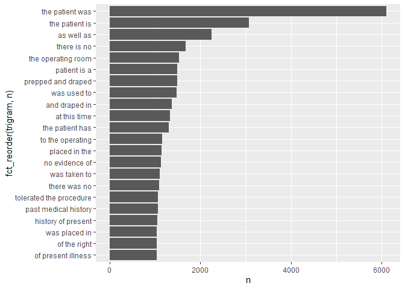

LAB\_6
================
Ram Ayyala
10/3/2021

\#Loading Libraries

``` r
library(dplyr)
```

    ## 
    ## Attaching package: 'dplyr'

    ## The following objects are masked from 'package:stats':
    ## 
    ##     filter, lag

    ## The following objects are masked from 'package:base':
    ## 
    ##     intersect, setdiff, setequal, union

``` r
library(ggplot2)
```

    ## Warning: package 'ggplot2' was built under R version 4.1.1

``` r
library(tidytext)
library(tibble)
library(forcats)
```

    ## Warning: package 'forcats' was built under R version 4.1.1

``` r
library(tidyverse)
```

    ## Warning: package 'tidyverse' was built under R version 4.1.1

    ## -- Attaching packages --------------------------------------- tidyverse 1.3.1 --

    ## v tidyr   1.1.3     v purrr   0.3.4
    ## v readr   2.0.0     v stringr 1.4.0

    ## -- Conflicts ------------------------------------------ tidyverse_conflicts() --
    ## x dplyr::filter() masks stats::filter()
    ## x dplyr::lag()    masks stats::lag()

\#Download Data

``` r
fn <- "mtsamples.csv"
if (!file.exists(fn))
  download.file("https://raw.githubusercontent.com/USCbiostats/data-science-data/master/00_mtsamples/mtsamples.csv", destfile=fn)

mtsamples <- read.csv(fn)
mtsamples <- as_tibble(mtsamples)
```

## Question 1: What specialties do we have?

``` r
specialties <- mtsamples %>%
  count(medical_specialty)
specialties %>%
  arrange(desc(n)) %>%
  top_n(15) %>%
  knitr::kable()
```

    ## Selecting by n

| medical\_specialty            |    n |
|:------------------------------|-----:|
| Surgery                       | 1103 |
| Consult - History and Phy.    |  516 |
| Cardiovascular / Pulmonary    |  372 |
| Orthopedic                    |  355 |
| Radiology                     |  273 |
| General Medicine              |  259 |
| Gastroenterology              |  230 |
| Neurology                     |  223 |
| SOAP / Chart / Progress Notes |  166 |
| Obstetrics / Gynecology       |  160 |
| Urology                       |  158 |
| Discharge Summary             |  108 |
| ENT - Otolaryngology          |   98 |
| Neurosurgery                  |   94 |
| Hematology - Oncology         |   90 |

There are `r nrow(specialties)` specialties. Let’s take a look at the
distribution

``` r
#ggplot(mtsamples, aes(x=medical_specialty)) +
#  geom_histogram(stat="count") +
 # coord_flip()

ggplot(specialties, aes(x =n, y = fct_reorder(medical_specialty, n))) + 
  geom_col()
```

<!-- --> The specialty
categories are not uniformly distributed.

## Question 2

``` r
mtsamples %>%
  unnest_tokens(output = word, input = transcription) %>%
  count(word, sort = TRUE) %>% 
  top_n(20) %>%
  ggplot (aes(x=n, y=fct_reorder(word,n)))+
  geom_col()
```

    ## Selecting by n

<!-- -->

The word “patient” seems ot be important which makes sense given the
dataset. However we do observe a lot of stopwords.

## Question 3

``` r
mtsamples %>%
  unnest_tokens(output = word, input = transcription) %>%
  count(word, sort = TRUE) %>% 
  anti_join(stop_words, by ="word") %>%
  #using regex to remove numbers 
  filter(!grepl("^[0-9]+$",x=word)) %>%
  top_n(20) %>%
  ggplot (aes(x=n, y=fct_reorder(word,n)))+
  geom_col()
```

    ## Selecting by n

<!-- --> Now
that we have removed the stop words, we see that there are alot of
interesting words, with patient being the top word as expected. We see
that the text overall is about diagnosing, patient history, the
procedure, and patient history which include things like past procedures
informed, where the surgery was and where the incesion was, etc.

## Question 4

``` r
mtsamples %>%
  unnest_ngrams(output = bigram, input = transcription, n = 2) %>%
  count(bigram, sort = TRUE) %>% 
  top_n(20) %>%
  ggplot (aes(x=n, y=fct_reorder(bigram,n)))+
  geom_col()
```

    ## Selecting by n

<!-- --> Using
bi-grams is not very informative, so lets try with tri-grams.

``` r
mtsamples %>%
  unnest_ngrams(output = trigram, input = transcription, n = 3) %>%
  count(trigram, sort = TRUE) %>% 
  top_n(20) %>%
  ggplot (aes(x=n, y=fct_reorder(trigram,n)))+
  geom_col()
```

    ## Selecting by n

<!-- -->

With trigrams, we start to see some of the phrases like “tolerated the
procedure”, “prepped and draped.” This gives us more context into the
dataset.

## Question 5

``` r
bigrams<- mtsamples %>%
  unnest_ngrams(output = bigram, input = transcription, n = 2) %>%
  separate(bigram, into=c("w1", "w2"), sep =" ")

bigrams %>%
  filter(w1=="history") %>%
  select(w1,w2) %>%
  count(w2, sort = TRUE)
```

    ## # A tibble: 369 x 2
    ##    w2                  n
    ##    <chr>           <int>
    ##  1 of               4537
    ##  2 the               761
    ##  3 she               279
    ##  4 he                227
    ##  5 significant       200
    ##  6 this              200
    ##  7 and               197
    ##  8 1                 181
    ##  9 is                172
    ## 10 noncontributory   121
    ## # ... with 359 more rows

``` r
bigrams %>%
  filter(w2=="history") %>%
  select(w1,w2) %>%
  count(w1, sort = TRUE)
```

    ## # A tibble: 567 x 2
    ##    w1           n
    ##    <chr>    <int>
    ##  1 medical   1223
    ##  2 family     941
    ##  3 a          939
    ##  4 social     865
    ##  5 surgical   491
    ##  6 no         473
    ##  7 with       163
    ##  8 any        129
    ##  9 brief      125
    ## 10 the        107
    ## # ... with 557 more rows

Since we are looking at single words again, it is a good idea to tteat
these as single tokens. So lets remove the stopwords and the numbers

``` r
bigrams %>%
  filter(w1 == "history")%>%
  filter(!(w2 %in% stop_words$word) & !grepl("^[0-9]+$", w2)) %>% 
  count(w2, sort=TRUE) %>%
  top_n(10) %>% 
  knitr::kable(caption = "Words AFTER history")
```

    ## Selecting by n

| w2              |   n |
|:----------------|----:|
| significant     | 200 |
| noncontributory | 121 |
| patient         | 101 |
| negative        |  96 |
| positive        |  87 |
| unremarkable    |  53 |
| hypertension    |  50 |
| includes        |  47 |
| mother          |  43 |
| history         |  42 |

Words AFTER history

``` r
bigrams %>%
  filter(w2 == "history")%>%
  filter(!(w1 %in% stop_words$word) & !grepl("^[0-9]+$", w1)) %>% 
  count(w1, sort=TRUE) %>%
  top_n(10) %>% 
  knitr::kable(caption = "Words BEFORE history")
```

    ## Selecting by n

| w1          |    n |
|:------------|-----:|
| medical     | 1223 |
| family      |  941 |
| social      |  865 |
| surgical    |  491 |
| pain        |   98 |
| psychiatric |   90 |
| prior       |   87 |
| past        |   80 |
| previous    |   72 |
| personal    |   55 |

Words BEFORE history

## Question 6

``` r
mtsamples %>%
  unnest_tokens(word, input=transcription) %>% 
  group_by(medical_specialty) %>% 
  count(word, sort = TRUE) %>%
  filter(!(word %in% stop_words$word) & !grepl("^[0-9]+$", word)) %>%
  top_n(5) %>%
  arrange(medical_specialty,n) %>%
  knitr::kable()
```

    ## Selecting by n

| medical\_specialty            | word         |    n |
|:------------------------------|:-------------|-----:|
| Allergy / Immunology          | nasal        |   13 |
| Allergy / Immunology          | past         |   13 |
| Allergy / Immunology          | allergies    |   21 |
| Allergy / Immunology          | patient      |   22 |
| Allergy / Immunology          | noted        |   23 |
| Allergy / Immunology          | history      |   38 |
| Autopsy                       | body         |   40 |
| Autopsy                       | anterior     |   47 |
| Autopsy                       | neck         |   55 |
| Autopsy                       | inch         |   59 |
| Autopsy                       | left         |   83 |
| Bariatrics                    | gastric      |   30 |
| Bariatrics                    | surgery      |   34 |
| Bariatrics                    | weight       |   36 |
| Bariatrics                    | history      |   50 |
| Bariatrics                    | patient      |   62 |
| Cardiovascular / Pulmonary    | history      |  654 |
| Cardiovascular / Pulmonary    | coronary     |  681 |
| Cardiovascular / Pulmonary    | artery       | 1085 |
| Cardiovascular / Pulmonary    | patient      | 1516 |
| Cardiovascular / Pulmonary    | left         | 1550 |
| Chiropractic                  | left         |   54 |
| Chiropractic                  | history      |   56 |
| Chiropractic                  | dr           |   66 |
| Chiropractic                  | patient      |   85 |
| Chiropractic                  | pain         |  187 |
| Consult - History and Phy.    | mg           |  908 |
| Consult - History and Phy.    | pain         | 1153 |
| Consult - History and Phy.    | normal       | 1368 |
| Consult - History and Phy.    | history      | 2820 |
| Consult - History and Phy.    | patient      | 3046 |
| Cosmetic / Plastic Surgery    | incision     |   67 |
| Cosmetic / Plastic Surgery    | skin         |   88 |
| Cosmetic / Plastic Surgery    | breast       |   95 |
| Cosmetic / Plastic Surgery    | procedure    |   98 |
| Cosmetic / Plastic Surgery    | patient      |  116 |
| Dentistry                     | procedure    |   82 |
| Dentistry                     | left         |   94 |
| Dentistry                     | teeth        |  104 |
| Dentistry                     | tooth        |  108 |
| Dentistry                     | patient      |  195 |
| Dermatology                   | procedure    |   44 |
| Dermatology                   | left         |   58 |
| Dermatology                   | cm           |   77 |
| Dermatology                   | patient      |  101 |
| Dermatology                   | skin         |  101 |
| Diets and Nutritions          | food         |   27 |
| Diets and Nutritions          | plan         |   27 |
| Diets and Nutritions          | day          |   28 |
| Diets and Nutritions          | carbohydrate |   37 |
| Diets and Nutritions          | weight       |   40 |
| Diets and Nutritions          | patient      |   43 |
| Discharge Summary             | hospital     |  183 |
| Discharge Summary             | history      |  208 |
| Discharge Summary             | mg           |  301 |
| Discharge Summary             | discharge    |  358 |
| Discharge Summary             | patient      |  672 |
| Emergency Room Reports        | denies       |  149 |
| Emergency Room Reports        | normal       |  255 |
| Emergency Room Reports        | pain         |  273 |
| Emergency Room Reports        | history      |  356 |
| Emergency Room Reports        | patient      |  685 |
| Endocrinology                 | dissection   |   45 |
| Endocrinology                 | gland        |   45 |
| Endocrinology                 | nerve        |   45 |
| Endocrinology                 | history      |   57 |
| Endocrinology                 | left         |   63 |
| Endocrinology                 | patient      |  121 |
| Endocrinology                 | thyroid      |  129 |
| ENT - Otolaryngology          | procedure    |  181 |
| ENT - Otolaryngology          | ear          |  182 |
| ENT - Otolaryngology          | left         |  219 |
| ENT - Otolaryngology          | nasal        |  281 |
| ENT - Otolaryngology          | patient      |  415 |
| Gastroenterology              | colon        |  240 |
| Gastroenterology              | normal       |  328 |
| Gastroenterology              | history      |  341 |
| Gastroenterology              | procedure    |  470 |
| Gastroenterology              | patient      |  872 |
| General Medicine              | mg           |  503 |
| General Medicine              | pain         |  567 |
| General Medicine              | normal       |  717 |
| General Medicine              | history      | 1027 |
| General Medicine              | patient      | 1356 |
| Hematology - Oncology         | mass         |   97 |
| Hematology - Oncology         | mg           |  107 |
| Hematology - Oncology         | left         |  187 |
| Hematology - Oncology         | history      |  290 |
| Hematology - Oncology         | patient      |  316 |
| Hospice - Palliative Care     | family       |   19 |
| Hospice - Palliative Care     | pain         |   19 |
| Hospice - Palliative Care     | daughter     |   22 |
| Hospice - Palliative Care     | history      |   27 |
| Hospice - Palliative Care     | mg           |   28 |
| Hospice - Palliative Care     | patient      |   43 |
| IME-QME-Work Comp etc.        | left         |   70 |
| IME-QME-Work Comp etc.        | injury       |   81 |
| IME-QME-Work Comp etc.        | dr           |   82 |
| IME-QME-Work Comp etc.        | patient      |  106 |
| IME-QME-Work Comp etc.        | pain         |  152 |
| Lab Medicine - Pathology      | upper        |   20 |
| Lab Medicine - Pathology      | lobe         |   29 |
| Lab Medicine - Pathology      | lymph        |   30 |
| Lab Medicine - Pathology      | cm           |   35 |
| Lab Medicine - Pathology      | tumor        |   35 |
| Letters                       | dr           |   46 |
| Letters                       | normal       |   53 |
| Letters                       | patient      |   65 |
| Letters                       | abc          |   71 |
| Letters                       | pain         |   80 |
| Nephrology                    | left         |  132 |
| Nephrology                    | kidney       |  144 |
| Nephrology                    | history      |  160 |
| Nephrology                    | renal        |  257 |
| Nephrology                    | patient      |  348 |
| Neurology                     | time         |  278 |
| Neurology                     | history      |  429 |
| Neurology                     | normal       |  485 |
| Neurology                     | patient      |  648 |
| Neurology                     | left         |  672 |
| Neurosurgery                  | left         |  222 |
| Neurosurgery                  | procedure    |  247 |
| Neurosurgery                  | c6           |  266 |
| Neurosurgery                  | c5           |  289 |
| Neurosurgery                  | patient      |  374 |
| Obstetrics / Gynecology       | normal       |  276 |
| Obstetrics / Gynecology       | incision     |  293 |
| Obstetrics / Gynecology       | procedure    |  301 |
| Obstetrics / Gynecology       | uterus       |  317 |
| Obstetrics / Gynecology       | patient      |  628 |
| Office Notes                  | noted        |   60 |
| Office Notes                  | history      |   76 |
| Office Notes                  | patient      |   94 |
| Office Notes                  | negative     |  193 |
| Office Notes                  | normal       |  230 |
| Ophthalmology                 | chamber      |  149 |
| Ophthalmology                 | anterior     |  150 |
| Ophthalmology                 | procedure    |  176 |
| Ophthalmology                 | patient      |  258 |
| Ophthalmology                 | eye          |  456 |
| Orthopedic                    | lateral      |  472 |
| Orthopedic                    | procedure    |  669 |
| Orthopedic                    | pain         |  763 |
| Orthopedic                    | left         |  998 |
| Orthopedic                    | patient      | 1711 |
| Pain Management               | injected     |   76 |
| Pain Management               | pain         |   76 |
| Pain Management               | needle       |  156 |
| Pain Management               | procedure    |  197 |
| Pain Management               | patient      |  236 |
| Pediatrics - Neonatal         | child        |   82 |
| Pediatrics - Neonatal         | mom          |   82 |
| Pediatrics - Neonatal         | normal       |  155 |
| Pediatrics - Neonatal         | history      |  235 |
| Pediatrics - Neonatal         | patient      |  247 |
| Physical Medicine - Rehab     | history      |   54 |
| Physical Medicine - Rehab     | motor        |   62 |
| Physical Medicine - Rehab     | pain         |   95 |
| Physical Medicine - Rehab     | left         |  104 |
| Physical Medicine - Rehab     | patient      |  220 |
| Podiatry                      | incision     |   96 |
| Podiatry                      | tendon       |   98 |
| Podiatry                      | left         |  137 |
| Podiatry                      | patient      |  231 |
| Podiatry                      | foot         |  232 |
| Psychiatry / Psychology       | reported     |  141 |
| Psychiatry / Psychology       | mother       |  164 |
| Psychiatry / Psychology       | mg           |  183 |
| Psychiatry / Psychology       | history      |  344 |
| Psychiatry / Psychology       | patient      |  532 |
| Radiology                     | mild         |  242 |
| Radiology                     | exam         |  302 |
| Radiology                     | patient      |  304 |
| Radiology                     | normal       |  644 |
| Radiology                     | left         |  701 |
| Rheumatology                  | day          |   22 |
| Rheumatology                  | examination  |   22 |
| Rheumatology                  | joints       |   22 |
| Rheumatology                  | pain         |   23 |
| Rheumatology                  | mg           |   26 |
| Rheumatology                  | patient      |   34 |
| Rheumatology                  | history      |   50 |
| Sleep Medicine                | stage        |   29 |
| Sleep Medicine                | activity     |   31 |
| Sleep Medicine                | apnea        |   35 |
| Sleep Medicine                | patient      |   69 |
| Sleep Medicine                | sleep        |  143 |
| SOAP / Chart / Progress Notes | blood        |  194 |
| SOAP / Chart / Progress Notes | pain         |  239 |
| SOAP / Chart / Progress Notes | history      |  254 |
| SOAP / Chart / Progress Notes | mg           |  302 |
| SOAP / Chart / Progress Notes | patient      |  537 |
| Speech - Language             | evaluation   |   17 |
| Speech - Language             | goals        |   17 |
| Speech - Language             | term         |   17 |
| Speech - Language             | time         |   17 |
| Speech - Language             | patient’s    |   28 |
| Speech - Language             | speech       |   35 |
| Speech - Language             | therapy      |   41 |
| Speech - Language             | patient      |  105 |
| Surgery                       | incision     | 1641 |
| Surgery                       | anesthesia   | 1687 |
| Surgery                       | procedure    | 3243 |
| Surgery                       | left         | 3263 |
| Surgery                       | patient      | 4855 |
| Urology                       | history      |  196 |
| Urology                       | left         |  288 |
| Urology                       | procedure    |  306 |
| Urology                       | bladder      |  357 |
| Urology                       | patient      |  776 |
